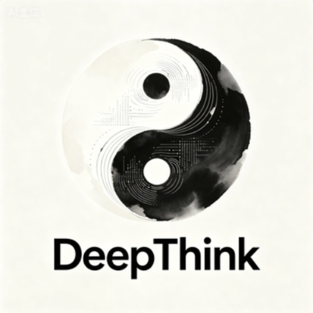

**Languages**: [English](README.md) · [简体中文](README.zh-CN.md) · [Español](README.es.md) · [হিন্দী](README.hi.md) · [العربية](README.ar.md) · [বাংলা](README.bn.md) · [Português](README.pt.md) · [Русский](README.ru.md) · [日本語](README.ja.md) · [Deutsch](README.de.md) · [Français](README.fr.md) · [Bahasa Indonesia](README.id.md) · [اردو](README.ur.md) · [মরাঠী](README.mr.md) · [తెలుగు](README.te.md) · [Türkçe](README.tr.md) · [தமிழ்](README.ta.md) · [한국어](README.ko.md) · [Tiếng Việt](README.vi.md) · [Italiano](README.it.md) · [Polski](README.pl.md) · [Українська](README.uk.md) · [Nederlands](README.nl.md) · [ไทย](README.th.md) · [ગુજરાતી](README.gu.md) · [Bahasa Melayu](README.ms.md) · [ಕನ್ನಡ](README.kn.md) · [فارسی](README.fa.md) · [Svenska](README.sv.md) · [Čeština](README.cs.md)

<p align="center">
  
</p>

<h1 align="center">DeepThink</h1>

<p align="center">
  স্ব-হোস্টেড মাল্টি-ইউজার স্থানীয় AI Agent Loop Engineering সিস্টেম (ডেস্কটপ + ব্রাউজার + মোবাইল) / AI Genius Institute দ্বারা চালিত
</p>

<p align="center">
  <a href="LICENSE"></a>
  <a href="https://nodejs.org"></a>
  
  <a href="https://github.com/AIGeniusInstitute/deepthink/stargazers"></a>
</p>

---

<p align="center">
  
</p>


## DeepThink কী?

DeepThink, একটি এন্টারপ্রাইজ-গ্রেড স্বায়ত্ত Agent সেল্ফ-ইভল্ভিং সুপারইন্টেলিজেন্স প্ল্যাটফর্ম, Harness Engineering থেকে Loop Engineering প্যারাডাইমে রূপান্তরের পথিক, এন্টারপ্রাইজ গ্রাহকদের জন্য নতুন প্রজন্মের AI ইনফ্রাস্ট্রাকচার (AI Infra)। DeepThink প্ল্যাটফর্ম একটি মাল্টি-Agent সহযোগিতা ফ্রেমওয়ার্ককে কেন্দ্র করে, AI Coding, Self-Evolving, Full-Stack Observability, Bug Auto-Fix Loop, এবং Human-Agent Symbiosis কে একত্রিত করে এমন একটি এন্টারপ্রাইজ-গ্রেড AI সিস্টেম গড়ে তোলে যা ক্রমাগত শেখে, নিজেকে উন্নত করে, এবং পরিশেষে সুপারইন্টেলিজেন্সে পরিণত হয়:

- **AI স্বায়ত্ত R&D প্ল্যাটফর্ম** — Agent স্বাধীনভাবে সম্পূর্ণ সফটওয়্যার ডেভেলপমেন্ট লাইফসাইকেল সম্পন্ন করে, নিয়মিত কোডিং কাজে মানব প্রকৌশলীদের প্রয়োজন ছাড়াই
- **সেল্ফ-ইভল্ভিং Agent ইঞ্জিন** — Agent ক্রমাগত ত্রুটি থেকে শেখে, কোডবেস থেকে জ্ঞান শোষণ করে, এবং ব্যবহারকারী প্রতিক্রিয়া থেকে বিকশিত হয়
- **প্রোগ্রামার-Agent সহযোগিতা কেন্দ্র** — প্রতিটি প্রোগ্রামারের একটি ব্যক্তিগত "ডেভেলপমেন্ট প্রজেক্ট" থাকে যাতে একাধিক সমান্তরাল সেশন থাকে, এবং একটি কেন্দ্রীয় শিডিউলার কনকারেন্সি দ্বন্দ্ব রোধ করে
- **এন্টারপ্রাইজ SaaS প্ল্যাটফর্ম** — মাল্টি-টেন্যান্ট আইসোলেশন, স্তরিত অনুমতি, স্থিতিস্থাপক বিলিং, এবং এন্টারপ্রাইজ ইন্টিগ্রেশন (Feishu/DingTalk/WeCom/LDAP)
- **সুপারইন্টেলিজেন্স ইনকিউবেটর** — ক্রমাগত বিবর্তনের মাধ্যমে, একটি একক Agent শেষ পর্যন্ত একটি সম্পূর্ণ সফটওয়্যার টিমের সর্বাঙ্গীণ সক্ষমতা অর্জন করে

> "প্রতিটি এন্টারপ্রাইজ যেন একটি কখনও থামে না এমন, ক্রমাগত বিকশিত হওয়া AI সুপার R&D টিমের মালিক হয় — টুল ব্যবহারকারী থেকে, কোড নির্মাতায়, পরিশেষে একটি স্ব-প্রতিলিপিকৃত সুপারইন্টেলিজেন্সে পরিণত হয়ে। আসুন আমরা AGI-এর দিকে যাওয়া পথে একসাথে চলি।"

### মূল বৈশিষ্ট্য

- **স্থানীয়ভাবে Claude Code চালিত** — Claude Agent SDK-র উপর ভিত্তি, অন্তর্নিহিত রানটাইম সম্পূর্ণ Claude Code CLI, সব ক্ষমতা উত্তরাধিকারে পায়
- **Harness ও Loop Engineering** — ভার্সনড হার্নেস ম্যানিফেস্ট (সিস্টেম প্রম্পট / সাবএজেন্ট / টুল / স্কিল) স্ন্যাপশট / ডিফ / ইভ্যাল / প্রমোট / রোলব্যাক সহ, এবং প্রতি-ইটারেশন রিভিউ ও ব্যর্থতা পুনঃইনজেকশনসহ দীর্ঘকালীন স্বায়ত্ত টাস্ক লুপ
- **Agent-as-a-Service (PaaS)** — DB-ব্যাকড Agent সংজ্ঞা তৈরি, ভার্সন, মাউন্ট, শেয়ার ও ইনস্টল, প্রতি-ইউজার কোটা, অ্যাডমিন রিভিউ, এবং প্রকাশযোগ্য টেমপ্লেট মার্কেটপ্লেস সহ
- **মাল্টি-ইউজার আইসোলেশন** — প্রতি-ইউজার ওয়ার্কস্পেস, প্রতি-ইউজার IM চ্যানেল, RBAC অনুমতি ব্যবস্থা, আমন্ত্রণ কোড নিবন্ধন, অডিট লগ
- **আট চ্যানেলের একীভূত রাউটিং** — Feishu, Telegram, QQ, DingTalk, WeChat, Discord, WhatsApp, এবং Web ইন্টারফেস — সবই অভিন্নভাবে রাউট হয়
- **মাল্টি-ইঞ্জিন ও মাল্টি-প্রোভাইডার** — প্লাগেবল কোড-এজেন্ট ইঞ্জিন (Claude Code / AtomCode / Codex / OpenCode) এবং একাধিক Claude API প্রোভাইডার তিনটি লোড-ব্যালেন্সিং কৌশল সহ (round-robin / weighted / failover), স্বয়ংক্রিয় হেলথ ডিটেকশন
- **স্যান্ডবক্সড কোড এক্সিকিউশন** — Python / Node / shell কোড এক্সিকিউশন ও Chromium CDP ব্রাউজার অটোমেশনের জন্য Docker + seccomp + cgroups হার্ডেনড স্যান্ডবক্স
- **বিলিং ও ব্যবহার পরিসংখ্যা** — সম্পূর্ণ বিলিং সিস্টেম (সাবস্ক্রিপশন প্ল্যান, ওয়ালেট ব্যালেন্স, রিডিম কোড), প্রতি-মডেল টোকেন ট্র্যাকিং ও চার্ট ভিজ্যুয়ালাইজেশন
- **মোবাইল PWA** — মোবাইলের জন্য গভীরভাবে অপ্টিমাইজড, হোম স্ক্রিনে এক-ট্যাপ ইনস্টল, iOS / Android উভয়ই অভিযোজিত
- **ইন্টারন্যাশনালাইজড** — ২৯টি UI ভাষা নেটিভ এন্ডোনিম ও RTL সমর্থন সহ; Agent ব্যবহারকারীর নির্বাচিত ভাষায় উত্তর দেয়

## ফিচার শোকেস

DeepThink-এর কোর ক্ষমতাগুলির একটি ভিজ্যুয়াল ভ্রমণ — প্রতিটি স্ক্রিন কেমন দেখায় এবং ব্যবহারকারীকে কী মান দেয়।

| স্ক্রিনশট | ফিচার | কোর হাইলাইটস | আপনার জন্য এর অর্থ |
|------|------|------|------|

|  | **মেইন ওয়ার্কস্পেস** | মাল্টি-কনভার্সেশন ট্যাব, স্ট্রিমিং Markdown, রিয়েল-টাইম থিংকিং প্যানেল, টুল-কল ট্রেসিং | এক ওয়ার্কস্পেসে অনেক প্যারালেল চ্যাট থাকে — স্টেট না হারিয়ে কন্টেক্সট সুইচ করুন, Agent-কে লাইভ চিন্তা ও কাজ করতে দেখুন |
|  | **Agent স্টুডিও** | কাস্টম Agent ডেফিনিশন তৈরি / ভার্সন / মাউন্ট, হোস্ট-ক্যাপাবিলিটি প্রিফ্লাইট, স্ন্যাপশট ম্যানেজমেন্ট | আপনার নিজের বিশেষজ্ঞ Agent ডিফাইন করুন (code-reviewer, web-researcher, …) এবং প্রতিটি সেশনে পুনরায় ব্যবহার করুন |
|  | **Agent এডিটর** | Web UI থেকে `~/.claude/agents/*.md` এডিট করুন, সিস্টেম-প্রম্পট + টুলস + সাবএজেন্ট এক ফর্মে | সাধারণ ভাষায় একটি Agent-এর আচরণ টিউন করুন — ফাইল খোঁজার দরকার নেই, পরিবর্তনগুলি পরবর্তী সেশনে প্রযোজ্য হবে |
|  | **Agent টেস্ট** | প্রকাশনার আগে নমুনা ইনপুটের বিরুদ্ধে Agent চালান, পুরো আউটপুট ট্রেস পরিদর্শন করুন | আত্মবিশ্বাসের সাথে Agent পাঠান — প্রোডাকশনে ছাড়ার আগে টেস্ট কেসে আচরণ যাচাই করুন |

|  | **মাল্টি-ইঞ্জিন** | প্লাগেবল ইঞ্জিন (Claude Code / AtomCode / Codex / OpenCode), একীভূত অ্যাভেইলেবিলিটি ড্যাশবোর্ড | প্রতিটি টাস্কের জন্য সেরা ব্রেইন বেছে নিন — প্ল্যাটফর্ম পুনরায় আর্কিটেক্ট না করে প্রতি সেশনে ইঞ্জিন সুইচ করুন |
|  | **ইঞ্জিন কনফিগ** | প্রতি-ইঞ্জিন ডেমন লাইফসাইকেল, প্রোভাইডার ক্রেডেনশিয়াল, এক নজরে হেলথ স্ট্যাটাস | একাধিক প্রোভাইডার পাশাপাশি চালান — ক্রেডেনশিয়াল যোগ করুন, লাইভনেস মনিটর করুন, এবং স্বয়ংক্রিয়ভাবে ফেইলওভার করুন |
|  | **AtomCode ইঞ্জিন** | স্ট্যান্ডঅ্যালোন HTTP/SSE ডেমন, প্রতি-agent-runner লুপব্যাক পোর্ট, অটো-টিয়ারডাউন | AtomCode কে একটি বিকল্প কোডিং ইঞ্জিন হিসেবে ব্যবহার করুন — প্রতি প্রসেসে আইসোলেটেড ডেমন, কোনো পোর্ট কনফ্লিক্ট নেই |
|  | **মার্কেটপ্লেস** | অ্যাডমিন-প্রকাশনযোগ্য টেমপ্লেট (agent / mcp / skill / kb), ব্রাউজ, রেট, ওয়ান-ক্লিক ইনস্টল | শেয়ার্ড Agent এবং টুল অ্যাপ স্টোরের মতো আবিষ্কার করে ইনস্টল করুন — অ্যাডমিনরা কিউরেট করেন, ব্যবহারকারীরা এক ক্লিকে ইনস্টল করেন |

|  | **MCP সার্ভার** | প্রতি-ওয়ার্কস্পেস stdio + HTTP MCP সার্ভার, গ্লোবাল কনফিগ থেকে স্বাধীন | প্রতি ওয়ার্কস্পেসকে তার নিজস্ব টুলসেট দিন — Notion, GitHub, ডেটাবেস কানেক্ট করুন… ঠিক ওই প্রজেক্টে স্কোপড |
|  | **স্কিলস** | প্রজেক্ট / ব্যবহারকারী / ওয়ার্কস্পেস-লেভেল Skills, ভলিউম মাউন্ট + সিমলিংকের মাধ্যমে অটো-আবিষ্কৃত | প্রতি প্রজেক্টে Agent-কে নতুন ট্রিক শেখান — কোনো ইমেজ রিবিল্ড নেই, স্কিলস পরবর্তী সেশনে আবির্ভূত হয় |
|  | **মেমরি সিস্টেম** | ব্যবহারকারী-গ্লোবাল / সেশন / তারিখ মেমরি, ফুল-টেক্সট সার্চ, অনলাইন এডিটিং | Agent সেশন জুড়ে আপনাকে মনে রাখে — প্রেফারেন্স, প্রজেক্ট কন্টেক্সট এবং সিদ্ধান্ত পুনরায় ব্যাখ্যা ছাড়াই রিকল করুন |
|  | **শিডিউলড টাস্ক** | Cron / ইন্টারভাল / ওয়ান-টাইম, Agent বা Script এক্সিকিউশন, গ্রুপ বা আইসোলেটেড কন্টেক্সট, সম্পন্ন হলে IM নোটিফিকেশন | পুনরাবৃত্ত কাজ অটোমেট করুন — নাইটলি রিপোর্ট, পিরিয়ডিক চেক, সেলফ-রানিং লুপ যা শেষ হলে Feishu/Telegram-এ আপনাকে পিং করে |
|  | **স্যান্ডবক্সড এক্সিকিউশন** | Docker + seccomp + cgroups, Python / Node / shell কোড, Chromium CDP ব্রাউজার অটোমেশন | Agent-কে আনট্রাস্টেড কোড চালাতে এবং ব্রাউজার নিরাপদে চালাতে দিন — হার্ডেন্ড আইসোলেশন, MCP টুল হিসেবে এক্সপোজড |
|  | **সিস্টেম মনিটর** | কন্টেইনার লিস্ট, কিউ স্টেট, প্রতি-প্রোভাইডার অ্যাক্টিভ সেশন, হেলথ চেক, ওয়ান-ক্লিক ইমেজ বিল্ড | ঠিক কী চলছে দেখুন — স্টাক কন্টেইনার ধরুন, লোড ব্যালেন্স করুন, এবং ব্রাউজার থেকে ইমেজ রিবিল্ড করুন |
|  | **ব্যবহার ও বিলিং** | প্রতি-মডেল টোকেন ব্রেকডাউন (ইনপুট / আউটপুট / ক্যাশ), USD খরচ, বার + পাই চার্ট, মাল্টি-ডাইমেনশনাল ফিল্টার | আপনার টোকেন এবং টাকা কোথায় যাচ্ছে জানুন — ব্যবহারকারী, মডেল এবং টাইম রেঞ্জ দিয়ে স্লাইস করুন, টিমের কাছে নির্ভুল বিল পাঠান |
|  | **অ্যাবাউট** | ভার্সন, বিল্ড ইনফো, প্রজেক্ট লিংক, ওয়ান-ক্লিক আপডেট চেক | আপ-টু-ডেট থাকুন — আপনার বিল্ড ভার্সন দেখুন এবং ডক্স, রেপো এবং আপডেট চ্যানেলে সরাসরি যান |

## দ্রুত শুরু

### পূর্বশর্ত

**বাধ্যতামূলক**: [Node.js](https://nodejs.org) >= 20, [Docker](https://www.docker.com/) (কন্টেইনার মোডের জন্য; admin শুধু হোস্ট মোডে এটি প্রয়োজন করে না), এবং Claude API কী (Anthropic অফিসিয়াল বা সামঞ্জস্যপূর্ণ রিলে পরিষেবা)।

**ঐচ্ছিক**: Feishu এন্টারপ্রাইজ অ্যাপ ক্রেডেনশিয়াল, Telegram Bot Token, QQ Bot ক্রেডেনশিয়াল, DingTalk ক্রেডেনশিয়াল, WeChat iLink টোকেন, Discord Bot Token, WhatsApp (প্রথম চালুকালে QR স্ক্যান) — শুধু যদি আপনি IM ইন্টিগ্রেশন চান।

> Claude Code CLI ম্যানুয়ালি ইনস্টল করার প্রয়োজন নেই — প্রোজেক্টের Claude Agent SDK নির্ভরতায় সম্পূর্ণ CLI রানটাইম অন্তর্ভুক্ত, `make start` প্রথমবার চালানোর সময় স্বয়ংক্রিয়ভাবে ইনস্টল হয়।

### ইনস্টল ও শুরু

```bash
# 1. রিপোজিটরি ক্লোন করুন
git clone https://github.com/AIGeniusInstitute/deepthink.git
cd deepthink

# 2. এক-কমান্ড শুরু (প্রথমবার নির্ভরতা ইনস্টল + কম্পাইল)
make start
```

http://localhost:9898-এ যান এবং সেটআপ উইজার্ড অনুসরণ করুন: অ্যাডমিন তৈরি করুন (কোনো ডিফল্ট অ্যাকাউন্ট নেই), Claude API কনফিগার করুন, এবং ঐচ্ছিকভাবে IM চ্যানেল কনফিগার করুন। সব কনফিগারেশন Web ইন্টারফেস থেকে করা হয়, কোনো কনফিগ ফাইল ছাড়া। API কী AES-256-GCM দিয়ে এনক্রিপ্টেড সংরক্ষিত।

### কন্টেইনার মোড সক্ষম করুন

admin ব্যবহারকারী ডিফল্টভাবে হোস্ট মোড ব্যবহার করে (Docker প্রয়োজন নেই)। আপনার যদি কন্টেইনার মোড প্রয়োজন হয় (member ব্যবহারকারী নিবন্ধনের পর স্বয়ংক্রিয়ভাবে ব্যবহার করে):

```bash
./container/build.sh
```

নতুন ব্যবহারকারী নিবন্ধনের পর স্বয়ংক্রিয়ভাবে কন্টেইনার মোডের প্রধান ওয়ার্কস্পেস (`home-{userId}`) তৈরি হয়, অতিরিক্ত কনফিগারেশন ছাড়া।

## আর্কিটেকচার ওভারভিউ


<p align="center">
  
</p>


DeepThink চারটি স্বাধীন Node.js প্রোজেক্ট নিয়ে গঠিত:

- **ব্যাকএন্ড** (Node.js 22 + TypeScript 5.9 + Hono): প্রধান পরিষেবা যাতে মেসেজ রাউটার (2s পোলিং + ডিডুপ), কনকারেন্সি কিউ (সর্বোচ্চ 20 কন্টেইনার + 5 হোস্ট প্রসেস), টাস্ক শিডিউলার (cron / interval / once), রিয়েল-টাইম স্ট্রিমিং ও টার্মিনালের জন্য WebSocket সার্ভার, bcrypt + HMAC Cookie অথেন্টিকেশন, RBAC, এবং AES-256-GCM এনক্রিপ্টেড কনফিগ ম্যানেজমেন্ট অন্তর্ভুক্ত। SQLite পারসিস্টেন্স (WAL মোড, স্কিমা v1→v51)। এতে Harness / Loop Engineering, Agent-as-a-Service (PaaS), Sandbox, এবং Claude Code Plugins লেয়ারও অন্তর্ভুক্ত।
- **ফ্রন্টএন্ড** (`web/`): React 19 + Vite 6 + Zustand 5 + Tailwind CSS 4 SPA, react-markdown, mermaid, recharts, xterm.js ও মোবাইল PWA সহ।
- **Agent Runner** (`container/agent-runner/`): এক্সিকিউশন ইঞ্জিন যা Docker কন্টেইনার বা হোস্ট প্রসেস হিসেবে চলে; Claude Agent SDK-এর `query()` ইনভোক করে, stdout-এ 30+ ধরনের StreamEvent নির্গত করে, এবং অ্যাটমিক রাইটিং সহ ফাইল-ভিত্তিক IPC চ্যানেলের মাধ্যমে মূল প্রসেসে 27টি MCP টুল সরবরাহ করে।
- **ডেস্কটপ** (`desktop/`): একটি Electron শেল যা macOS / Windows / Linux-এর জন্য স্ট্যান্ডঅ্যালোন অ্যাপ প্যাকেজ করে।

আটটি IM চ্যানেল (Feishu, Telegram, QQ, DingTalk, WeChat, Discord, WhatsApp, Web) রাউটারে প্রবেশ করে, ডিডুপ্লিকেট ও কিউতে রাউট হয়, যা প্রোভাইডার পুলের মাধ্যমে একটি API কী / ইঞ্জিন নির্বাচন করে কন্টেইনার, হোস্ট প্রসেস বা স্যান্ডবক্স শুরু করে। স্ট্রিমিং ইভেন্টগুলি WebSocket দ্বারা Web ক্লায়েন্টে সম্প্রচারিত হয় বা IM API-এর মাধ্যমে প্রতিটি চ্যানেলে উত্তর দেওয়া হয়।

## সম্পূর্ণ ডকুমেন্টেশন

সম্পূর্ণ গাইডের জন্য, দেখুন:

- [ইংরেজি সম্পূর্ণ সংস্করণ](README.md)
- [简体中文 সম্পূর্ণ সংস্করণ](README.zh-CN.md)

---

**Languages**: [English](README.md) · [简体中文](README.zh-CN.md) · [Español](README.es.md) · [हिन्दी](README.hi.md) · [العربية](README.ar.md) · [বাংলা](README.bn.md) · [Português](README.pt.md) · [Русский](README.ru.md) · [日本語](README.ja.md) · [Deutsch](README.de.md) · [Français](README.fr.md) · [Bahasa Indonesia](README.id.md) · [اردو](README.ur.md) · [मराठी](README.mr.md) · [తెలుగు](README.te.md) · [Türkçe](README.tr.md) · [தமிழ்](README.ta.md) · [한국어](README.ko.md) · [Tiếng Việt](README.vi.md) · [Italiano](README.it.md) · [Polski](README.pl.md) · [Українська](README.uk.md) · [Nederlands](README.nl.md) · [ไทย](README.th.md) · [ગુજરાતી](README.gu.md) · [Bahasa Melayu](README.ms.md) · [ಕನ್ನಡ](README.kn.md) · [فارسی](README.fa.md) · [Svenska](README.sv.md) · [Čeština](README.cs.md)


## About Author

- [AI光剑的博客](https://blog.csdn.net/universsky2015)

- [Github](https://jason-chen-2017.github.io/Jason-Chen-2017/)

- [光剑图书馆: 全球免费开放的电子图书馆 World Free eBook](https://universsky.github.io/)


---

## 捐赠

> Donate to AI Genius Institute:


| 微信                                                    | 支付宝                                                  |
| ------------------------------------------------------- | ------------------------------------------------------- |
|  |  |
