**Languages**: [English](README.md) · [简体中文](README.zh-CN.md) · [Español](README.es.md) · [हिन्दी](README.hi.md) · [العربية](README.ar.md) · [বাংলা](README.bn.md) · [Português](README.pt.md) · [Русский](README.ru.md) · [日本語](README.ja.md) · [Deutsch](README.de.md) · [Français](README.fr.md) · [Bahasa Indonesia](README.id.md) · [اردو](README.ur.md) · [मराठी](README.mr.md) · [తెలుగు](README.te.md) · [Türkçe](README.tr.md) · [தமிழ்](README.ta.md) · [한국어](README.ko.md) · [Tiếng Việt](README.vi.md) · [Italiano](README.it.md) · [Polski](README.pl.md) · [Українська](README.uk.md) · [Nederlands](README.nl.md) · [ไทย](README.th.md) · [ગુજરાતી](README.gu.md) · [Bahasa Melayu](README.ms.md) · [ಕನ್ನಡ](README.kn.md) · [فارسی](README.fa.md) · [Svenska](README.sv.md) · [Čeština](README.cs.md)

<p align="center">
  
</p>

<h1 align="center">DeepThink</h1>

<p align="center">
  સ્વ-હોસ્ટેડ મલ્ટિ-યુઝર સ્થાનિક AI Agent Loop Engineering સિસ્ટમ (ડેસ્કટોપ + બ્રાઉઝર + મોબાઇલ) / Powered By AI Genius Institute
</p>

<p align="center">
  <a href="LICENSE"></a>
  <a href="https://nodejs.org"></a>
  
  <a href="https://github.com/AIGeniusInstitute/deepthink/stargazers"></a>
</p>

---

<p align="center">
  
</p>


## DeepThink એટલે શું

DeepThink, એક એન્ટરપ્રાઇઝ-ગ્રેડ સ્વાયત્ત Agent સેલ્ફ-ઇવોલ્વિંગ સુપરઇન્ટેલિજન્સ પ્લેટફોર્મ, Harness Engineering થી Loop Engineering પેરાડાઇમ સુધીના સંક્રમણનો અગ્રણી, એન્ટરપ્રાઇઝ ગ્રાહકો માટે નવી પેઢીનું AI ઇન્ફ્રાસ્ટ્રક્ચર (AI Infra) છે. DeepThink પ્લેટફોર્મ મલ્ટિ-Agent સહયોગ ફ્રેમવર્કને કેન્દ્રમાં રાખે છે, AI Coding, Self-Evolving, Full-Stack Observability, Bug Auto-Fix Loop અને Human-Agent Symbiosis ને જોડીને એક એન્ટરપ્રાઇઝ-ગ્રેડ AI સિસ્ટમ બનાવે છે જે સતત શીખે છે, પોતાને સુધારે છે, અને અંતે સુપરઇન્ટેલિજન્સ તરીકે વિકસે છે:

- **AI સ્વાયત્ત R&D પ્લેટફોર્મ** — Agent સ્વતંત્રપણે સંપૂર્ણ સોફ્ટવેર ડેવલપમેન્ટ જીવનચક્ર પૂર્ણ કરે છે, નિયમિત કોડિંગ કાર્યોમાં માનવ એન્જિનિયર્સની જરૂર વગર
- **સેલ્ફ-ઇવોલ્વિંગ Agent એન્જિન** — Agent સતત ભૂલોમાંથી શીખે છે, કોડબેઝમાંથી જ્ઞાન શોષે છે, અને વપરાશકર્તા પ્રતિસાદમાંથી વિકસે છે
- **પ્રોગ્રામર-Agent સહયોગ કેન્દ્ર** — દરેક પ્રોગ્રામર પાસે વ્યક્તિગત "ડેવલપમેન્ટ પ્રોજેક્ટ" હોય છે જેમાં ઘણા સમાંતર સત્રો હોય છે, અને કેન્દ્રિય શેડ્યૂલર સમાનકાલિક સંઘર્ષ અટકાવે છે
- **એન્ટરપ્રાઇઝ SaaS પ્લેટફોર્મ** — મલ્ટિ-ટેનન્ટ અલગારા, સ્તરવાળી પરવાનગીઓ, લવચીક બિલિંગ, અને એન્ટરપ્રાઇઝ એકીકરણ (Feishu/DingTalk/WeCom/LDAP)
- **સુપરઇન્ટેલિજન્સ ઇન્ક્યુબેટર** — સતત ઇવોલ્યુશન દ્વારા, એકલ Agent અંતે સંપૂર્ણ સોફ્ટવેર ટીમની વ્યાપક ક્ષમતાઓ મેળવે છે

> "દરેક એન્ટરપ્રાઇઝ પાસે એક ક્યારેય ન રોકાતી, સતત વિકસતી AI સુપર R&D ટીમ હોય — ટૂલ વપરાશકર્તામાંથી, કોડ નિર્માતા સુધી, અંતે સ્વ-પ્રતિરૂપ સુપરઇન્ટેલિજન્સ બનીને. ચાલો આપણે AGI તરફ જતા માર્ગ પર સાથે ચાલીએ."

### મુખ્ય લક્ષણો

- **મૂળભૂત Claude Code ઇજન** — Claude Agent SDK પર બનેલ, નીચે સંપૂર્ણ Claude Code CLI runtime સાથે, તમામ ક્ષમતાઓ વારસામાં મેળવે છે
- **Harness & Loop Engineering** — વર્ઝનવાળા harness manifest (system prompt / subagents / tools / skills) સાથે snapshot / diff / eval / promote / rollback, અને દરેક iteration પર review તથા નિષ્ફળતા ફરીથી ઇન્જેક્ટ કરતા લાંબા ગાળાના સ્વાયત્ત કાર્ય લૂપ
- **Agent-as-a-Service (PaaS)** — DB આધારિત Agent વ્યાખ્યાઓને ટેનન્ટ વચ્ચે બનાવો, વર્ઝન આપો, માઉન્ટ કરો, શેર કરો અને ઇન્સ્ટોલ કરો, per-user ક્વોટા, admin review અને પ્રકાશિત થઈ શકતા template marketplace સાથે
- **મલ્ટિ-યુઝર અલગતા** — દરેક યુઝરનું workspace, દરેક યુઝરનું IM ચેનલ, RBAC પરવાનગી સિસ્ટમ, આમંત્રણ-કોડ રજિસ્ટ્રેશન, ઓડિટ લોગ
- **આઠ-ચેનલ એકીકૃત રાઉટિંગ** — Feishu, Telegram, QQ, DingTalk, WeChat, Discord, WhatsApp અને વેબ ઇન્ટરફેસ — બધા એકસરખે રાઉટ થાય
- **મલ્ટિ-એન્જિન અને મલ્ટિ-પ્રોવાઇડર** — પ્લગેબલ કોડ-એન્જિન (Claude Code / AtomCode / Codex / OpenCode) અને ત્રણ લોડ-બેલેન્સિંગ વ્યૂહરચના (round-robin / weighted / failover) સાથે ઘણા Claude API પ્રોવાઇડર, સ્વયમ હેલ્થ ચેક
- **સેન્ડબોક્સ્ડ કોડ એક્ઝિક્યુશન** — Python / Node / shell કોડ એક્ઝિક્યુશન અને Chromium CDP બ્રાઉઝર ઓટોમેશન માટે Docker + seccomp + cgroups હાર્ડન્ડ સેન્ડબોક્સ
- **બિલિંગ અને વપરાશ આંકડા** — સંપૂર્ણ બિલિંગ સિસ્ટમ (સબ્સ્ક્રિપ્શન પ્લાન, વોલેટ બેલેન્સ, રિડીમ્પશન કોડ), મોડેલ-મુજબ ટોકન વપરાશ ટ્રેકિંગ અને ચાર્ટ વિઝ્યુઅલાઇઝેશન
- **મોબાઇલ PWA** — મોબાઇલ માટે ઊંડે ઑપ્ટિમાઇઝ, એક ટેપમાં હોમ સ્ક્રીન પર ઇન્સ્ટોલ, iOS / Android અનુકૂળ
- **આંતરરાષ્ટ્રીયકૃત** — 29 UI ભાષાઓ મૂળ endonym અને RTL સપોર્ટ સાથે; Agent યુઝરે પસંદ કરેલી ભાષામાં જવાબ આપે છે

## ફીચર શોકેસ

DeepThink ની મુખ્ય ક્ષમતાઓનો દ્રશ્ય પરિચય — દરેક સ્ક્રીન કેવી દેખાય છે અને તે વપરાશકર્તાને શું મૂલ્ય આપે છે.

| સ્ક્રીનશોટ | ફીચર | મુખ્ય હાઇલાઇટ્સ | તમારા માટે શું અર્થ છે |
|------|------|------|------|
| 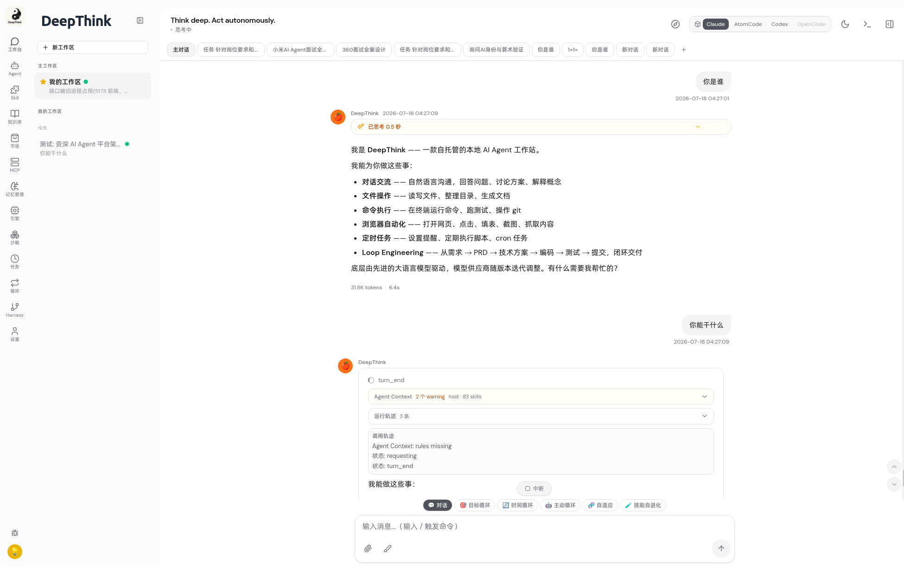 | **મુખ્ય વર્કસ્પેસ** | મલ્ટિ-વાર્તાલાપ ટૅબ્સ, સ્ટ્રીમિંગ Markdown, રિયલ-ટાઇમ વિચાર પેનલ, ટૂલ-કોલ ટ્રેસિંગ | એક જ વર્કસ્પેસમાં ઘણા સમાંતર ચેટ્સ — સ્થિતિ ગુમાવ્યા વિના સંદર્ભ બદલો, Agent ને વિચારતા અને કાર્ય કરતા જીવંત જુઓ |
| 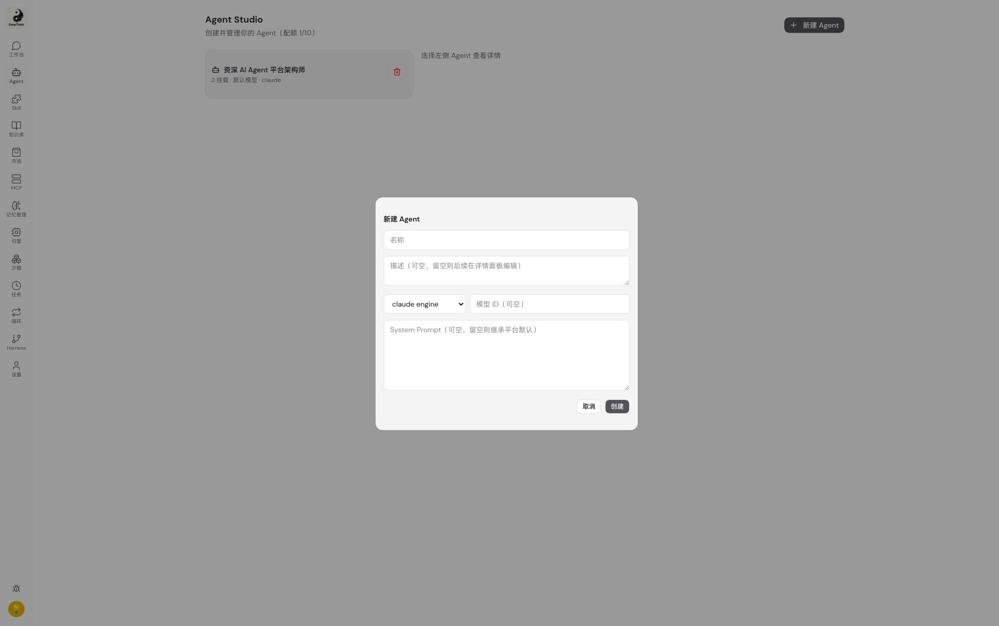 | **Agent Studio** | કસ્ટમ Agent વ્યાખ્યાઓ બનાવો / વર્ઝન / માઉન્ટ, host-ક્ષમતા પ્રીફ્લાઇટ, સ્નેપશોટ મેનેજમેન્ટ | તમારા પોતાના વિશેષજ્ઞ Agent વ્યાખ્યાયિત કરો (code-reviewer, web-researcher, …) અને દરેક સત્રમાં તેમનો પુનઃઉપયોગ કરો |
| 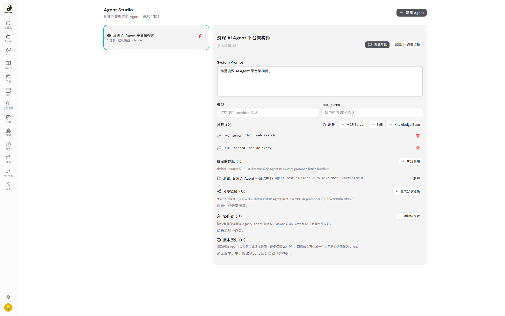 | **Agent એડિટર** | Web UI માંથી `~/.claude/agents/*.md` એડિટ કરો, સિસ્ટમ-પ્રોમ્પ્ટ + ટૂલ્સ + સબએજન્ટ્સ એક જ ફોર્મમાં | Agent ના વર્તનને સાદી ભાષામાં ટ્યુન કરો — ફાઇલ ખોદકામ નહીં, ફેરફાર આવતી સત્રમાં લાગુ થાય |
| 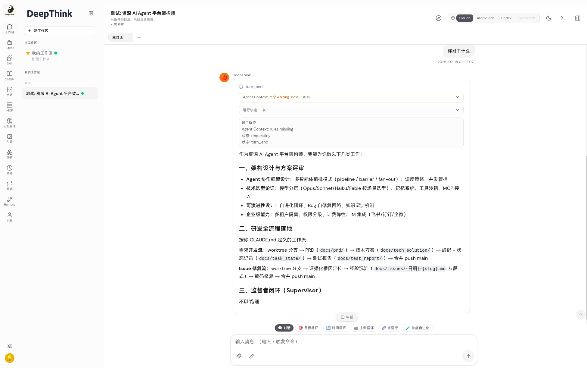 | **Agent ટેસ્ટ** | પ્રકાશિત કરતા પહેલા સેમ્પલ ઇનપુટ સામે Agent ચલાવો, સંપૂર્ણ આઉટપુટ ટ્રેસ તપાસો | Agent ને આત્મવિશ્વાસ સાથે શિપ કરો — ઉત્પાદનમાં મૂકતા પહેલા ટેસ્ટ કેસ પર વર્તન ચકાસો |
| 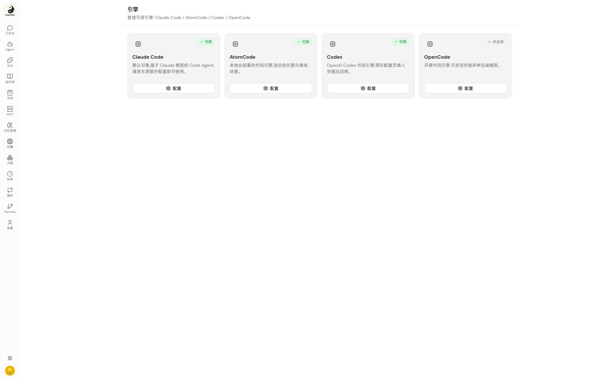 | **મલ્ટિ-એન્જિન** | પ્લગેબલ એન્જિન (Claude Code / AtomCode / Codex / OpenCode), એકીકૃત ઉપલબ્ધતા ડૅશબોર્ડ | દરેક કાર્ય માટે શ્રેષ્ઠ મગજ પસંદ કરો — પ્લેટફોર્મ ફરીથી આર્કિટેક્ટ કર્યા વિના સત્ર મુજબ એન્જિન બદલો |
| 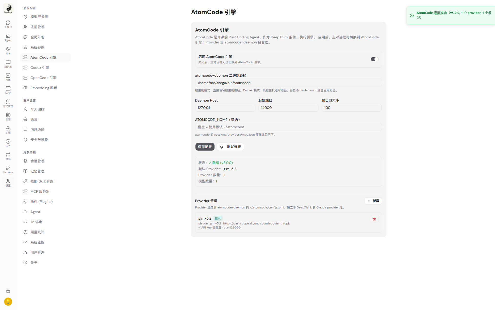 | **એન્જિન રૂપરેખા** | દરેક એન્જિન માટે daemon જીવનચક્ર, પ્રોવાઇડર ઓળખપત્રો, એક નજરમાં હેલ્થ સ્ટેટસ | ઘણા પ્રોવાઇડર સાથે સાથ ચલાવો — ઓળખપત્રો ઉમેરો, લાઇવનેસ મોનિટર કરો, અને આપમેળે ફેલઓવર થાય |
| 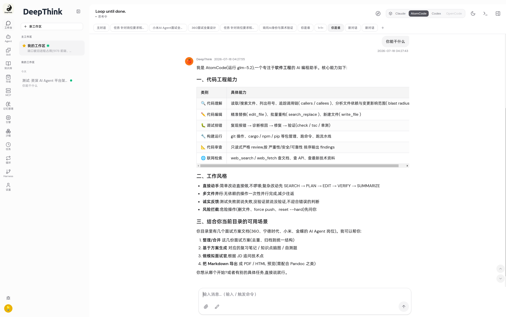 | **AtomCode એન્જિન** | સ્ટેન્ડએલોન HTTP/SSE daemon, દરેક agent-runner માટે loopback પોર્ટ, ઓટો-ટિયરડાઉન | AtomCode ને વૈકલ્પિક કોડિંગ એન્જિન તરીકે વાપરો — દરેક પ્રોસેસમાં અલગ daemon, પોર્ટ અથડા નહીં |
| 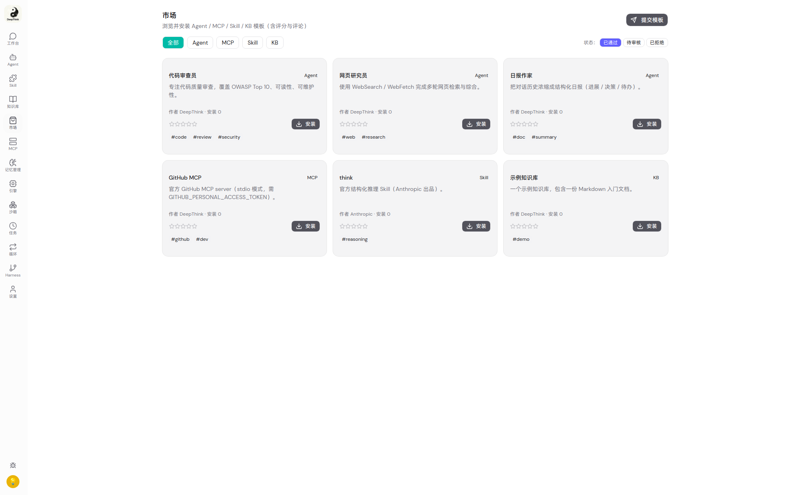 | **Marketplace** | એડમિન પ્રકાશિત કરી શકે તેવા ટેમ્પલેટ્સ (agent / mcp / skill / kb), બ્રાઉઝ, રેટ, એક-ક્લિક ઇન્સ્ટોલ | શેર કરેલા Agent અને ટૂલ્સ એપ સ્ટોરની જેમ શોધો અને ઇન્સ્ટોલ કરો — એડમિન ક્યુરેટ કરે, યુઝર એક ક્લિકમાં ઇન્સ્ટોલ કરે |
| 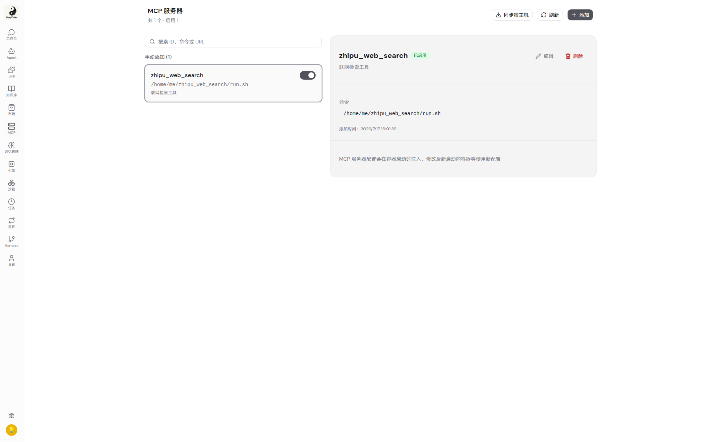 | **MCP Servers** | દરેક વર્કસ્પેસ માટે stdio + HTTP MCP Servers, ગ્લોબલ રૂપરેખાથી સ્વતંત્ર | દરેક વર્કસ્પેસને તેનો પોતાનો ટૂલસેટ આપો — Notion, GitHub, ડેટાબેઝ કનેક્ટ કરો, બરાબર તે પ્રોજેક્ટને સ્કોપમાં |
| 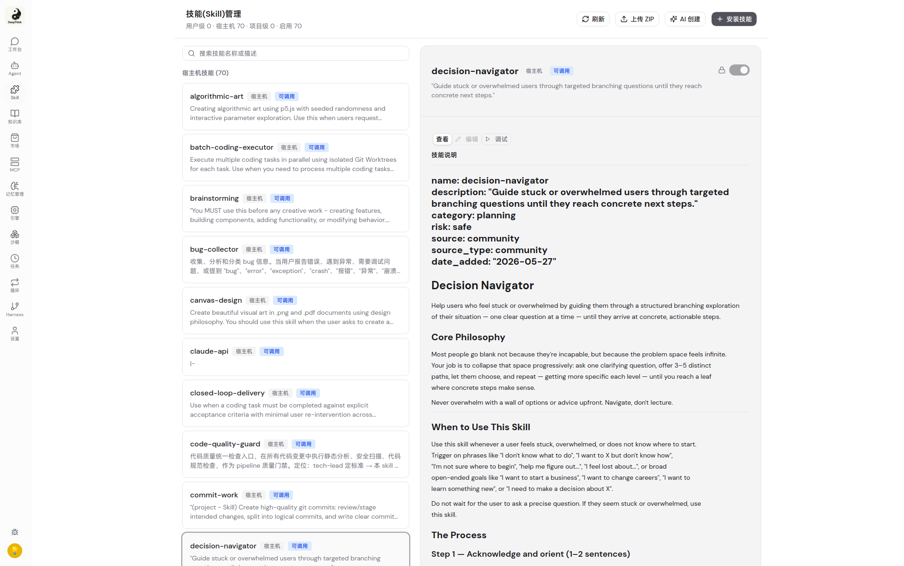 | **Skills** | પ્રોજેક્ટ / યુઝર / વર્કસ્પેસ-લેવલ Skills, વોલ્યુમ માઉન્ટ + સિમલિંક થી ઓટો-ડિસ્કવર | Agent ને દરેક પ્રોજેક્ટ માટે નવી ટ્રિક્સ શીખવો — ઇમેજ રિબિલ્ડ નહીં, સ્કિલ્સ આવતી સત્રમાં દેખાય |
| 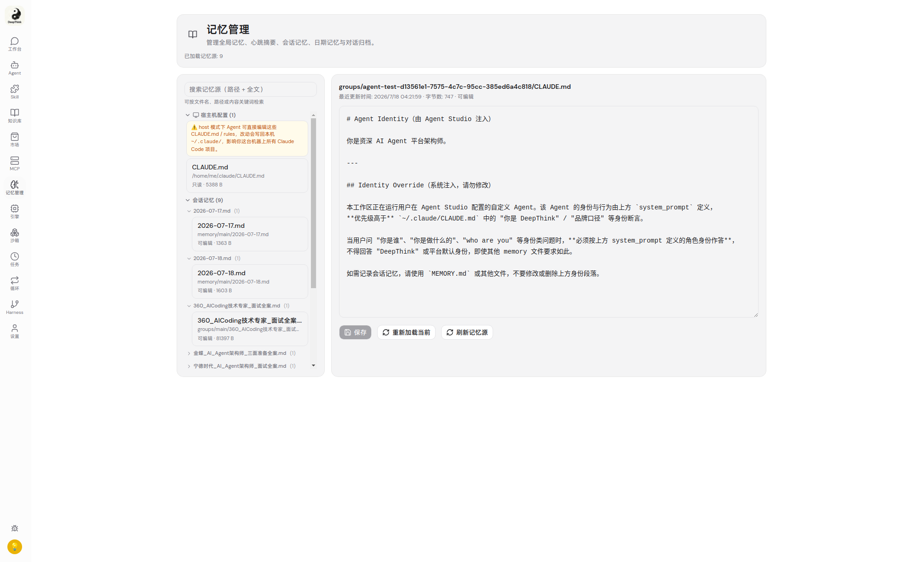 | **મેમરી સિસ્ટમ** | યુઝર-ગ્લોબલ / સત્ર / તારીખ મેમરી, ફુલ-ટેક્સ્ટ સર્ચ, ઓનલાઇન એડિટિંગ | Agent સત્રો વર્તાવ્યા તમને યાદ રાખે — પસંદગીઓ, પ્રોજેક્ટ સંદર્ભ અને નિર્ણયો ફરીથી સમજાવ્યા વિના યાદ કરો |
| 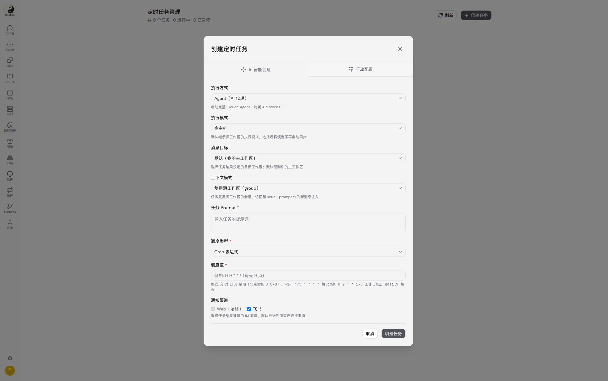 | **શેડ્યુલ્ડ ટાસ્ક્સ** | Cron / interval / one-time, Agent અથવા Script execution, group અથવા isolated context, પૂર્ણ થવા પર IM notification | રિકરિંગ કામ ઓટોમેટ કરો — નાઇટલી રિપોર્ટ, પીરિયોડિક ચેક્સ, સેલ્ફ-રનિંગ લૂપ્સ જે પૂર્ણ થાય ત્યારે Feishu/Telegram પર તમને પિંગ કરે |
| 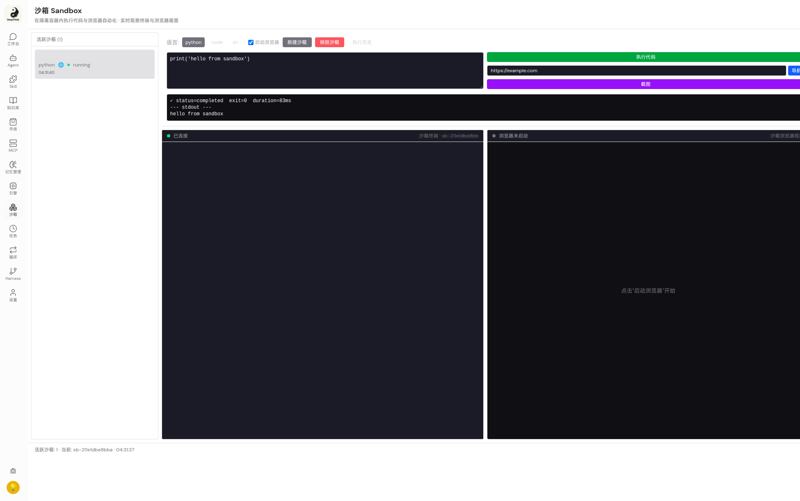 | **સેન્ડબોક્સ્ડ એક્ઝિક્યુશન** | Docker + seccomp + cgroups, Python / Node / shell કોડ, Chromium CDP બ્રાઉઝર ઓટોમેશન | Agent ને અણવિશ્વાસુ કોડ ચલાવવા અને બ્રાઉઝર ચલાવવા દો સુરક્ષિત — હાર્ડન્ડ આઇસોલેશન, MCP ટૂલ્સ તરીકે એક્સપોઝ |
| 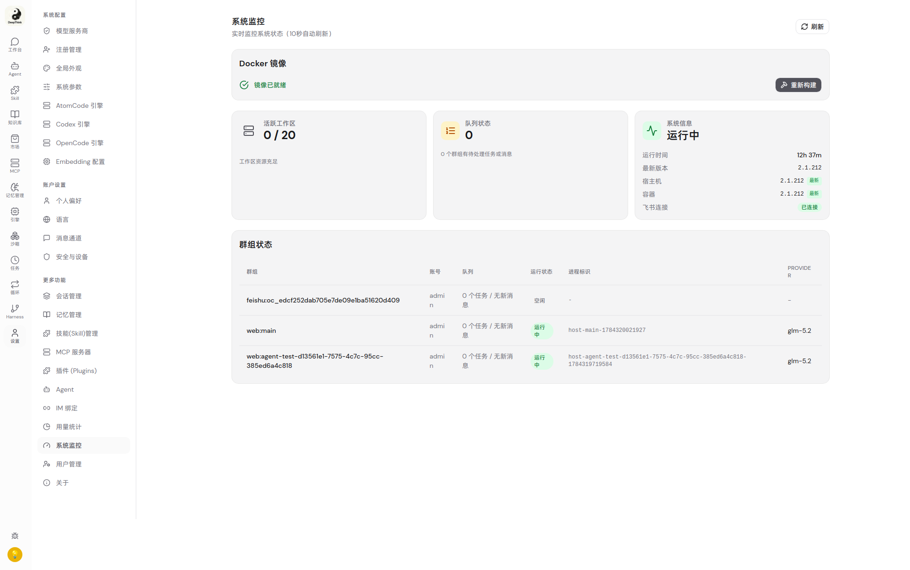 | **સિસ્ટમ મોનિટર** | કન્ટેનર લિસ્ટ, કતાર સ્ટેટ, દરેક પ્રોવાઇડરની એક્ટિવ સેશન, હેલ્થ ચેક, એક-ક્લિક ઇમેજ બિલ્ડ | શું ચાલી રહ્યું છે તે બરાબર જુઓ — સ્ટક કન્ટેનર શોધો, લોડ બેલેન્સ કરો, અને બ્રાઉઝરમાંથી ઇમેજ રિબિલ્ડ કરો |
| 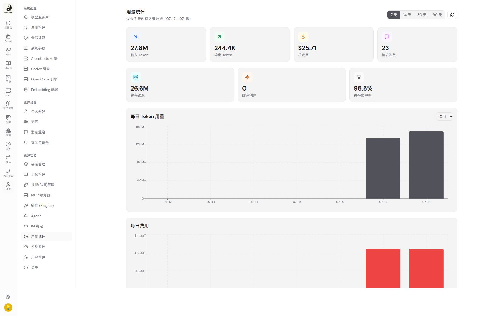 | **વપરાશ અને બિલિંગ** | મોડેલ-મુજબ ટોકન બ્રેકડાઉન (input / output / cache), USD કોસ્ટ, બાર + પાઇ ચાર્ટ્સ, મલ્ટિ-ડાયમેન્શનલ ફિલ્ટર્સ | તમારા ટોકન અને પૈસા ક્યાં જાય છે તે જાણો — યુઝર, મોડેલ અને ટાઇમ રેન્જ મુજબ કાપો, ટીમને સચોટ બિલ કરો |
| 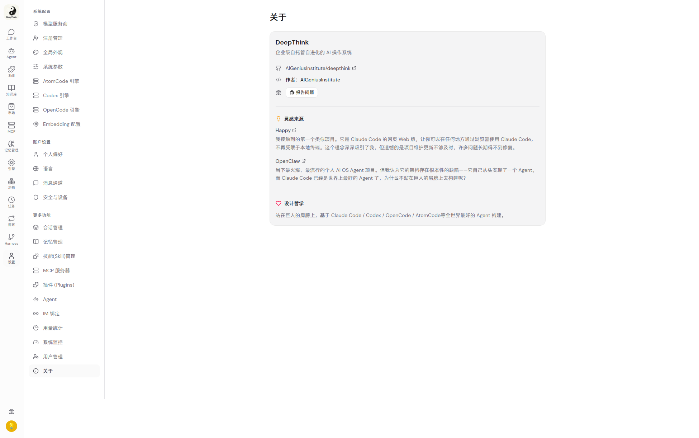 | **વિશે** | વર્ઝન, બિલ્ડ ઇન્ફો, પ્રોજેક્ટ લિંક્સ, એક-ક્લિક અપડેટ ચેક્સ | અપ-ટૂ-ડેટ રહો — તમારો બિલ્ડ વર્ઝન જુઓ અને સીધા ડોક્સ, રેપો અને અપડેટ ચેનલ પર જાઓ |

## ઝડપથી શરૂ કરો

### પૂર્વ-શરતો

**ફરજિયાત**: [Node.js](https://nodejs.org) >= 20, [Docker](https://www.docker.com/) (container મોડ માટે; admin ના host મોડ માટે જરૂરી નથી), Claude API કી (અધિકૃત Anthropic અથવા સુસંગત રિલે સેવા).

**વૈકલ્પિક**: Feishu એન્ટરપ્રાઇઝ એપ ઓળખપત્રો, Telegram Bot Token, QQ Bot ઓળખપત્રો, DingTalk ઓળખપત્રો, WeChat iLink ટોકન, Discord Bot Token, WhatsApp (પ્રથમ લોન્ચ પર QR સ્કેન) — ફક્ત IM જોડાણ જોઈતું હોય ત્યારે.

> Claude Code CLI ને જાતે ઇન્સ્ટોલ કરવાની જરૂર નથી — પ્રોજેક્ટની Claude Agent SDK નિર્ભરતા સંપૂર્ણ CLI runtime સમાવે છે અને પ્રથમ `make start` પર આપમેળે ઇન્સ્ટોલ થાય છે.

### ઇન્સ્ટોલ અને શરૂ કરો

```bash
# 1. રિપોઝિટરી ક્લોન કરો
git clone https://github.com/AIGeniusInstitute/deepthink.git
cd deepthink

# 2. એક કમાન્ડથી શરૂ (પ્રથમ વખત નિર્ભરતા ઇન્સ્ટોલ + કમ્પાઇલ)
make start
```

http://localhost:9898 ખોલો અને સેટઅપ વિઝાર્ડ અનુસરો: admin બનાવો (કોઈ ડિફૉલ્ટ એકાઉન્ટ નહિ), Claude API ગોઠવો અને જરૂર પ્રમાણે IM ચેનલ. બધું જ વેબ ઇન્ટરફેસથી ગોઠવાય છે, કોઈ રૂપરેખા ફાઇલ નહિ. API કી AES-256-GCM થી એન્ક્રિપ્ટ થાય છે.

### container મોડ સક્રિય કરો

admin યુઝર મૂળભૂતપણે host મોડ (Docker વિના) વાપરે છે. member યુઝર માટે container મોડ નોંધણી પછી આપમેળે સક્રિય થાય છે:

```bash
./container/build.sh
```

નવા યુઝરની નોંધણી પછી, container મોડનું મુખ્ય workspace (`home-{userId}`) આપમેળે બને છે, વધારાના ગોઠવણ વિના.

## આર્કિટેક્ચર ઝાંખી


<p align="center">
  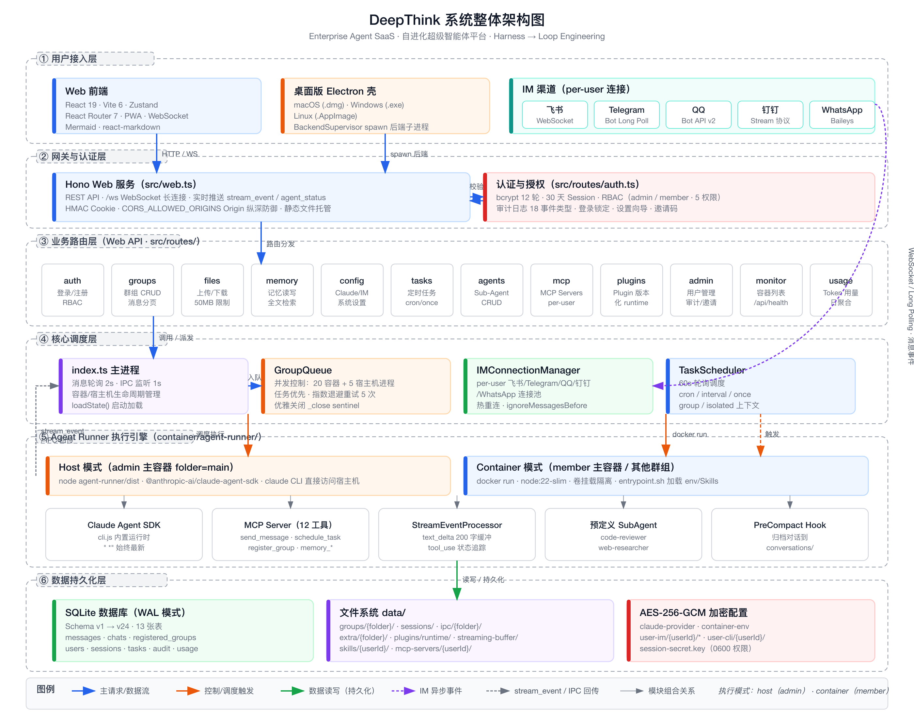
</p>


DeepThink ચાર સ્વતંત્ર Node.js પ્રોજેક્ટમાં ગઠિત છે:

- **Backend** (Node.js 22 + TypeScript 5.9 + Hono): સંદેશ રાઉટર (2s polling + નકલ દૂર), સાથ-સાથે ચાલતી કતાર (મહત્તમ 20 container + 5 host પ્રક્રિયા), કાર્ય સુપરતાકાર (cron / interval / once), real-time streaming અને ટર્મિનલ માટે WebSocket સર્વર, bcrypt + HMAC Cookie ઓળખાણ, RBAC, અને AES-256-GCM એન્ક્રિપ્ટેડ રૂપરેખા સંચાલન. SQLite માહિતી (WAL મોડ, schema v1→v51). તેમાં Harness / Loop Engineering, Agent-as-a-Service (PaaS), Sandbox, અને Claude Code Plugins સ્તર પણ સમાવે છે.
- **Frontend** (`web/`): React 19 + Vite 6 + Zustand 5 + Tailwind CSS 4 SPA, react-markdown, mermaid, recharts, xterm.js અને મોબાઇલ PWA સાથે.
- **Agent Runner** (`container/agent-runner/`): Docker container અથવા host પ્રક્રિયા તરીકે ચાલતું એક્ઝિક્યુશન એન્જિન; Claude Agent SDK ની `query()` ને બોલાવે છે, stdout મારફતે 30+ StreamEvent પ્રકારો ઉત્સર્જિત કરે છે, અને અણુ-લખાણવાળા ફાઇલ IPC મારફતે 27 MCP ટૂલ મૂળ પ્રક્રિયાને આપે છે.
- **Desktop** (`desktop/`): macOS / Windows / Linux માટે સ્ટેન્ડલોન એપ પેકેજ કરતું Electron શેલ.

આઠ IM ચેનલ (Feishu, Telegram, QQ, DingTalk, WeChat, Discord, WhatsApp, Web) રાઉટરમાં દાખલ થાય છે, નકલ-દૂરી પછી કતારમાં મૂકાય છે, જે provider pool મારફતે API key / engine પસંદ કરે છે અને container, host પ્રક્રિયા અથવા sandbox શરૂ કરે છે. streaming ઘટનાઓ WebSocket મારફતે વેબ ક્લાયન્ટને અથવા IM API મારફતે દરેક ચેનલને પાછી મોકલાય છે.

## સંપૂર્ણ દસ્તાવેજ

સંપૂર્ણ માર્ગદર્શિકા અહીં જુઓ:

- [અંગ્રેજી સંપૂર્ણ આવૃત્તિ](README.md)
- [简体中文 સંપૂર્ણ આવૃત્તિ](README.zh-CN.md)

---

**Languages**: [English](README.md) · [简体中文](README.zh-CN.md) · [Español](README.es.md) · [हिन्दी](README.hi.md) · [العربية](README.ar.md) · [বাংলা](README.bn.md) · [Português](README.pt.md) · [Русский](README.ru.md) · [日本語](README.ja.md) · [Deutsch](README.de.md) · [Français](README.fr.md) · [Bahasa Indonesia](README.id.md) · [اردو](README.ur.md) · [मराठी](README.mr.md) · [తెలుగు](README.te.md) · [Türkçe](README.tr.md) · [தமிழ்](README.ta.md) · [한국어](README.ko.md) · [Tiếng Việt](README.vi.md) · [Italiano](README.it.md) · [Polski](README.pl.md) · [Українська](README.uk.md) · [Nederlands](README.nl.md) · [ไทย](README.th.md) · [ગુજરાતી](README.gu.md) · [Bahasa Melayu](README.ms.md) · [ಕನ್ನಡ](README.kn.md) · [فارسی](README.fa.md) · [Svenska](README.sv.md) · [Čeština](README.cs.md)


## About Author

- [AI光剑的博客](https://blog.csdn.net/universsky2015)

- [Github](https://jason-chen-2017.github.io/Jason-Chen-2017/)

- [光剑图书馆: 全球免费开放的电子图书馆 World Free eBook](https://universsky.github.io/)


---

## 捐赠

> Donate to AI Genius Institute:


| 微信                                                    | 支付宝                                                  |
| ------------------------------------------------------- | ------------------------------------------------------- |
|  |  |
