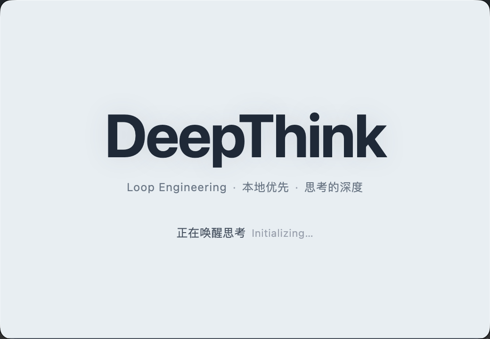

**Languages**: [English](README.md) · [简体中文](README.zh-CN.md) · [Español](README.es.md) · [हिन्दी](README.hi.md) · [العربية](README.ar.md) · [বাংলা](README.bn.md) · [Português](README.pt.md) · [Русский](README.ru.md) · [日本語](README.ja.md) · [Deutsch](README.de.md) · [Français](README.fr.md) · [Bahasa Indonesia](README.id.md) · [اردو](README.ur.md) · [मराठी](README.mr.md) · [తెలుగు](README.te.md) · [Türkçe](README.tr.md) · [தமிழ்](README.ta.md) · [한국어](README.ko.md) · [Tiếng Việt](README.vi.md) · [Italiano](README.it.md) · [Polski](README.pl.md) · [Українська](README.uk.md) · [Nederlands](README.nl.md) · [ไทย](README.th.md) · [ગુજરાતી](README.gu.md) · [Bahasa Melayu](README.ms.md) · [ಕನ್ನಡ](README.kn.md) · [فارسی](README.fa.md) · [Svenska](README.sv.md) · [Čeština](README.cs.md)

<p align="center">
  
</p>

<p align="center">
  <a href="static/deep-think-intro.mp4" target="_blank" title="DeepThink Intro Video">
    
  </a>
</p>

<h1 align="center">DeepThink</h1>

<p align="center">
  ಸ್ವ-ಹೋಸ್ಟ್ ಮಾಡಿದ ಬಹು-ಬಳಕೆದಾರ ಸ್ಥಳೀಯ AI Agent Loop Engineering ವ್ಯವಸ್ಥೆ (ಡೆಸ್ಕ್‌ಟಾಪ್ + ಬ್ರೌಸರ್ + ಮೊಬೈಲ್) / Powered By AI Genius Institute
</p>

<p align="center">
  <a href="LICENSE"></a>
  <a href="https://nodejs.org"></a>
  
  <a href="https://github.com/AIGeniusInstitute/deep-think/stargazers"></a>
</p>

---

## DeepThink ಎಂದರೇನು

DeepThink ಎಂಬುದು [Claude Agent SDK](https://github.com/anthropics/claude-agent-sdk-typescript) ಮೇಲೆ ನಿರ್ಮಿಸಿದ ಸ್ವ-ಹೋಸ್ಟ್ ಮಾಡಿದ ಬಹು-ಬಳಕೆದಾರ AI Agent ವ್ಯವಸ್ಥೆಯಾಗಿದೆ. ಇದು ಸಂಪೂರ್ಣ Claude Code runtime ಅನ್ನು Feishu, Telegram, QQ, DingTalk, WeChat ಮತ್ತು ವೆಬ್ ಇಂಟರ್ಫೇಸ್‌ನಿಂದ ಪ್ರವೇಶಿಸಬಹುದಾದ ಸೇವೆಯಾಗಿ ಸಂಕೀರ್ಣಗೊಳಿಸುತ್ತದೆ. ಇದು ಫೈಲ್ ಓದುವಿಕೆ/ಬರೆಯುವಿಕೆ, ಟರ್ಮಿನಲ್ ನಿಯಂತ್ರಣ, ಬ್ರೌಸರ್ ಸ್ವಯಂಚಾಲನೆ, ಬಹು-ಸುತ್ತಿನ ತಾರ್ಕಿಕತೆ ಮತ್ತು MCP ಉಪಕರಣ ಪರಿಸರವ್ಯವಸ್ಥೆಯನ್ನು ಬೆಂಬಲಿಸುತ್ತದೆ.

ವಿನ್ಯಾಸ ತತ್ವ: **Agent ನ ಸಾಮರ್ಥ್ಯಗಳನ್ನು ಮರು-ಕಾರ್ಯಗತಗೊಳಿಸಬೇಡಿ, ಬದಲಾಗಿ Claude Code ಅನ್ನು ನೇರವಾಗಿ ಮರು-ಬಳಕೆ ಮಾಡಿ**. ಹಿಂಬಾಗದಲ್ಲಿ ಸಂಪೂರ್ಣ Claude Code CLI runtime ಚಾಲನೆಯಾಗುತ್ತದೆ, API ಆವರಣ ಅಥವಾ ಪ್ರಾಂಪ್ಟ್ ಸರಣಿಯಲ್ಲ. Claude Code ನ ಅಪ್‌ಗ್ರೇಡ್‌ಗಳು (ಹೊಸ ಉಪಕರಣಗಳು, ಬಲಿಷ್ಠ ತಾರ್ಕಿಕತೆ, ಹೆಚ್ಚಿನ MCP ಬೆಂಬಲ) ಅಡಾಪ್ಟರ್ ಇಲ್ಲದೆ ಸ್ವಯಂಚಾಲಿತವಾಗಿ DeepThink ಗೆ ಪ್ರತಿಬಿಂಬಿಸುತ್ತವೆ.

### ಪ್ರಮುಖ ಲಕ್ಷಣಗಳು

- **ಸ್ಥಳೀಯ Claude Code ಎಂಜಿನ್** — Claude Agent SDK ಆಧಾರಿತ, ಆಂತರಿಕ runtime ಸಂಪೂರ್ಣ Claude Code CLI, ಎಲ್ಲಾ ಸಾಮರ್ಥ್ಯಗಳನ್ನು ಪಡೆಯುತ್ತದೆ
- **ಬಹು-ಬಳಕೆದಾರ ಪ್ರತ್ಯೇಕತೆ** — ಪ್ರತಿ ಬಳಕೆದಾರರ workspace, ಪ್ರತಿ ಬಳಕೆದಾರರ IM ಚಾನಲ್, RBAC ಅನುಮತಿ ವ್ಯವಸ್ಥೆ, ಆಮಂತ್ರಣ ಕೋಡ್ ನೋಂದಣಿ, ಆಡಿಟ್ ಲಾಗ್
- **ಆರು-ಚಾನಲ್ ರೂಟಿಂಗ್** — Feishu WebSocket, Telegram Bot API, QQ Bot API v2, DingTalk Stream, WeChat iLink, ವೆಬ್ ಇಂಟರ್ಫೇಸ್
- **ಬಹು-ಪ್ರೊವೈಡರ್ ಲೋಡ್ ಸಮತೋಲನ** — ಹಲವಾರು Claude API ಪ್ರೊವೈಡರ್‌ಗಳು, ಮೂರು ತಂತ್ರಗಳು (round-robin / weighted / failover) ಸ್ವಯಂಚಾಲಿತ ಆರೋಗ್ಯ ಪರಿಶೀಲನೆಯೊಂದಿಗೆ
- **ಬಿಲ್ಲಿಂಗ್ ಮತ್ತು ಬಳಕೆ ಅಂಕಿಅಂಶಗಳು** — ಸಂಪೂರ್ಣ ಬಿಲ್ಲಿಂಗ್ (ಚಂದಾ, ವಾಲೆಟ್, ವಿಮೋಚನಾ ಕೋಡ್‌ಗಳು), ಮಾದರಿಯ ಪ್ರಕಾರ ಟೋಕನ್ ಟ್ರ್ಯಾಕಿಂಗ್ ಚಾರ್ಟ್‌ಗಳೊಂದಿಗೆ
- **ಮೊಬೈಲ್ PWA** — ಮೊಬೈಲ್‌ಗೆ ಅನುಕೂಲಕರ, ಒಂದು ಕ್ಲಿಕ್‌ನಲ್ಲಿ ಹೋಮ್ ಸ್ಕ್ರೀನ್‌ಗೆ ಸ್ಥಾಪನೆ, iOS ಮತ್ತು Android ಎರಡಕ್ಕೂ ಬೆಂಬಲ

## ತ್ವರಿತ ಆರಂಭ

### ಪೂರ್ವಾಪೇಕ್ಷಿತಗಳು

**ಕಡ್ಡಾಯ**: [Node.js](https://nodejs.org) >= 20, [Docker](https://www.docker.com/) (ಕಂಟೇನರ್ ಮೋಡ್‌ಗೆ; admin ನ host ಮೋಡ್‌ಗೆ ಅಗತ್ಯವಿಲ್ಲ), Claude API ಕೀ (ಅಧಿಕೃತ Anthropic ಅಥವಾ ಹೊಂದಾಣಿಕೆಯ ರಿಲೇ ಸೇವೆ).

**ಐಚ್ಛಿಕ**: Feishu ಎಂಟರ್‌ಪ್ರೈಸ್ ಆ್ಯಪ್ ರುಜುವಾತುಗಳು, Telegram Bot Token, QQ Bot ರುಜುವಾತುಗಳು, DingTalk ರುಜುವಾತುಗಳು, WeChat iLink ಟೋಕನ್ — IM ಸಂಪರ್ಕ ಬೇಕಾದಾಗ ಮಾತ್ರ.

> Claude Code CLI ಅನ್ನು ಹಸ್ತಚಾಲಿತವಾಗಿ ಸ್ಥಾಪಿಸಲು ಅಗತ್ಯವಿಲ್ಲ — ಪ್ರಾಜೆಕ್ಟ್‌ನ Claude Agent SDK ಅವಲಂಬನೆಯು ಸಂಪೂರ್ಣ CLI runtime ಅನ್ನು ಒಳಗೊಂಡಿದೆ, ಮೊದಲ `make start` ನಲ್ಲಿ ಸ್ವಯಂಚಾಲಿತವಾಗಿ ಸ್ಥಾಪಿಸಲಾಗುತ್ತದೆ.

### ಸ್ಥಾಪನೆ ಮತ್ತು ಪ್ರಾರಂಭ

```bash
# 1. ರೆಪೊಸಿಟರಿ ಕ್ಲೋನ್ ಮಾಡಿ
git clone https://github.com/AIGeniusInstitute/deep-think.git
cd deepthink

# 2. ಒಂದು ಆದೇಶದಿಂದ ಪ್ರಾರಂಭ (ಮೊದಲ ಬಾರಿ ಅವಲಂಬನೆ ಸ್ಥಾಪನೆ + ಕಂಪೈಲ್)
make start
```

http://localhost:9898 ತೆರೆಯಿರಿ ಮತ್ತು ಸೆಟಪ್ ವಿಜಾರ್ಡ್ ಅನುಸರಿಸಿ: admin ರಚಿಸಿ (ಯಾವುದೇ ಡಿಫಾಲ್ಟ್ ಖಾತೆ ಇಲ್ಲ), Claude API ಸಂರಚಿಸಿ ಮತ್ತು ಅಗತ್ಯವಿದ್ದರೆ IM ಚಾನಲ್‌ಗಳನ್ನು ಹೊಂದಿಸಿ. ಎಲ್ಲವೂ ವೆಬ್ ಇಂಟರ್ಫೇಸ್‌ನಿಂದ ಸಂರಚಿಸಲ್ಪಡುತ್ತದೆ, ಯಾವುದೇ ಸಂರಚನಾ ಫೈಲ್ ಬೇಡ. API ಕೀಗಳು AES-256-GCM ನಿಂದ ಎನ್‌ಕ್ರಿಪ್ಟ್ ಆಗುತ್ತವೆ.

### ಕಂಟೇನರ್ ಮೋಡ್ ಸಕ್ರಿಯಗೊಳಿಸಿ

admin ಬಳಕೆದಾರ ಡಿಫಾಲ್ಟ್ ಆಗಿ host ಮೋಡ್ (Docker ಇಲ್ಲದೆ) ಬಳಸುತ್ತಾರೆ. member ಬಳಕೆದಾರರಿಗೆ ಕಂಟೇನರ್ ಮೋಡ್ ನೋಂದಣಿ ನಂತರ ಸ್ವಯಂಚಾಲಿತವಾಗಿ ಸಕ್ರಿಯವಾಗುತ್ತದೆ:

```bash
./container/build.sh
```

ಹೊಸ ಬಳಕೆದಾರರ ನೋಂದಣಿ ನಂತರ, ಕಂಟೇನರ್ ಮೋಡ್‌ನ ಮುಖ್ಯ workspace (`home-{userId}`) ಸ್ವಯಂಚಾಲಿತವಾಗಿ ರಚಿಸಲ್ಪಡುತ್ತದೆ, ಹೆಚ್ಚಿನ ಸಂರಚನೆ ಇಲ್ಲದೆ.

## ಆರ್ಕಿಟೆಕ್ಚರ್ ಅವಲೋಕನ

DeepThink ಮೂರು ಸ್ವತಂತ್ರ Node.js ಪ್ರಾಜೆಕ್ಟ್‌ಗಳಿಂದ ಕೂಡಿದೆ:

- **Backend** (Node.js 22 + TypeScript 5.9 + Hono): ಸಂದೇಶ ರೂಟರ್ (2s polling + ನಕಲು ತೆಗೆದಿಹಾಕುವಿಕೆ), ಸಮಾನಾಂತರ ಸರತಿ (ಗರಿಷ್ಠ 20 ಕಂಟೇನರ್ + 5 host ಪ್ರಕ್ರಿಯೆ), ಕಾರ್ಯ ಶೆಡ್ಯೂಲರ್ (cron / interval / once), real-time streaming ಮತ್ತು ಟರ್ಮಿನಲ್‌ಗಾಗಿ WebSocket ಸರ್ವರ್, bcrypt + HMAC Cookie ದೃಢೀಕರಣ, RBAC, AES-256-GCM ಎನ್‌ಕ್ರಿಪ್ಟೆಡ್ ಸಂರಚನೆ. ಡೇಟಾ SQLite (WAL ಮೋಡ್, schema v1→v33).
- **Frontend** (`web/`): React 19 SPA + Vite 6 + Zustand 5 + Tailwind CSS 4 + shadcn/ui, react-markdown, mermaid, recharts, xterm.js, ಮೊಬೈಲ್ PWA.
- **Agent Runner** (`container/agent-runner/`): Docker ಕಂಟೇನರ್ ಅಥವಾ host ಪ್ರಕ್ರಿಯೆಯಾಗಿ ಚಾಲನೆಯಾಗುವ ಎಕ್ಸಿಕ್ಯೂಶನ್ ಎಂಜಿನ್. Claude Agent SDK ನ `query()` ಅನ್ನು ಕರೆಯುತ್ತದೆ, 14 ಪ್ರಕಾರದ StreamEvent ಗಳನ್ನು ಹೊರಸೂಸುತ್ತದೆ ಮತ್ತು ಪರಮಾಣು ಬರವಣಿಗೆಯ ಫೈಲ್ IPC ಮೂಲಕ 12 MCP ಉಪಕರಣಗಳನ್ನು ಮೂಲ ಪ್ರಕ್ರಿಯೆಗೆ ಒದಗಿಸುತ್ತದೆ.

ಆರು IM ಚಾನಲ್‌ಗಳು ರೂಟರ್‌ಗೆ ಪ್ರವೇಶಿಸುತ್ತವೆ, ನಕಲು ತೆಗೆದ ನಂತರ ಸರತಿಗೆ ಸೇರುತ್ತವೆ, ProviderPool ಮೂಲಕ API ಕೀ ಆಯ್ಕೆಯಾಗುತ್ತದೆ ಮತ್ತು ಕಂಟೇನರ್ ಅಥವಾ host ಪ್ರಕ್ರಿಯೆ ಪ್ರಾರಂಭವಾಗುತ್ತದೆ. streaming ಘಟನೆಗಳು WebSocket ಮೂಲಕ ವೆಬ್ ಕ್ಲೈಂಟ್‌ಗಳಿಗೆ ಮತ್ತು IM API ಮೂಲಕ ಚಾನಲ್‌ಗಳಿಗೆ ಹಿಂದಿರುಗುತ್ತವೆ.

## ಸಂಪೂರ್ಣ ದಸ್ತಾವೇಜು

ಸಂಪೂರ್ಣ ಮಾರ್ಗದರ್ಶಿ ಇಲ್ಲಿ ಲಭ್ಯ:

- [ಇಂಗ್ಲಿಷ್ ಸಂಪೂರ್ಣ ಆವೃತ್ತಿ](README.md)
- [简体中文 ಸಂಪೂರ್ಣ ಆವೃತ್ತಿ](README.zh-CN.md)

---

**Languages**: [English](README.md) · [简体中文](README.zh-CN.md) · [Español](README.es.md) · [हिन्दी](README.hi.md) · [العربية](README.ar.md) · [বাংলা](README.bn.md) · [Português](README.pt.md) · [Русский](README.ru.md) · [日本語](README.ja.md) · [Deutsch](README.de.md) · [Français](README.fr.md) · [Bahasa Indonesia](README.id.md) · [اردو](README.ur.md) · [मराठी](README.mr.md) · [తెలుగు](README.te.md) · [Türkçe](README.tr.md) · [தமிழ்](README.ta.md) · [한국어](README.ko.md) · [Tiếng Việt](README.vi.md) · [Italiano](README.it.md) · [Polski](README.pl.md) · [Українська](README.uk.md) · [Nederlands](README.nl.md) · [ไทย](README.th.md) · [ગુજરાતી](README.gu.md) · [Bahasa Melayu](README.ms.md) · [ಕನ್ನಡ](README.kn.md) · [فارسی](README.fa.md) · [Svenska](README.sv.md) · [Čeština](README.cs.md)


## About Author

- [AI光剑的博客](https://blog.csdn.net/universsky2015)

- [Github](https://jason-chen-2017.github.io/Jason-Chen-2017/)

- [光剑图书馆: 全球免费开放的电子图书馆 World Free eBook](https://universsky.github.io/)


---

## 捐赠

> Donate to AI Genius Institute:


| 微信                                                    | 支付宝                                                  |
| ------------------------------------------------------- | ------------------------------------------------------- |
|  |  |
