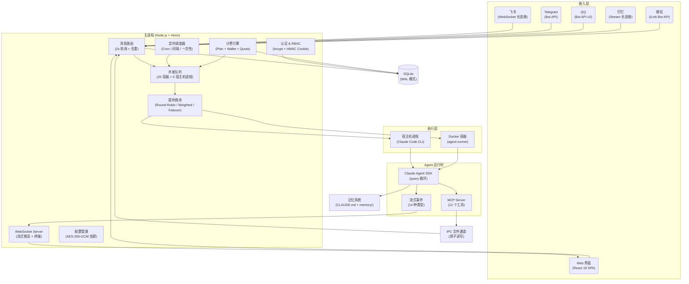

**Languages**: [English](README.md) · [简体中文](README.zh-CN.md) · [Español](README.es.md) · [हिन्दी](README.hi.md) · [العربية](README.ar.md) · [বাংলা](README.bn.md) · [Português](README.pt.md) · [Русский](README.ru.md) · [日本語](README.ja.md) · [Deutsch](README.de.md) · [Français](README.fr.md) · [Bahasa Indonesia](README.id.md) · [اردو](README.ur.md) · [मराठी](README.mr.md) · [తెలుగు](README.te.md) · [Türkçe](README.tr.md) · [தமிழ்](README.ta.md) · [한국어](README.ko.md) · [Tiếng Việt](README.vi.md) · [Italiano](README.it.md) · [Polski](README.pl.md) · [Українська](README.uk.md) · [Nederlands](README.nl.md) · [ไทย](README.th.md) · [ગુજરાતી](README.gu.md) · [Bahasa Melayu](README.ms.md) · [ಕನ್ನಡ](README.kn.md) · [فارسی](README.fa.md) · [Svenska](README.sv.md) · [Čeština](README.cs.md)

<p align="center">
  
</p>

<h1 align="center">DeepThink</h1>

<p align="center">
  A self-hosted, multi-user local AI Agent Loop Engineering system (desktop + browser + mobile) / Powered By AI Genius Institute
</p>

<p align="center">
  <a href="LICENSE"></a>
  <a href="https://nodejs.org"></a>
  
  <a href="https://github.com/AIGeniusInstitute/deep-think/stargazers"></a>
</p>

<p align="center">
  <a href="#what-is-deepthink">Introduction</a> · <a href="#core-capabilities">Core Capabilities</a> · <a href="#quick-start">Quick Start</a> · <a href="#technical-architecture">Technical Architecture</a> · <a href="#contributions">Contributions</a>
</p>

---


## What is DeepThink

DeepThink is a self-hosted, multi-user AI Agent system built on the [Claude Agent SDK](https://github.com/anthropics/claude-code/tree/main/packages/claude-agent-sdk). It wraps the complete Claude Code runtime as a service accessible via Feishu, Telegram, QQ, DingTalk, WeChat, and the Web interface, supporting file read/write, terminal operations, browser automation, multi-turn reasoning, and the MCP tool ecosystem.

Core design principle: **Don't reimplement Agent capabilities — reuse Claude Code directly**. The underlying layer invokes the full Claude Code CLI runtime, not an API wrapper or prompt chain. Every Claude Code upgrade — new tools, stronger reasoning, broader MCP support — automatically benefits DeepThink with zero adaptation.

### Key Features

- **Native Claude Code Powered** — Built on the Claude Agent SDK, with the full Claude Code CLI runtime underneath, inheriting all of its capabilities
- **Multi-User Isolation** — Per-user workspaces, per-user IM channels, an RBAC permission system, invite-code registration, and audit logs; every user has an independent execution environment
- **Unified Routing Across Six Channels** — Feishu WebSocket long connection (streaming cards + Reactions), Telegram Bot API, QQ Bot API v2, DingTalk Stream protocol, WeChat iLink Bot API, and the Web interface — all six channels routed uniformly
- **Multi-Provider Load Balancing** — Supports multiple Claude API providers with three load-balancing strategies (round-robin / weighted / failover), automatic health detection and recovery
- **Billing & Usage Statistics** — A complete billing system (subscription plans, wallet balance, redemption codes), per-model token usage tracking, and chart visualizations
- **Mobile PWA** — Deeply optimized for mobile, supports one-tap install to the home screen, fully adapted for iOS / Android

> The project draws on the containerized architecture of [OpenClaw](https://github.com/nicepkg/OpenClaw) and incorporates the multi-session collaboration ideas from Claude Code's official [Cowork](https://github.com/anthropics/claude-code/tree/main/packages/cowork): multiple independent Agent sessions work in parallel, each with its own isolated workspace and persistent memory, and results are delivered via IM channels.

## Core Capabilities

### Multi-Channel Access

| Channel | Connection | Message Format | Highlights |
|------|---------|---------|------|
| **Feishu** | WebSocket long connection | Streaming cards (typewriter effect) | Native streaming render, multi-card auto-split, image/file downloads to workspace, Reaction feedback, group @mention control |
| **Telegram** | Bot API (Long Polling) | Markdown → HTML | Long-message auto-chunking (3800 chars), images via Vision (base64), document files auto-downloaded to workspace |
| **QQ** | WebSocket (Bot API v2) | Plain text | DM + group @Bot, image messages (Vision), pairing-code binding |
| **DingTalk** | Stream protocol long connection | Markdown cards | AI Card streaming typewriter, message deduplication (LRU 1000 / 30min TTL), image downloads (downloadCode / contentUrl), group @mention filtering |
| **WeChat** | iLink Bot API (Long Polling) | Plain text (2000 chars) | QR-code scan pairing, CDN image download + AES decryption, typing indicator, auto-reconnect |
| **Web** | WebSocket real-time | Streaming Markdown | Image paste/drag-upload, virtual scrolling, Mermaid chart rendering, image lightbox |

Each user can independently configure their own IM channels (Feishu app credentials, Telegram Bot Token, QQ Bot credentials, DingTalk Client ID/Secret, WeChat iLink Token) without interfering with each other. Messages are uniformly routed: messages from each channel reply to that channel, and messages from the Web reply on the Web.


### Multi-Provider & Load Balancing

Supports configuring multiple Claude API providers (official Anthropic, various relay services, Coding Plans) for high-availability deployment:

- **Three load-balancing strategies** — Round-Robin, Weighted, Failover
- **Automatic health detection** — Consecutive error tracking (3 errors by default marks unhealthy), 5-minute auto-recovery probing
- **Per-group provider switching** — The monitoring page lets you specify which provider each workspace uses
- **OAuth credential support** — Supports Claude Code OAuth Tokens, compatible with all authentication methods
- **Active session counts** — Real-time display of concurrent usage per provider


### Agent Execution Engine

Built on the [Claude Agent SDK](https://github.com/anthropics/claude-code/tree/main/packages/claude-agent-sdk); the SDK invokes the full Claude Code CLI underneath.

- **Per-user primary workspace** — Each user has a fixed primary workspace (admin uses host mode, member uses container mode); IM messages are routed to their respective primary workspaces
- **Host mode** — Agent runs directly on the host, accessing the local filesystem with zero Docker dependency (default mode for the admin primary workspace)
- **Container mode** — Docker-isolated execution, non-root user, 40+ preinstalled tools (default mode for the member primary workspace)
- **Multi-session concurrency** — Up to 20 containers + 5 host processes running simultaneously, session-level queue scheduling
- **Script tasks** — Scheduled tasks support both Agent and Script execution types; Script mode directly executes shell commands
- **Custom working directory** — Each session can configure `customCwd` to point to a different project
- **Automatic failure recovery** — Exponential-backoff retry (5s → 80s, up to 5 attempts); context-overflow auto-compression with history archiving


### Multi-Conversation & Agent Definitions

Multiple independent conversations are supported within the same workspace, each with its own context and session:

- **Conversation tabs** — Draggable tab bar; supports creating, renaming, and deleting conversations
- **Per-conversation IM binding** — Each conversation can independently bind to an IM channel
- **Custom Agent definitions** — Create custom SubAgents (e.g., code-reviewer, web-researcher), reusing the Claude Agent SDK's `agents` option
- **Independent session persistence** — Each conversation maintains its own Claude session, fully isolated


### Real-Time Streaming Experience

The Agent's thinking and execution process is pushed to the frontend in real time, rather than waiting for the final result:

- **Thinking process** — Collapsible Extended Thinking panel, streamed character by character
- **Tool-call tracing** — Tool name, execution duration, nesting depth, input-parameter summary
- **Call-trail timeline** — The last 30 tool-call records for quick backtracking
- **Hook execution status** — PreToolUse / PostToolUse Hook start, progress, and result
- **Streaming Markdown rendering** — GFM tables, code highlighting, Mermaid charts, image lightbox
- **Share as image** — Export messages as shareable images
- **Feishu streaming cards** — Native typewriter effect (70ms/char), three-tier fallback chain (Streaming → CardKit v1 → Legacy), multi-card auto-split (split at ~45 elements), 100K-char single-element support
- **DingTalk AI Card** — DingTalk native streaming card with real-time typewriter effect


### Billing System

<details>
<summary>Complete subscription and usage billing system (click to expand)</summary>
<br/>

A billing system designed for multi-user deployment, supporting flexible billing modes:

- **Subscription plan management** — Admins create billing plans, setting price, token quota, and validity period
- **User wallet** — Each user has an independent balance, supporting top-ups and consumption
- **Redemption code system** — Create redemption codes with maximum usage counts and expiration times
- **Per-model token tracking** — Token usage records precise to the model level (input/output/cache)
- **Cost calculation** — Automatically calculates cost in USD based on model pricing
- **Admin console** — Plan CRUD, user-balance management, redemption-code management, billing audit logs
- **Quota checks** — Automatically checks user quota and balance before requests; blocks execution when exceeded

</details>


### Usage Statistics

- **Token usage breakdown** — Input tokens, output tokens, cache read/create tokens, each tracked independently
- **Cost calculation** — Automatically calculates cost per model, with USD formatting
- **Multi-dimensional filtering** — Filter flexibly by user, model, and time range (7/14/30/90 days)
- **Chart visualization** — Bar charts and pie charts showing usage trends and distribution
- **Admin view** — Admins can view usage data for all users


### 12 MCP Tools

At runtime the Agent can communicate with the main process via the built-in MCP Server:

| Tool | Description |
|------|------|
| `send_message` | Send a message to a user/group immediately while running |
| `schedule_task` | Create scheduled/recurring/one-time tasks (cron / interval / once) |
| `list_tasks` | List scheduled tasks |
| `pause_task` / `resume_task` / `cancel_task` | Pause, resume, cancel tasks |
| `register_group` | Register a new group (admin primary workspace only) |
| `install_skill` | Install a Skill to the workspace (primary workspace only) |
| `uninstall_skill` | Uninstall an installed Skill (primary workspace only) |
| `memory_append` | Append time-sensitive memory to `memory/YYYY-MM-DD.md` |
| `memory_search` | Full-text search across workspace memory files |
| `memory_get` | Read memory file contents |


### Scheduled Tasks

- **Three scheduling modes** — Cron expressions / fixed interval / one-time execution
- **Two execution types** — Agent (launches a full Claude Agent) / Script (directly executes shell commands)
- **Two context modes** — `group` (executes in a specified session) / `isolated` (independent isolated environment)
- **Notification channels** — On task completion, notify a specified IM channel (Feishu / Telegram / QQ / DingTalk / WeChat)
- **Full execution logs** — Duration, status, result, all managed via the Web interface


### Memory System

The Agent autonomously maintains persistent cross-session memory:

- **User global memory** — `data/groups/user-global/{userId}/CLAUDE.md`; each user has an independent global memory, readable by all sessions
- **Session memory** — `data/groups/{folder}/CLAUDE.md`, private to the session
- **Date memory** — `memory/YYYY-MM-DD.md`, for time-sensitive information
- **Conversation archive** — PreCompact Hook automatically archives to `conversations/` before context compression
- **Full-text search** — Online editing + search from the Web interface


### Workspace-Level Configuration

Each workspace can independently configure its own runtime environment:

- **Per-workspace MCP Servers** — Add stdio or HTTP MCP Servers to a workspace, independent of the global config
- **Per-workspace Skills** — Install specific Skills for a workspace, enabled on demand
- **Per-workspace environment variables** — Group-level environment-variable overrides, higher priority than global config
- **Shared workspace members** — Multiple users can join the same workspace to collaborate


### IM Binding System

A flexible mechanism for binding IM channels to workspaces:

- **Workspace-level binding** — Bind an IM group/DM to a specified workspace or specific conversation
- **Feishu topic-group mapping** — After binding a Feishu topic group, each topic is automatically mapped to an independent session with its own context; the workspace switches to a vertical topic-list navigation
- **Slash-command management** — `/bind <target>` to bind, `/unbind` to unbind, `/where` to view the current binding, `/new <name>` to create a new workspace and bind
- **Web settings management** — View and manage all IM bindings from the settings page


### Skills System

- **Project-level Skills** — Placed in `container/skills/`, auto-mounted on all containers
- **User-level Skills** — Placed in `~/.claude/skills/`, auto-mounted on all containers
- **Workspace-level Skills** — Install Skills for a specific workspace via the Web interface
- No image rebuild needed; volume mounts + symlinks enable auto-discovery

### Web Terminal

A complete terminal based on xterm.js + node-pty: WebSocket connection, draggable resizable panel, operate containers directly from the Web interface.


### Docker Build UI

Build Docker images with one click from the Web monitoring page; build logs are streamed in real time via WebSocket — no need to run commands in a terminal manually.


### Mobile PWA

A Progressive Web App optimized for mobile, installable to the home screen from a mobile browser in one tap:

- **Native experience** — Full-screen mode, standalone app icon, visually indistinguishable from a native app
- **Responsive layout** — Mobile-first design; chat interface, settings pages, and monitoring panels all adapt to small screens
- **iOS / Android adaptation** — Safe-area handling, scroll optimization, font rendering, touch interaction
- **Always available** — Anytime, anywhere; pull out your phone to chat with the AI Agent, check execution status, and manage tasks


### File Management

- **Full file browser** — Tree-view directory structure, file-type icons
- **File operations** — Upload (50MB limit, drag-and-drop supported) / download / delete / create directory
- **File preview** — Online text-file viewing, image preview + lightbox, Markdown rendering
- **Security** — Path-traversal protection + system-path protection

### Security & Multi-User

| Capability | Description |
|------|------|
| **User isolation** | Each user has an independent primary workspace (`home-{userId}`), working directory, and IM channel |
| **Personalization** | Users can customize AI name, avatar emoji / color / uploaded image |
| **RBAC** | 5 permissions, 4 role templates (admin_full / member_basic / ops_manager / user_admin) |
| **Registration control** | Open registration / invite-code registration / closed registration |
| **Audit logs** | 18 event types, full operation tracking |
| **Encrypted storage** | API keys encrypted with AES-256-GCM; Web API returns only masked values |
| **Mount security** | Whitelist validation + blacklist pattern matching (`.ssh`, `.gnupg`, and other sensitive paths) |
| **Terminal permissions** | Users can access the Web terminal of their own container (not supported in host mode) |
| **Login protection** | 5 failures lock for 15 minutes, bcrypt 12 rounds, HMAC Cookie, 30-day session validity |
| **Session management** | View and delete active login sessions; supports multi-device management |
| **PWA** | One-tap install to the phone home screen, deeply optimized for mobile, use the AI Agent anytime, anywhere |

## Quick Start

### Prerequisites

Before you begin, ensure the following dependencies are installed:

**Required**

- **[Node.js](https://nodejs.org) >= 20** — Runs the main service and frontend build
  - macOS: `brew install node`
  - Linux: See [NodeSource](https://github.com/nodesource/distributions) or use `nvm`
  - Windows: [Download from the official site](https://nodejs.org)

- **[Docker](https://www.docker.com/)** — Runs Agents in container mode (required for member users; admin host-only mode can skip this)
  - macOS: [OrbStack](https://orbstack.dev) recommended (lighter), or [Docker Desktop](https://www.docker.com/products/docker-desktop/)
  - Linux: `curl -fsSL https://get.docker.com | sh`
  - Windows: [Docker Desktop](https://www.docker.com/products/docker-desktop/)

- **Claude API Key** — Official Anthropic or compatible relay services (various Coding Plans); configure it in the Web interface after launch

**Optional**

- Feishu enterprise self-built app credentials — Only needed for Feishu integration; create at the [Feishu Open Platform](https://open.feishu.cn)
- Telegram Bot Token — Only needed for Telegram integration; obtain via [@BotFather](https://t.me/BotFather)
- QQ Bot credentials — Only needed for QQ integration; create at the [QQ Open Platform](https://q.qq.com/qqbot/openclaw/index.html)
- DingTalk Bot credentials — Only needed for DingTalk integration; create at the [DingTalk Open Platform](https://open.dingtalk.com)
- WeChat iLink Bot Token — Only needed for WeChat integration

> The Claude Code CLI does not need to be installed manually — the Claude Agent SDK bundled as a project dependency already includes the full CLI runtime, and it is installed automatically on the first `make start`.

### Installation & Launch

```bash
# 1. Clone the repository
git clone https://github.com/AIGeniusInstitute/deep-think.git
cd deepthink

# 2. One-tap launch (auto-installs dependencies + compiles on first run)
make start

Open: http://localhost:9898

For public access, configure a reverse proxy with nginx/caddy yourself
```

Follow the setup wizard to complete initialization:

1. **Create an admin** — Customize username and password (no default account)
2. **Configure Claude API** — Fill in the API key and model (relay services supported; multiple providers configurable)
3. **Configure IM channels** (optional) — Feishu / Telegram / QQ / DingTalk / WeChat
4. **Start chatting** — Send a message directly from the Web chat page

> All configuration is done via the Web interface, with no config files required. API keys are stored AES-256-GCM encrypted.


### Enabling Container Mode

The admin user defaults to host mode (no Docker needed) and works out of the box. For container mode (used automatically by member users after registration):

```bash
# Build the container image
./container/build.sh
```

A container-mode primary workspace (`home-{userId}`) is created automatically when a new user registers — no extra configuration needed.

### Configuring Feishu Integration

1. Go to the [Feishu Open Platform](https://open.feishu.cn) and create an enterprise self-built app
2. Under the app's "Event Subscriptions", add: `im.message.receive_v1` (receive messages)
3. Under the app's "Permission Management", enable the following permissions:
   - `cardkit:card:write` (create and update cards)
   - `im:chat` (get and update group information)
   - `im:chat:read` (get group information)
   - `im:chat:readonly` (read group information as the app)
   - `im:message` (send messages)
   - `im:message.group_at_msg:readonly` (receive group @ messages)
   - `im:message.group_msg` (receive all group messages) — **sensitive permission**, requires admin approval. Without it, only @-Bot messages are processed in groups
   - `im:message.p2p_msg:readonly` (receive private-chat messages)
   - `im:resource` (get and upload image/file resources)

   <details>
   <summary>Permissions JSON (can be imported directly into the Feishu Open Platform)</summary>

   ```json
   {
     "scopes": {
       "tenant": [
         "cardkit:card:write",
         "im:chat",
         "im:chat:read",
         "im:chat:readonly",
         "im:message",
         "im:message.group_at_msg:readonly",
         "im:message.group_msg",
         "im:message.p2p_msg:readonly",
         "im:resource"
       ],
       "user": []
     }
   }
   ```

   </details>

4. Publish the app version and wait for approval
5. In the DeepThink Web interface, under "Settings → IM Channels → Feishu", fill in the App ID and App Secret

Each user can independently configure Feishu app credentials in their personal settings, enabling per-user Feishu Bots.

> **Group mention control**: By default, groups require @-Bot to respond. Use `/require_mention false` to switch to all-message response (requires the `im:message.group_msg` permission).

> **Feishu topic groups**: After binding a Feishu topic group (`chat_mode=topic` or `group_message_type=thread`) to a workspace, each topic automatically creates an independent session Agent with its own context and message history. The Web interface switches to a vertical topic list with search and delete support. Unbinding automatically cleans up all topic sessions.


### Configuring Telegram Integration

1. In Telegram, find [@BotFather](https://t.me/BotFather), send `/newbot` to create a Bot
2. Save the returned Bot Token
3. In the DeepThink Web interface, under "Settings → IM Channels → Telegram", fill in the Bot Token
4. **Group usage**: To use the Bot in a Telegram group, send `/mybots` in BotFather → select the Bot → Bot Settings → Group Privacy → Turn off; otherwise the Bot can only receive `/` command messages


### Configuring QQ Integration

1. Go to the [QQ Open Platform](https://q.qq.com/qqbot/openclaw/index.html), scan the QR code with mobile QQ to register and log in
2. Create a bot, set the name and avatar
3. On the bot management page, get the **App ID** and **App Secret**
4. In the DeepThink Web interface, under "Settings → IM Channels → QQ", fill in the App ID and App Secret
5. **Pairing**: Generate a pairing code on the settings page, then send `/pair <pairing-code>` to the Bot in QQ to complete binding

> QQ Bot uses the official API v2 protocol, supporting C2C private chats and group @-Bot messages. In groups, the Bot only receives @-Bot messages.


### Configuring DingTalk Integration

1. Go to the [DingTalk Open Platform](https://open.dingtalk.com) and create an enterprise internal app
2. Under App Management → Bots & Messaging, enable "Bot Configuration"
3. Select **Stream mode** (not HTTP callback mode) to receive messages
4. Get the app's **Client ID** (AppKey) and **Client Secret** (AppSecret)
5. In the DeepThink Web interface, under "Settings → IM Channels → DingTalk", fill in the Client ID and Client Secret

> DingTalk Bot supports both DM and group chats. In groups, the Bot only responds to @-Bot messages. Supports AI Card streaming typewriter effect.


### Configuring WeChat Integration

1. In the DeepThink Web interface, under "Settings → IM Channels → WeChat", enable the WeChat channel
2. Fill in the iLink Bot Token
3. Click "Scan to Pair" to generate a QR code
4. Scan the QR code with WeChat to complete binding

> WeChat messages are limited to 2000 characters; excess content is automatically chunked.


### IM Slash Commands

In Feishu / Telegram / QQ / DingTalk / WeChat, messages starting with `/` are intercepted as slash commands (unknown commands fall back to being treated as normal messages):

| Command | Alias | Purpose |
|------|------|------|
| `/list` | `/ls` | List all workspaces and conversations |
| `/status` | - | View the current workspace/conversation status |
| `/where` | - | View the current binding location and reply policy |
| `/bind <target>` | - | Bind to a specified workspace or Agent (e.g., `/bind myws` or `/bind myws/a3b`) |
| `/unbind` | - | Unbind back to the default workspace |
| `/new <name>` | - | Create a new workspace and bind the current group to it |
| `/recall` | `/rc` | AI-summarized recent conversation history |
| `/clear` | - | Clear the current conversation's session context |
| `/require_mention` | - | Toggle group response mode: `true` (require @) or `false` (respond to all) |


### Execution Modes

| Mode | Description | Target | Prerequisites |
|------|------|---------|---------|
| **Host mode** | Agent runs directly on the host, accessing the local filesystem | Admin primary workspace (`folder=main`) | Claude Agent SDK (auto-installed) |
| **Container mode** | Agent runs isolated in a Docker container, 40+ preinstalled tools | Member primary workspace (`folder=home-{userId}`) | Docker Desktop + built image |

The admin primary workspace defaults to host mode; a container-mode primary workspace is auto-created on member registration. You can also switch execution modes manually from the Web interface's session management.

### Container Toolchain

The container image is based on `node:22-slim` and ships with the following tools:

| Category | Tools |
|------|------|
| AI / Agent | Claude Code CLI, Claude Agent SDK, MCP SDK |
| Browser automation | Chromium, agent-browser |
| Programming languages | Node.js 22, Python 3, uv / uvx |
| Build toolchain | build-essential, cmake, pkg-config |
| Text search | ripgrep (`rg`), fd-find (`fd`) |
| Multimedia processing | ffmpeg, ImageMagick, Ghostscript, Graphviz |
| Document conversion | Pandoc, poppler-utils (PDF tools) |
| Database clients | SQLite3, MySQL Client, PostgreSQL Client, Redis Tools |
| Network tools | curl, wget, openssh-client, dnsutils |
| Feishu CLI | feishu-cli (prebuilt binary + Skills) |
| Shell | Zsh + Oh My Zsh (ys theme) |
| Others | git, jq, tree, shellcheck, zip/unzip |

## Technical Architecture

### Architecture Diagram



**Data flow**: Messages enter the main process from the access layer (6 channels), are deduplicated and routed, then dispatched to the concurrency queue. The queue selects an API key via the provider pool and starts a host process or Docker container. The agent-runner inside the container calls the Claude Agent SDK's `query()` function. Streaming events (14 types: thinking, text, tool calls, etc.) are passed back to the main process via the stdout marker protocol, then broadcast to Web clients via WebSocket or replied to each channel via IM APIs. The MCP Server provides 12 tools over a file-based IPC channel, enabling bidirectional communication between the Agent and the main process. The billing engine checks quota and balance before each request.

### Tech Stack

| Layer | Technologies |
|------|------|
| **Backend** | Node.js 22 · TypeScript 5.9 · Hono · better-sqlite3 (WAL) · ws · node-pty · Pino · Zod 4 |
| **Frontend** | React 19 · Vite 6 · Zustand 5 · Tailwind CSS 4 · shadcn/ui · Radix UI · Lucide Icons · react-markdown · mermaid · recharts · @dnd-kit · xterm.js · @tanstack/react-virtual · PWA |
| **Agent** | Claude Agent SDK · Claude Code CLI · MCP SDK · IPC file channels |
| **Container** | Docker (node:22-slim) · Chromium · agent-browser · Python · 40+ preinstalled tools |
| **Security** | bcrypt (12 rounds) · AES-256-GCM · HMAC Cookie · RBAC · path-traversal protection · mount whitelist |
| **IM integrations** | @larksuiteoapi/node-sdk (Feishu) · grammY (Telegram) · QQ Bot API v2 · dingtalk-stream (DingTalk) · iLink Bot API (WeChat) |

### Directory Structure

All runtime data lives under `data/`, auto-created at startup — no manual initialization required.

```
deepthink/
├── src/                          # Backend source
│   ├── index.ts                  #   Entry: message polling, IPC listening, container lifecycle
│   ├── web.ts                    #   Hono app, WebSocket, static files
│   ├── routes/                   #   17 route modules (auth / groups / files / config / monitor /
│   │                             #   memory / tasks / skills / admin / browse / agents /
│   │                             #   mcp-servers / billing / bug-report / usage /
│   │                             #   workspace-config / agent-definitions)
│   ├── feishu.ts                 #   Feishu connection factory (WebSocket long connection)
│   ├── feishu-streaming-card.ts  #   Feishu streaming card (typewriter effect + three-tier fallback)
│   ├── telegram.ts               #   Telegram connection factory (Bot API)
│   ├── qq.ts                     #   QQ connection factory (Bot API v2 WebSocket)
│   ├── dingtalk.ts               #   DingTalk connection factory (Stream protocol long connection)
│   ├── dingtalk-streaming-card.ts#   DingTalk AI Card streaming controller
│   ├── wechat.ts                 #   WeChat connection factory (iLink Bot API)
│   ├── im-manager.ts             #   IM connection pool (per-user five-channel connection management)
│   ├── im-downloader.ts          #   IM file download utility (saves to workspace downloads/)
│   ├── container-runner.ts       #   Docker / host process management
│   ├── group-queue.ts            #   Concurrency control queue
│   ├── provider-pool.ts          #   Multi-provider load balancing
│   ├── billing.ts                #   Billing engine (plans, wallet, quota)
│   ├── runtime-config.ts         #   AES-256-GCM encrypted config
│   ├── task-scheduler.ts         #   Scheduled-task scheduler
│   ├── script-runner.ts          #   Script-task executor
│   ├── file-manager.ts           #   File security (path-traversal protection)
│   ├── mount-security.ts         #   Mount whitelist / blacklist
│   └── db.ts                     #   SQLite data layer (Schema v1→v33)
│
├── web/                          # Frontend (React + Vite)
│   └── src/
│       ├── pages/                #   17 pages
│       ├── components/           #   UI components (chat / settings / billing / monitor / ...)
│       ├── stores/               #   14 Zustand stores
│       └── api/client.ts         #   Unified API client
│
├── container/                    # Agent container
│   ├── Dockerfile                #   Container image definition
│   ├── build.sh                  #   Build script
│   ├── agent-runner/             #   In-container execution engine
│   │   └── src/
│   │       ├── index.ts          #     Agent main loop + streaming events
│   │       └── mcp-tools.ts      #     12 MCP tools
│   └── skills/                   #   Project-level Skills
│
├── shared/                       # Cross-project shared type definitions
│   ├── stream-event.ts           #   StreamEvent type single source of truth (14 event types)
│   ├── channel-prefixes.ts       #   IM channel prefix mapping (5 channels)
│   └── image-detector.ts         #   Image MIME detection
│
├── scripts/                      # Build helper scripts
│   ├── sync-stream-event.sh      #   Sync shared/ types to each subproject
│   └── check-stream-event-sync.sh#   Validate type-copy consistency
│
├── config/                       # Project config
│   ├── default-groups.json       #   Pre-registered groups
│   ├── mount-allowlist.json      #   Container mount whitelist
│   └── global-claude-md.template.md # Global CLAUDE.md template
│
├── data/                         # Runtime data (auto-created at startup)
│   ├── db/messages.db            #   SQLite database (WAL mode)
│   ├── groups/{folder}/          #   Session working directory (Agent read/write)
│   │   ├── downloads/{channel}/  #     IM file downloads (feishu/telegram/qq/dingtalk, by date subdirectory)
│   │   └── CLAUDE.md             #     Session-private memory
│   ├── groups/user-global/{id}/  #   User global memory directory
│   ├── sessions/{folder}/.claude/#   Claude session persistence
│   ├── ipc/{folder}/             #   IPC channels (input / messages / tasks)
│   ├── env/{folder}/env          #   Container environment-variable file
│   ├── memory/{folder}/          #   Date memory
│   └── config/                   #   Encrypted config files
│
└── Makefile                      # Common commands
```

### Development Guide

#### First-Time Install

```bash
make install              # Install root project dependencies + compile agent-runner
make install-host-tools   # Install external tools needed by host mode (feishu-cli, agent-browser, uv) + refresh builtin-skills cache
```

`make install` automatically fixes the executable permission of node-pty's `spawn-helper` (on macOS arm64, the prebuilt binary occasionally lacks the +x bit, which would break Web-terminal PTY mode).

#### Daily Development

```bash
make dev              # Start frontend + backend in parallel (hot reload); auto-installs deps + builds container image on first run
make dev-backend      # Start backend only (tsx runs TS directly, no pre-build needed)
make dev-web          # Start frontend only (Vite at 5173)
make status           # View service status (processes, ports, logs, Docker containers)
make logs             # Stream logs live (only effective when manually backgrounded, e.g. make start > /tmp/deepthink.log 2>&1 &)
make stop             # Stop the service (pm2 stop if pm2-managed, otherwise kill the port-listener process)
```

`make dev` auto-detects whether `package.json` is newer than `node_modules` and re-runs `make install` if so; it also ensures the Docker image exists (required for container mode). If pm2 is active on the system, it pauses pm2 first to release the port and restores it on exit.

#### Build & Type Checking

```bash
make build            # Compile everything (backend + frontend + agent-runner, includes sync-types)
make build-backend    # Backend only
make build-web        # Frontend only
make typecheck        # Full TypeScript typecheck (backend + frontend + agent-runner)
make typecheck-backend    # Backend only
make typecheck-web        # Frontend only
make typecheck-agent-runner  # agent-runner only
make format           # Format code with Prettier
make format-check     # Check formatting only (for CI, no file modifications)
make test             # Run constraint tests (vitest; required before/after refactoring)
make sync-types       # Sync shared/ type definitions to each subproject (stream-event.ts, image-detector.ts)
make clean            # Clean all build artifacts (dist/, web/dist/, container/agent-runner/dist/)
```

> After modifying `shared/stream-event.ts`, you must run `make sync-types` to sync to the three subprojects, otherwise types will be inconsistent. `make build` and `make typecheck` trigger the sync automatically.

#### Production Deployment

```bash
make start            # One-tap launch for production (foreground blocking, logs to terminal)
make update-sdk       # Manually update the Claude Agent SDK in agent-runner + main service to the latest version
make ensure-latest-sdk  # Auto-check before startup whether the SDK has a new version (update if so, skip otherwise; built into make start)
```

For background running: `make start > /tmp/deepthink.log 2>&1 &`, then use `make logs` to stream logs, `make status` for process status, and `make stop` to stop the service.

#### Data Management

```bash
make reset-init       # Reset to first-install state (clears database, config, workspaces, memory, sessions, IPC, logs)
make backup           # Back up runtime data to deepthink-backup-{date}.tar.gz
make restore          # Restore from the latest backup (or make restore FILE=xxx.tar.gz to specify a file)
```

> `make reset-init` clears the entire `data/` directory — use only for testing the setup wizard or starting completely fresh. Use with caution in production.

#### Desktop Packaging

Package DeepThink as a standalone executable app (macOS `.dmg` / Windows `.exe` / Linux `.AppImage`); see `CLAUDE.md` §2.6 for details.

```bash
make desktop-build      # Compile the desktop Electron shell (includes build + sync-types + npm install)
make desktop-fetch-node # Fetch the Node.js binary for the current platform into desktop/dev-resources/node (required before first packaging)
make desktop-dev        # Desktop dev mode: launch the Electron shell loading the local backend
make desktop-pack-mac   # Package macOS .dmg (arm64 + x64, must run on macOS)
make desktop-pack-win   # Package Windows .exe (must run on a Windows runner)
make desktop-pack-linux # Package Linux AppImage/.deb (must run on a Linux runner)
```

Build artifacts go to `desktop/release/`, including the main `.dmg` / `.exe` / `.AppImage` file and the `.blockmap` (for incremental updates).

> Cross-platform packaging must run on the corresponding platform's runner (an electron-builder limitation). macOS can produce both arm64 + x64 dmg builds; Windows and Linux can each only run on their native platform.

#### Release Publishing

DeepThink offers two ways to publish to a GitHub Release: manual `make release` (suitable for quick single-platform releases) and fully automated GitHub Actions (suitable for official version releases, with three platforms built in parallel).

**Option 1: Manual release (`make release`)**

Prerequisites: `make desktop-pack-*` has produced artifacts, a tag has been created and pushed to the remote.

```bash
# 1. Create and push a tag
git tag -a v1.0.0 -m "Release v1.0.0"
git push origin v1.0.0

# 2. Build artifacts locally (macOS example)
make desktop-pack-mac

# 3. Publish to GitHub Release (requires: brew install gh && gh auth login)
make release VERSION=v1.0.0

# Delete on accidental release
make release-delete VERSION=v1.0.0
```

`make release` behavior:
- Checks that the `gh` CLI is installed and authenticated
- Checks that the corresponding tag exists locally
- Checks that `desktop/release/` contains artifacts
- If `docs/release-notes/v1.0.0.md` exists, uses it as release notes; otherwise uses `--generate-notes` to auto-generate from commit history
- Uploads all files under `desktop/release/` as release assets
- Marks the release as `--latest` (affects `electron-updater` update checks)

**Option 2: GitHub Actions fully automated (`.github/workflows/release.yml`)**

Triggered automatically when a `v*` tag is pushed; three platforms build in parallel and a Release is auto-created:

```bash
# 1. Create and push a tag (workflow triggers automatically)
git tag -a v1.0.0 -m "Release v1.0.0"
git push origin v1.0.0

# 2. Watch the build progress on the GitHub Actions page
#    https://github.com/AIGeniusInstitute/deep-think/actions

# 3. The Release is published automatically when the build completes; assets include:
#    - macOS: DeepThink-1.0.0-arm64.dmg / DeepThink-1.0.0.dmg + .blockmap
#    - Windows: DeepThink-Setup-1.0.0.exe + .blockmap
#    - Linux: DeepThink-1.0.0.AppImage / .deb
```

You can also trigger it manually via `workflow_dispatch` on the GitHub repo's Actions page (passing the `version` parameter, matching an existing tag).

> The workflow uses `softprops/action-gh-release@v2` with `generate_release_notes: true` to auto-generate release notes from commits. To customize, write the content to `docs/release-notes/v1.0.0.md` before pushing the tag — manual `make release` will prefer that file (the Actions workflow currently uses auto-generation).

#### Help

```bash
make help    # List all available make commands with descriptions
```

| Service | Default Port | Description |
|------|---------|------|
| Backend | 9898 | Hono + WebSocket |
| Frontend dev server | 5173 | Vite, proxies `/api` and `/ws` to the backend (dev mode only) |

#### Custom Ports

**Production mode** (`make start`): Only the backend service runs; the frontend is served as static files by the backend. Change the port via the `WEB_PORT` environment variable:

```bash
WEB_PORT=8080 make start
# Open http://localhost:8080
```

**Dev mode** (`make dev`): The frontend Vite dev server (`5173`) and backend (`9898`) run separately; access `5173` during development.

Change the backend port:

```bash
# Backend on 8080 (via env var)
WEB_PORT=8080 make dev-backend

# The frontend must update its proxy target, otherwise API requests go to the default 9898
VITE_API_PROXY_TARGET=http://127.0.0.1:8080 VITE_WS_PROXY_TARGET=ws://127.0.0.1:8080 make dev-web
```

Change the frontend port via Vite CLI arguments:

```bash
cd web && npx vite --port 3001
```

### Environment Variables

The following are optional overrides. We recommend using the Web setup wizard to configure the Claude API and IM credentials (encrypted storage).

| Variable | Default | Description |
|------|--------|------|
| `WEB_PORT` | `9898` | Web service port |
| `ASSISTANT_NAME` | `DeepThink` | Assistant display name |
| `CONTAINER_IMAGE` | `deepthink-agent:latest` | Agent container image |
| `CONTAINER_TIMEOUT` | `1800000` (30min) | Container hard timeout (overridable via Web settings) |
| `IDLE_TIMEOUT` | `1800000` (30min) | Container idle keepalive (overridable via Web settings) |
| `MAX_CONCURRENT_CONTAINERS` | `20` | Max concurrent containers (overridable via Web settings) |
| `MAX_CONCURRENT_HOST_PROCESSES` | `5` | Host-process concurrency cap (overridable via Web settings) |
| `TRUST_PROXY` | `false` | Trust the `X-Forwarded-For` header from reverse proxies |
| `TZ` | System timezone | Timezone for scheduled tasks |

> More runtime parameters (container timeout, concurrency limits, login protection, billing settings, etc.) can be configured under "Settings → System Settings" in the Web interface — no environment variables needed.

### Admin Password Recovery

```bash
npm run reset:admin -- <username> <new-password>
```

### Data Reset

```bash
make reset-init

# Or manually:
rm -rf data store groups
```

## Contributions

Issues and Pull Requests are welcome!

### Development Workflow

1. Fork the repo and clone it locally
2. Create a feature branch: `git checkout -b feature/your-feature`
3. Develop and test: `make dev` to start the dev environment, `make typecheck` for type checks
4. Commit and push to your Fork
5. Open a Pull Request against the `main` branch

### Commit Conventions

Commit messages use Simplified Chinese, in the format: `type: description`

```
修复: 侧边栏下拉菜单无法点击
新增: Telegram Bot 集成
重构: 统一消息路由逻辑
```

### Project Structure

The project contains three independent Node.js projects, each with its own `package.json` and `tsconfig.json`:

| Project | Directory | Purpose |
|------|------|------|
| Main service | `/` (root) | Backend service (17 route modules) |
| Web frontend | `web/` | React SPA (17 pages, 14 stores) |
| Agent Runner | `container/agent-runner/` | In-container / on-host execution engine |

Additionally, the `shared/` directory holds cross-project shared type definitions (StreamEvent, Channel Prefixes, Image Detector), synced to each subproject at build time via `make sync-types`.

## Star History

## Star History

<a href="https://www.star-history.com/?type=date&legend=top-left&repos=AIGeniusInstitute%2Fdeep-think">
 <picture>
   <source media="(prefers-color-scheme: dark)" srcset="https://api.star-history.com/chart?repos=AIGeniusInstitute/deep-think&type=date&theme=dark&legend=top-left&sealed_token=0gNYAW67bWNrFGzx-kxE6i2dToMHwyrb24xZtohvRFcRNNzLVK-3VzinIWDn3Vfl3iTU6FY9TsCVmk9pHF2zB37sJ5TCvSSEOnjvKTkjF46QvTjnrhEfzg" />
   <source media="(prefers-color-scheme: light)" srcset="https://api.star-history.com/chart?repos=AIGeniusInstitute/deep-think&type=date&legend=top-left&sealed_token=0gNYAW67bWNrFGzx-kxE6i2dToMHwyrb24xZtohvRFcRNNzLVK-3VzinIWDn3Vfl3iTU6FY9TsCVmk9pHF2zB37sJ5TCvSSEOnjvKTkjF46QvTjnrhEfzg" />
   
 </picture>
</a>

## License

[MIT](LICENSE)

## Languages

- [English](README.md)
- [简体中文](README.zh-CN.md)
- [Español](README.es.md)
- [हिन्दी](README.hi.md)
- [العربية](README.ar.md)
- [বাংলা](README.bn.md)
- [Português](README.pt.md)
- [Русский](README.ru.md)
- [日本語](README.ja.md)
- [Deutsch](README.de.md)
- [Français](README.fr.md)
- [Bahasa Indonesia](README.id.md)
- [اردو](README.ur.md)
- [मराठी](README.mr.md)
- [తెలుగు](README.te.md)
- [Türkçe](README.tr.md)
- [தமிழ்](README.ta.md)
- [한국어](README.ko.md)
- [Tiếng Việt](README.vi.md)
- [Italiano](README.it.md)
- [Polski](README.pl.md)
- [Українська](README.uk.md)
- [Nederlands](README.nl.md)
- [ไทย](README.th.md)
- [ગુજરાતી](README.gu.md)
- [Bahasa Melayu](README.ms.md)
- [ಕನ್ನಡ](README.kn.md)
- [فارسی](README.fa.md)
- [Svenska](README.sv.md)
- [Čeština](README.cs.md)
