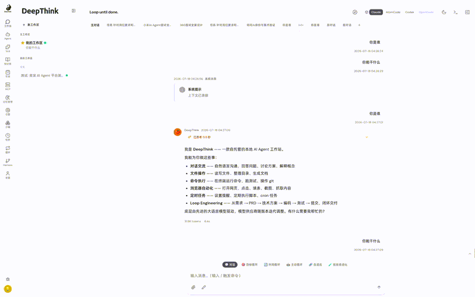
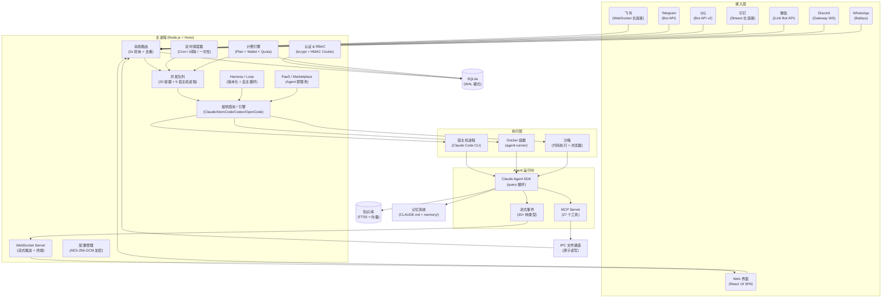

**Languages**: [English](README.md) · [简体中文](README.zh-CN.md) · [Español](README.es.md) · [हिन्दी](README.hi.md) · [العربية](README.ar.md) · [বাংলা](README.bn.md) · [Português](README.pt.md) · [Русский](README.ru.md) · [日本語](README.ja.md) · [Deutsch](README.de.md) · [Français](README.fr.md) · [Bahasa Indonesia](README.id.md) · [اردو](README.ur.md) · [मराठी](README.mr.md) · [తెలుగు](README.te.md) · [Türkçe](README.tr.md) · [தமிழ்](README.ta.md) · [한국어](README.ko.md) · [Tiếng Việt](README.vi.md) · [Italiano](README.it.md) · [Polski](README.pl.md) · [Українська](README.uk.md) · [Nederlands](README.nl.md) · [ไทย](README.th.md) · [ગુજરાતી](README.gu.md) · [Bahasa Melayu](README.ms.md) · [ಕನ್ನಡ](README.kn.md) · [فارسی](README.fa.md) · [Svenska](README.sv.md) · [Čeština](README.cs.md)
<p align="center">
  
</p>

<h1 align="center">DeepThink</h1>

<p align="center">
  自托管的多用户本地 AI Agent Loop Engineering 系统（支持桌面端 + 浏览器 + 移动端）/ Powered By AI Genius Institute，AI光剑.
</p>

<p align="center">
  <a href="LICENSE"></a>
  <a href="https://nodejs.org"></a>
  
  <a href="https://github.com/AIGeniusInstitute/deepthink/stargazers"></a>
</p>

<p align="center">
  <a href="#deepthink-是什么">介绍</a> · <a href="#核心能力">核心能力</a> · <a href="#快速开始">快速开始</a> · <a href="#技术架构">技术架构</a> · <a href="#贡献">贡献</a>
</p>

---


<p align="center">
  
</p>


## DeepThink 是什么

DeepThink，开源企业级自主 Agent 超级智能体自进化平台，是从 Harness Engineering 到 Loop Engineering 范式的先行者，面向企业客户的新一代 AI 基础设施（AI Infra）。DeepThink 平台以多 Agent 协作框架为核心，融合 AI 自主编程（AI Coding）、自主进化（Self-Evolving）、全栈可观测性（Full-Stack Observability）、Bug 自修复闭环（Bug Auto-Fix Loop）与 程序员-Agent 共生协作（Human-Agent Symbiosis），构建一个能持续学习、自我改进、最终成长为超级智能体的企业级 AI 系统：

- **AI 自主研发平台** —— Agent 独立完成软件研发全生命周期，无需人类工程师介入常规编码任务
- **自进化智能体引擎** —— Agent 持续从错误中学习、从代码库中吸收知识、从用户反馈中进化
- **程序员-Agent 协作中枢** —— 每位程序员拥有个人"开发项目"，内含多个并行会话，中央调度防止并发冲突
- **企业级 SaaS 平台** —— 多租户隔离、权限分级、弹性计费、企业集成（飞书/钉钉/企微/LDAP）
- **超级智能体孵化器** —— 通过持续进化，单一 Agent 最终具备完整软件团队的综合能力

> "让每一家企业都拥有一支永不停歇、持续进化的 AI 超级研发团队——从工具使用者，到代码创造者，最终成长为可自我繁衍的超级智能体。让我们在通往 AGI 的道路上一起前行。"

### 关键特性

- **原生 Claude Code 驱动** —— 基于 Claude Agent SDK，底层为完整的 Claude Code CLI 运行时，继承其全部能力
- **Harness & Loop Engineering** —— 版本化 harness 清单（system prompt / subagents / tools / skills），支持 snapshot / diff / eval / promote / rollback，以及长时运行的自主任务循环，每次迭代可审查并重新注入失败原因
- **Agent-as-a-Service（PaaS）** —— 跨租户创建、版本化、挂载、共享并安装数据库支撑的 Agent 定义，具备 per-user 配额、管理员审核和可发布的模板市场
- **多用户隔离** —— Per-user 工作区、Per-user IM 通道、RBAC 权限体系、邀请码注册、审计日志，每个用户拥有独立的执行环境
- **八端消息统一路由** —— 飞书（流式卡片 + Reaction）、Telegram Bot API、QQ Bot API v2、钉钉 Stream、微信 iLink、Discord Gateway、WhatsApp（Baileys）和 Web 界面——统一路由
- **多引擎 & 多提供商** —— 可插拔的代码 Agent 引擎（Claude Code / AtomCode / Codex / OpenCode）和多个 Claude API 提供商，三种负载均衡策略（round-robin / weighted / failover），自动健康检测与恢复
- **沙箱化代码执行** —— Docker + seccomp + cgroups 加固沙箱，用于 Python / Node / shell 代码执行和 Chromium CDP 浏览器自动化，作为 MCP 工具暴露给 Agent
- **计费与用量统计** —— 完整的计费系统（订阅计划、钱包余额、兑换码），Per-model Token 用量追踪与图表可视化
- **移动端 PWA** —— 针对移动端深度优化，支持一键安装到桌面，iOS / Android 均已适配
- **国际化** —— 29 种 UI 语言，支持原生 endonym 和 RTL；Agent 以用户选择的语言回复

> 项目借鉴了 [OpenClaw](https://github.com/nicepkg/OpenClaw) 的容器化架构，并融合了 Claude Code 官方 [Cowork](https://github.com/anthropics/claude-code/tree/main/packages/cowork) 的多会话协作思路：多个独立 Agent 会话并行工作，各自拥有隔离的工作空间和持久记忆，结果通过 IM 渠道送达。

## 功能展示

DeepThink 核心能力的可视化导览 —— 每个界面长什么样、为用户带来什么价值。

| 截图 | 功能 | 核心亮点 | 对您意味着什么 |
|------|------|------|------|
|  | **主工作区** | 多会话标签页、流式 Markdown、实时思考面板、工具调用追踪 | 一个工作区容纳多个并行对话 —— 切换上下文不丢状态，实时观看 Agent 思考与执行 |
|  | **Agent Studio** | 创建 / 版本化 / 挂载自定义 Agent 定义、宿主能力预检、快照管理 | 定义专属专家 Agent（code-reviewer、web-researcher…），跨所有会话复用 |
|  | **Agent 编辑器** | 从 Web UI 编辑 `~/.claude/agents/*.md`，系统提示词 + 工具 + 子 Agent 集于一个表单 | 用自然语言调教 Agent 行为 —— 无需翻文件，改动在下次会话生效 |
|  | **Agent 测试** | 发布前用样例输入运行 Agent，查看完整输出轨迹 | 放心交付 Agent —— 在测试用例上验证行为，再让它在生产中放手运行 |
|  | **多引擎** | 可插拔引擎（Claude Code / AtomCode / Codex / OpenCode），统一的可用性面板 | 为每个任务挑选最强大脑 —— 按会话切换引擎，无需重构平台 |
|  | **引擎配置** | 每引擎守护进程生命周期、提供商凭据、健康状态一目了然 | 并行运行多个提供商 —— 添加凭据、监控存活、自动故障转移 |
|  | **AtomCode 引擎** | 独立 HTTP/SSE 守护进程、每 agent-runner 环回端口、自动拆除 | 将 AtomCode 作为替代编码引擎 —— 每进程独立守护进程，无端口冲突 |
|  | **Marketplace** | 管理员可发布模板（agent / mcp / skill / kb）、浏览、评分、一键安装 | 像应用商店一样发现并安装共享 Agent 与工具 —— 管理员策展，用户一键安装 |
|  | **MCP Servers** | 每工作区 stdio + HTTP MCP Servers，独立于全局配置 | 给每个工作区配置自己的工具集 —— 连接 Notion、GitHub、数据库…精确限定在该项目范围 |
|  | **Skills** | 项目 / 用户 / 工作区级 Skills，通过卷挂载 + 符号链接自动发现 | 按项目教 Agent 新技能 —— 无需重建镜像，下次会话即可见 |
|  | **记忆系统** | 用户全局 / 会话 / 日期记忆，全文检索，在线编辑 | Agent 跨会话记住您 —— 回忆偏好、项目上下文与决策，无需重复说明 |
|  | **定时任务** | Cron / 间隔 / 一次性，Agent 或脚本执行，群组或隔离上下文，完成时 IM 通知 | 自动化周期工作 —— 日报、定期巡检、自运行循环，完成后在飞书/Telegram 通知您 |
|  | **沙箱执行** | Docker + seccomp + cgroups，Python / Node / shell 代码，Chromium CDP 浏览器自动化 | 让 Agent 安全运行不可信代码并驱动浏览器 —— 加固隔离，以 MCP 工具形式暴露 |
|  | **系统监控** | 容器列表、队列状态、每提供商活跃会话、健康检查、一键构建镜像 | 清楚看到正在运行什么 —— 发现卡住的容器、平衡负载、从浏览器重建镜像 |
|  | **用量与计费** | 按模型 token 拆分（输入 / 输出 / 缓存）、USD 成本、柱状 + 饼图、多维筛选 | 掌握 token 与花费去向 —— 按用户、模型、时间范围切片，精准向团队计费 |
|  | **关于** | 版本、构建信息、项目链接、一键更新检查 | 保持最新 —— 查看构建版本，直达文档、仓库与更新渠道 |

## 核心能力
### 多通道接入

| 渠道 | 连接方式 | 消息格式 | 亮点 |
|------|---------|---------|------|
| **飞书** | WebSocket 长连接 | 流式卡片（打字机效果） | 原生流式渲染、多卡片自动分页、图片/文件下载到工作区、Reaction 反馈、群聊 @mention 控制 |
| **Telegram** | Bot API（Long Polling） | Markdown → HTML | 长消息自动分片（3800 字符）、图片经 Vision（base64）、文档文件自动下载到工作区 |
| **QQ** | WebSocket（Bot API v2） | 流式卡片 / 纯文本 | C2C 私聊 + 群聊 @Bot、流式打字机（`stream_messages`）、图片消息（Vision）、配对码绑定 |
| **钉钉** | Stream 协议长连接 | Markdown 卡片 | AI Card 流式打字机、消息去重（LRU 1000 条 / 30min TTL）、图片下载（downloadCode / contentUrl）、群聊 @mention 过滤 |
| **微信** | iLink Bot API（Long Polling） | 纯文本（2000 字符） | 扫码配对、CDN 图片下载 + AES 解密、输入指示器、自动重连 |
| **Discord** | discord.js Gateway（WebSocket） | 流式编辑消息 | Guild / DM、附件处理、2000 字符自动分片、ack Reaction、500ms 节流的流式编辑回复 |
| **WhatsApp** | Baileys（WhatsApp Web 协议） | Markdown → 纯文本 | QR / 配对码登录、多文件认证状态、媒体（图片/视频/音频/文档）下载、群组成员事件 |
| **Web** | WebSocket 实时 | 流式 Markdown | 图片粘贴/拖拽上传、虚拟滚动、Mermaid 图表渲染、图片灯箱 |

每个用户都可以独立配置自己的 IM 通道（飞书应用凭据、Telegram Bot Token、QQ Bot 凭据、钉钉 Client ID/Secret、微信 iLink Token、Discord Bot Token、WhatsApp QR），互不干扰。消息统一路由：各渠道来源的消息回复到对应渠道，Web 来源的消息在 Web 端回复。


### 多引擎 & 多提供商

DeepThink 支持可插拔的代码 Agent 引擎和多个 API 提供商，用于高可用部署：

- **可插拔引擎** —— 每个会话可在 Claude Code、AtomCode、Codex、OpenCode 之间选择；Engines 页面展示统一的可用性仪表盘并管理每个引擎的守护进程生命周期
- **三种负载均衡策略** —— Round-Robin、Weighted、Failover
- **自动健康检测** —— 连续错误追踪（默认 3 次错误标记为不健康），5 分钟自动恢复探测
- **按工作区切换提供商** —— 监控页可指定每个工作区使用哪个提供商
- **OAuth 凭据支持** —— 支持 Claude Code OAuth Token，兼容所有认证方式；sticky provider 选择避免跨 OAuth thinking block 签名失效
- **活跃会话数** —— 实时展示每个提供商的并发使用量


### Agent 执行引擎

基于 [Claude Agent SDK](https://github.com/anthropics/claude-agent-sdk-typescript) 构建；SDK 底层会调用完整的 Claude Code CLI。

- **Per-user 主工作区** —— 每个用户有固定的主工作区（admin 用 host 模式，member 用 container 模式）；IM 消息路由到各自的主工作区
- **宿主机模式** —— Agent 直接在宿主机运行，访问本地文件系统，零 Docker 依赖（admin 主工作区的默认模式）
- **容器模式** —— Docker 隔离执行，非 root 用户，预装 40+ 工具（member 主工作区的默认模式）
- **多会话并发** —— 最多 20 个容器 + 5 个宿主机进程同时运行，会话级队列调度
- **脚本任务** —— 定时任务支持 Agent 和 Script 两种执行类型；Script 模式直接执行 shell 命令
- **自定义工作目录** —— 每个会话可配置 `customCwd` 指向不同的项目
- **自动失败恢复** —— 指数退避重试（5s → 80s，最多 5 次）；上下文溢出时自动压缩并归档历史
### Harness Engineering

管理员可以对模型的 **harness**（system prompt、subagents、tools、skills 的完整集合）进行 snapshot、diff、eval、promote 和 rollback，作为版本化清单。每个 harness 版本在 promote 前可进行行为评测并基于证据判定，从而安全地演进 Agent 配置，并在出现回退时立即回滚。

### Loop Engineering

长时运行的自主任务循环，在你离开后仍持续工作。支持六种循环模式 —— `goal`、`loop`、`schedule`、`proactive`、`adaptive` 和 `skill_evolution`。每次迭代由 SDK 审查，失败原因被重新注入到下一次迭代中，闭合自进化回路。循环由斜杠命令驱动，并实时发出 `loop_start` / `loop_iteration_start` / `loop_iteration_end` / `loop_goal_check` / `loop_review_result` / `loop_end` 流式事件。


### Agent-as-a-Service（PaaS）

将 Agent 变为可共享、可安装产品的多租户平台：

- **数据库支撑的 Agent 定义** —— 创建并版本化 Agent 定义，包含快照、挂载、协作者和分享
- **管理员审核流程** —— Per-user 配额和发布前的管理员审核
- **安装并挂载** —— 将共享 Agent 安装到自己的工作区；按需挂载到会话中
- **市场** —— 管理员可发布的模板市场（agent / mcp / skill / kb 模板），支持浏览、评分 / 评论、举报、一键安装，以及幂等的启动期播种


### 知识库

Per-user 的知识库，让 Agent 基于你的自有文档工作：

- **FTS5 全文检索** —— 内置 SQLite FTS5 对挂载文档建立索引
- **向量嵌入** —— 可选的 OpenAI 兼容 embedding 端点，用于语义检索
- **文档抽取** —— 从 PDF / DOCX / MD 等格式抽取纯文本用于索引，Office 文档支持 LibreOffice → PDF 预览
- **`kb_search` MCP 工具** —— Agent 在运行时直接查询挂载的知识库


### 沙箱化代码执行

一个加固的沙箱，用于运行不可信代码和驱动浏览器，作为 MCP 工具暴露给 Agent：

- **Docker + seccomp + cgroups** —— 通过 seccomp profile 和资源限制实现加固隔离
- **代码执行** —— `sandbox_run_code` / `sandbox_close`，支持 Python、Node 和 shell，可选用 session 或 single-exec 模式
- **浏览器自动化** —— `sandbox_browser_navigate` / `_click` / `_type` / `_screenshot` / `_evaluate`，通过沙箱内的转发器驱动 Chromium CDP target


### Claude Code Plugins

对 Claude Code Plugins 的一等支持：

- **Per-user 启用/禁用** —— 每个用户独立选择启用插件；更改在下一次新会话生效（UI 会相应提示）
- **不可变的内容寻址 catalog** —— 管理员扫描宿主机一次构建共享 catalog；plugin snapshot 按内容寻址且不可变
- **依赖预检** —— 在 materialize 前对 `commands/*.md` 的 `allowed-tools` 和 hook 命令做 best-effort 检查，并提供手动覆盖表
- **运行时 materialize** —— Per-user 的 enabled refs 在 spawn 时被 materialize 到版本化的 `--plugin-dir` 路径


### Agent Studio & Agent 定义

定义自定义 Agent 的双层：

- **全局 agents** —— 直接从 Web UI 编辑 `~/.claude/agents/*.md`
- **数据库支撑的用户 Agent** —— 版本化快照、工作区挂载、协作者和分享链接
- **宿主能力预检** —— 在 Agent 运行前校验宿主机具备所需工具


### 对话追踪（Chat Trace）

Agent 执行的 DAG 可视化 —— 每个节点（turn / tool / review / goal_check / skill / subagent）都渲染为可导航的图，支持用户标注和客户端侧 rerun / continue-from-here，为 Agent 如何得到答案提供全栈可观测性。


### Supervisor & i18n

- **Supervisor SubAgent** —— 可按会话开启的意图解析器，在主 Agent 运行前对进入的消息进行预分流（`clarify` / `delegate` / `auto`），减少对模糊请求的无效工作
- **国际化** —— 29 种 UI 语言，支持原生 endonym 和 RTL 标记；所选语言会注入到 Agent prompt 中，使回复匹配用户语言
### 多会话 & Agent 定义

同一工作区内支持多个独立会话，每个会话有独立的上下文和 session：

- **会话标签** —— 可拖拽的标签栏；支持创建、重命名、删除会话
- **Per-conversation IM 绑定** —— 每个会话可独立绑定到一个 IM 通道
- **自定义 Agent 定义** —— 创建自定义 SubAgent（如 code-reviewer、web-researcher），复用 Claude Agent SDK 的 `agents` 选项
- **独立的会话持久化** —— 每个会话维护自己的 Claude session，完全隔离


### 实时流式体验

Agent 的思考与执行过程通过 **30+ 种流式事件类型**（文本、思考、工具调用、hooks、任务、记忆回放、循环、用量、todo、上下文审计等）实时推送到前端：

- **思考过程** —— 可折叠的 Extended Thinking 面板，逐字符流式呈现
- **工具调用追踪** —— 工具名称、执行时长、嵌套深度、输入参数摘要
- **调用轨迹时间线** —— 最近若干条工具调用记录，便于快速回溯
- **Hook 执行状态** —— PreToolUse / PostToolUse Hook 的开始、进度、结果
- **循环事件** —— 自主循环的实时 `loop_iteration_*` 和 `loop_review_result` 事件
- **流式 Markdown 渲染** —— GFM 表格、代码高亮、Mermaid 图表、图片灯箱
- **分享为图片** —— 将消息导出为可分享的图片
- **飞书流式卡片** —— 原生打字机效果，三层 fallback 链（Streaming → CardKit v1 → Legacy），多卡片自动分页，单元素支持 10 万字符
- **钉钉 / QQ / Discord 流式** —— 各渠道原生的流式卡片 / 流式编辑打字机效果


### 计费系统

<details>
<summary>完整的订阅与用量计费系统（点击展开）</summary>
<br/>

面向多用户部署的计费系统，支持灵活的计费模式：

- **订阅计划管理** —— 管理员创建计费计划，设定价格、Token 配额和有效期
- **用户钱包** —— 每个用户拥有独立余额，支持充值和消费
- **兑换码系统** —— 创建带最大使用次数和过期时间的兑换码
- **Per-model Token 追踪** —— Token 用量精确到模型级别（输入/输出/缓存）
- **成本计算** —— 基于模型定价自动计算美元成本
- **管理控制台** —— 计划 CRUD、用户余额管理、兑换码管理、计费审计日志
- **配额检查** —— 请求前自动检查用户配额和余额；超额时阻止执行

</details>


### 用量统计

- **Token 用量拆分** —— 输入 token、输出 token、缓存读取/创建 token，各自独立追踪
- **成本计算** —— 按模型自动计算成本，以美元格式化
- **多维度筛选** —— 按用户、模型、时间范围（7/14/30/90 天）灵活筛选
- **图表可视化** —— 柱状图和饼图展示用量趋势与分布
- **管理员视图** —— 管理员可查看所有用户的用量数据
### 27 个 MCP 工具

运行时 Agent 通过内置 MCP Server 与主进程通信（22 个无条件 + 5 个条件触发）：

| 工具 | 说明 |
|------|------|
| `send_message` / `send_image` / `send_file` | 运行期间向用户/群组立即发送消息、图片或文件 |
| `schedule_task` / `list_tasks` / `update_task` | 创建定时/循环/一次性任务（cron / interval / once）；列出并更新任务 |
| `pause_task` / `resume_task` / `cancel_task` | 暂停、恢复、取消任务 |
| `register_group` | 注册新群组（仅 admin 主工作区可用） |
| `install_skill` / `uninstall_skill` / `create_skill` | 安装、卸载或创建 Skill（仅主工作区可用） |
| `memory_append` / `memory_search` / `memory_get` | 追加、全文检索并读取工作区记忆文件 |
| `kb_search` | 检索挂载的知识库（FTS5 + 可选向量嵌入） |
| `sandbox_run_code` / `sandbox_close` | 在加固沙箱中运行 Python / Node / shell 代码；关闭沙箱会话 |
| `sandbox_browser_navigate` / `_click` / `_type` / `_screenshot` / `_evaluate` | 在沙箱内驱动 Chromium CDP 浏览器 |
| `discord_get_server_info` / `discord_get_channel_info` / `discord_get_history` | 读取 Discord 服务器/频道元数据和消息历史 |


### 定时任务

- **三种调度模式** —— Cron 表达式 / 固定间隔 / 一次性执行
- **两种执行类型** —— Agent（启动完整的 Claude Agent）/ Script（直接执行 shell 命令）
- **两种上下文模式** —— `group`（在指定会话中执行）/ `isolated`（独立隔离环境）
- **通知渠道** —— 任务完成时通知指定 IM 通道（飞书 / Telegram / QQ / 钉钉 / 微信 / Discord）
- **完整执行日志** —— 耗时、状态、结果，全部通过 Web 界面管理


### 记忆系统

Agent 自主维护跨会话的持久记忆：

- **用户全局记忆** —— `data/groups/user-global/{userId}/CLAUDE.md`；每个用户有独立的全局记忆，所有会话可读
- **会话记忆** —— `data/groups/{folder}/CLAUDE.md`，会话私有
- **日期记忆** —— `memory/YYYY-MM-DD.md`，用于时间相关信息
- **对话归档** —— PreCompact Hook 在上下文压缩前自动归档到 `conversations/`
- **全文检索** —— 从 Web 界面在线编辑 + 检索

### 工作区级配置

每个工作区可独立配置自己的运行时环境：

- **Per-workspace MCP Servers** —— 为工作区添加 stdio 或 HTTP MCP Servers，独立于全局配置
- **Per-workspace Skills** —— 为工作区安装特定 Skills，按需启用
- **Per-workspace 环境变量** —— 群组级环境变量覆盖，优先级高于全局配置
- **共享工作区成员** —— 多个用户可加入同一工作区协作
- **跨组 ACL** —— 纯授权函数治理群组间 IPC 路由（folder / user / 绑定 IM 规则），使非主工作区 Agent 能安全地向绑定通道发消息


### IM 绑定系统

将 IM 通道绑定到工作区的灵活机制：

- **工作区级绑定** —— 将 IM 群组/私聊绑定到指定工作区或特定会话
- **飞书话题群映射** —— 绑定飞书话题群后，每个话题自动映射为独立会话并拥有自己的上下文；工作区切换为纵向话题列表导航
- **斜杠命令管理** —— `/bind <target>` 绑定，`/unbind` 解绑，`/where` 查看当前绑定，`/new <name>` 创建新工作区并绑定
- **Web 设置管理** —— 在设置页查看并管理所有 IM 绑定


### Skills 系统

- **项目级 Skills** —— 放在 `container/skills/`，自动挂载到所有容器
- **用户级 Skills** —— 放在 `~/.claude/skills/`，自动挂载到所有容器
- **工作区级 Skills** —— 通过 Web 界面为特定工作区安装 Skills
- 无需重新构建镜像；通过卷挂载 + 符号链接实现自动发现

### Web 终端

基于 xterm.js + node-pty 的完整终端：WebSocket 连接、可拖拽可调整大小的面板，直接从 Web 界面操作容器。


### Docker 构建 UI

在 Web 监控页一键构建 Docker 镜像；构建日志通过 WebSocket 实时流式输出 —— 无需在终端手动执行命令。


### 移动端 PWA

针对移动端优化的 Progressive Web App，可从移动浏览器一键安装到桌面：

- **原生体验** —— 全屏模式、独立应用图标，视觉上与原生应用无异
- **响应式布局** —— Mobile-first 设计；聊天界面、设置页和监控面板均适配小屏
- **iOS / Android 适配** —— 安全区处理、滚动优化、字体渲染、触控交互
- **随时可用** —— 随时随地拿出手机即可与 AI Agent 对话、查看执行状态、管理任务


### 文件管理

- **完整文件浏览器** —— 树形目录结构、文件类型图标
- **文件操作** —— 上传（50MB 限制，支持拖拽）/ 下载 / 删除 / 创建目录
- **文件预览** —— 在线文本文件查看、图片预览 + 灯箱、Markdown 渲染、Office 文档 → PDF 预览
- **安全** —— 路径遍历防护 + 系统路径保护

### 安全 & 多用户

| 能力 | 说明 |
|------|------|
| **用户隔离** | 每个用户拥有独立主工作区（`home-{userId}`）、工作目录和 IM 通道 |
| **个性化** | 用户可自定义 AI 名称、头像 emoji / 颜色 / 上传图片 |
| **RBAC** | 5 种权限，4 种角色模板（admin_full / member_basic / ops_manager / user_admin） |
| **注册控制** | 开放注册 / 邀请码注册 / 关闭注册 |
| **审计日志** | 18 种事件类型，完整操作追踪 |
| **加密存储** | API 密钥使用 AES-256-GCM 加密；Web API 仅返回掩码值 |
| **挂载安全** | 白名单校验 + 黑名单模式匹配（`.ssh`、`.gnupg` 等敏感路径） |
| **终端权限** | 用户可访问自己容器的 Web 终端（host 模式不支持） |
| **登录保护** | 5 次失败锁定 15 分钟，bcrypt 12 轮，HMAC Cookie，30 天会话有效期 |
| **会话管理** | 查看并删除活跃登录会话；支持多设备管理 |
| **CORS / WS 防御** | 可配置放行来源；WebSocket upgrade 拒绝非白名单来源并返回 403（CSWSH 防御） |
| **PWA** | 一键安装到手机桌面，针对移动端深度优化，随时随地使用 AI Agent |
## 快速开始

### 前置条件

开始前，请确保已安装以下依赖：

**必装**

- **[Node.js](https://nodejs.org) >= 20** —— 运行主服务和前端构建
  - macOS：`brew install node`
  - Linux：参见 [NodeSource](https://github.com/nodesource/distributions) 或使用 `nvm`
  - Windows：[从官网下载](https://nodejs.org)

- **[Docker](https://www.docker.com/)** —— 在容器模式下运行 Agent 和代码执行沙箱（member 用户必装；admin 仅用 host 模式可跳过）
  - macOS：推荐 [OrbStack](https://orbstack.dev)（更轻量），或 [Docker Desktop](https://www.docker.com/products/docker-desktop/)
  - Linux：`curl -fsSL https://get.docker.com | sh`
  - Windows：[Docker Desktop](https://www.docker.com/products/docker-desktop/)

- **Claude API Key** —— Anthropic 官方或兼容的中转服务（各种 Coding Plan 均可）；启动后在 Web 界面配置

**可选**（仅当你需要对应 IM 通道时）

- 飞书企业自建应用凭据 —— 在[飞书开放平台](https://open.feishu.cn)创建
- Telegram Bot Token —— 通过 [@BotFather](https://t.me/BotFather) 获取
- QQ Bot 凭据 —— 在 [QQ 开放平台](https://q.qq.com/qqbot/openclaw/index.html)创建
- 钉钉 Bot 凭据 —— 在[钉钉开放平台](https://open.dingtalk.com)创建
- 微信 iLink Bot Token
- Discord Bot Token —— 在 [Discord Developer Portal](https://discord.com/developers/applications)创建
- WhatsApp 账号 —— 首次启动时扫码（Baileys 协议）

> Claude Code CLI 无需手动安装 —— 作为项目依赖打包的 Claude Agent SDK 已包含完整的 CLI 运行时，首次 `make start` 时会自动安装。

### 安装与启动

```bash
# 1. 克隆仓库
git clone https://github.com/AIGeniusInstitute/deep-think.git
cd deepthink

# 2. 一键启动（首次运行自动安装依赖 + 编译）
make start

打开：http://localhost:9898

如需公网访问，请自行用 nginx/caddy 配置反向代理
```

按设置向导完成初始化：

1. **创建管理员** —— 自定义用户名和密码（无默认账号）
2. **配置 Claude API** —— 填入 API key 和模型（支持中转服务；可配置多个提供商）
3. **配置 IM 通道**（可选）—— 飞书 / Telegram / QQ / 钉钉 / 微信 / Discord / WhatsApp
4. **开始对话** —— 直接从 Web 聊天页发消息

> 所有配置均通过 Web 界面完成，无需任何配置文件。API 密钥以 AES-256-GCM 加密存储。


### 启用容器模式

admin 用户默认使用 host 模式（无需 Docker），开箱即用。对于容器模式（member 用户注册后自动使用）：

```bash
# 构建容器镜像
./container/build.sh

#（可选）构建用于代码执行 + 浏览器自动化的加固沙箱镜像
make sandbox-build
```

新用户注册时会自动创建容器模式主工作区（`home-{userId}`）—— 无需额外配置。
### 配置飞书集成

1. 前往[飞书开放平台](https://open.feishu.cn)创建企业自建应用
2. 在应用的"事件订阅"下添加：`im.message.receive_v1`（接收消息）
3. 在应用的"权限管理"下启用以下权限：
   - `cardkit:card:write`（创建并更新卡片）
   - `im:chat` / `im:chat:read` / `im:chat:readonly`（群组信息）
   - `im:message`（发送消息）
   - `im:message.group_at_msg:readonly`（接收群 @ 消息）
   - `im:message.group_msg`（接收所有群消息）—— **敏感权限**，需管理员审批。无此权限时，群内仅处理 @-Bot 消息
   - `im:message.p2p_msg:readonly`（接收私聊消息）
   - `im:resource`（获取并上传图片/文件资源）

4. 发布应用版本并等待审批
5. 在 DeepThink Web 界面"Settings → IM Channels → Feishu"下填入 App ID 和 App Secret

每个用户可在个人设置中独立配置飞书应用凭据，从而启用 per-user 飞书 Bot。

> **群聊 mention 控制**：默认情况下群聊需要 @-Bot 才会响应。使用 `/require_mention false` 切换为全量消息响应（需 `im:message.group_msg` 权限）。

> **飞书话题群**：将飞书话题群（`chat_mode=topic` 或 `group_message_type=thread`）绑定到工作区后，每个话题会自动创建一个拥有独立上下文和消息历史的会话 Agent。Web 界面切换为纵向话题列表，支持搜索和删除。解绑时会自动清理所有话题会话。


### 配置 Telegram 集成

1. 在 Telegram 中找到 [@BotFather](https://t.me/BotFather)，发送 `/newbot` 创建 Bot
2. 保存返回的 Bot Token
3. 在 DeepThink Web 界面"Settings → IM Channels → Telegram"下填入 Bot Token
4. **群聊使用**：要在 Telegram 群中使用 Bot，请在 BotFather 中发送 `/mybots` → 选择该 Bot → Bot Settings → Group Privacy → Turn off；否则 Bot 只能收到 `/` 命令消息


### 配置 QQ 集成

1. 前往 [QQ 开放平台](https://q.qq.com/qqbot/openclaw/index.html)，用手机 QQ 扫码注册并登录
2. 创建一个 bot，设置名称和头像
3. 在 bot 管理页面获取 **App ID** 和 **App Secret**
4. 在 DeepThink Web 界面"Settings → IM Channels → QQ"下填入 App ID 和 App Secret
5. **配对**：在设置页生成配对码，然后在 QQ 中向 Bot 发送 `/pair <配对码>` 完成绑定

> QQ Bot 使用官方 API v2 协议，支持 C2C 私聊和群聊 @-Bot 消息。在群聊中，Bot 只接收 @-Bot 消息。C2C 私聊支持流式打字机回复。


### 配置钉钉集成

1. 前往[钉钉开放平台](https://open.dingtalk.com)创建企业内部应用
2. 在 App Management → Bots & Messaging 下启用"Bot Configuration"
3. 选择 **Stream mode**（非 HTTP 回调模式）以接收消息
4. 获取应用的 **Client ID**（AppKey）和 **Client Secret**（AppSecret）
5. 在 DeepThink Web 界面"Settings → IM Channels → DingTalk"下填入 Client ID 和 Client Secret

> 钉钉 Bot 支持私聊和群聊。在群聊中，Bot 只响应 @-Bot 消息。支持 AI Card 流式打字机效果。


### 配置微信集成

1. 在 DeepThink Web 界面"Settings → IM Channels → WeChat"下启用微信通道
2. 填入 iLink Bot Token
3. 点击"扫码配对"生成二维码
4. 用微信扫码完成绑定

> 微信消息限制为 2000 字符；超长内容会自动分片。来自微信 CDN 的图片会先下载并 AES 解密后再传给 Agent。


### 配置 Discord 集成

1. 前往 [Discord Developer Portal](https://discord.com/developers/applications) 创建应用
2. 在"Bot"标签下创建一个 bot 并复制其 **Token**
3. 在"OAuth2 → URL Generator"下选择 `bot` 和（可选）`applications.commands` scope，勾选所需权限（Send Messages、Read Message History、Attach Files），打开生成的 URL 将 bot 邀请到你的服务器
4. 在 DeepThink Web 界面"Settings → IM Channels → Discord"下填入 Bot Token

> Discord 支持 guild（服务器）频道和私聊。长消息在 2000 字符处自动分片；回复采用 500ms 节流的流式编辑打字机效果，Agent 开始工作时会添加一个 ack Reaction。


### 配置 WhatsApp 集成

1. 在 DeepThink Web 界面"Settings → IM Channels → WhatsApp"下启用 WhatsApp 通道
2. 点击"生成二维码"
3. 在手机 WhatsApp 上扫码（Settings → Linked Devices）
4. 等待连接建立

> WhatsApp 集成使用社区维护的 Baileys 库（WhatsApp Web 协议）。登录状态通过 multi-file auth 持久化，因此只需在首次启动时扫码。媒体（图片 / 视频 / 音频 / 文档）消息会下载到工作区。详见 [`docs/channels/whatsapp.md`](docs/channels/whatsapp.md)（包含风险提示）。
### IM 斜杠命令

在飞书 / Telegram / QQ / 钉钉 / 微信 / Discord / WhatsApp 中，以 `/` 开头的消息会被拦截为斜杠命令（未知命令会回退为普通消息处理）：

| 命令 | 缩写 | 用途 |
|------|------|------|
| `/list` | `/ls` | 列出所有工作区和会话 |
| `/status` | - | 查看当前工作区/会话状态 |
| `/where` | - | 查看当前绑定位置和回复策略 |
| `/bind <target>` | - | 绑定到指定工作区或 Agent（如 `/bind myws` 或 `/bind myws/a3b`） |
| `/unbind` | - | 解绑回到默认工作区 |
| `/new <name>` | - | 创建新工作区并将当前群绑定到它 |
| `/recall` | `/rc` | AI 总结最近的对话历史 |
| `/clear` | - | 清除当前会话的会话上下文 |
| `/require_mention` | - | 切换群聊响应模式：`true`（需要 @）或 `false`（全量响应） |


### 执行模式

| 模式 | 描述 | 对象 | 前置依赖 |
|------|------|---------|---------|
| **宿主机模式** | Agent 直接在宿主机运行，访问本地文件系统 | Admin 主工作区（`folder=main`） | Claude Agent SDK（自动安装） |
| **容器模式** | Agent 在 Docker 容器中隔离运行，预装 40+ 工具 | Member 主工作区（`folder=home-{userId}`） | Docker Desktop + 已构建镜像 |

admin 主工作区默认为 host 模式；member 注册时自动创建容器模式主工作区。你也可以在 Web 界面的会话管理中手动切换执行模式。

### 容器工具链

容器镜像基于 `node:22-slim`，预装以下工具：

| 类别 | 工具 |
|------|------|
| AI / Agent | Claude Code CLI、Claude Agent SDK、MCP SDK |
| 浏览器自动化 | Chromium、agent-browser |
| 编程语言 | Node.js 22、Python 3（pip / venv）、Go |
| 构建工具链 | build-essential、cmake、pkg-config |
| 文本搜索 | ripgrep (`rg`)、fd-find (`fd`) |
| 多媒体处理 | ffmpeg、ImageMagick、Ghostscript、Graphviz |
| 文档转换 | Pandoc、poppler-utils（PDF 工具） |
| 数据库客户端 | SQLite3、MySQL Client、PostgreSQL Client、Redis Tools |
| 网络工具 | curl、wget、openssh-client、dnsutils、iputils-ping、lsof |
| 飞书 CLI | feishu-cli（预编译二进制 + Skills） |
| Shell | Zsh + Oh My Zsh（ys 主题） |
| 其他 | git、jq、tree、file、shellcheck、zip/unzip、rsync、bc、patch |
## 技术架构

### 架构图

<p align="center">
  
</p>




**数据流**：消息从接入层（8 个通道）进入主进程，去重并路由后派发到并发队列。队列通过提供商池选择 API key / 引擎，并启动宿主机进程、Docker 容器或沙箱。容器内的 agent-runner 调用 Claude Agent SDK 的 `query()` 函数。流式事件（30+ 种类型：思考、文本、工具调用、hooks、任务、记忆回放、循环、用量等）通过 stdout marker 协议传回主进程，再通过 WebSocket 广播到 Web 客户端，或通过 IM API 回复到各通道。MCP Server 通过基于文件的 IPC 通道提供 27 个工具，实现 Agent 与主进程的双向通信。计费引擎在每次请求前检查配额和余额。Harness/Loop 层对 Agent 配置做快照并演进，同时驱动自主任务循环。
### 技术栈

| 层 | 技术 |
|------|------|
| **后端** | Node.js 22 · TypeScript 5.9 · Hono · better-sqlite3 (WAL) · ws · node-pty · Pino · Zod 4 |
| **前端** | React 19 · Vite 6 · Zustand 5 · Tailwind CSS 4 · shadcn/ui · Radix UI · Lucide Icons · react-markdown · mermaid · recharts · @dnd-kit · xterm.js · @tanstack/react-virtual · PWA |
| **Agent** | Claude Agent SDK · Claude Code CLI · MCP SDK · IPC 文件通道 |
| **引擎** | Claude Code · AtomCode · Codex · OpenCode（可插拔，守护进程管理） |
| **PaaS** | 数据库支撑的 Agent 定义 · 模板市场 · per-user 配额 · 管理员审核 |
| **Harness / Loop** | 版本化 harness 清单 · 自主任务循环 · 每次迭代 SDK 审查 |
| **沙箱** | Docker + seccomp + cgroups · Chromium CDP 浏览器自动化 |
| **容器** | Docker (node:22-slim) · Chromium · agent-browser · Python · Go · 40+ 预装工具 |
| **安全** | bcrypt (12 轮) · AES-256-GCM · HMAC Cookie · RBAC · 路径遍历防护 · 挂载白名单 · 跨组 ACL |
| **IM 集成** | @larksuiteoapi/node-sdk（飞书）· grammY（Telegram）· QQ Bot API v2 · dingtalk-stream（钉钉）· iLink Bot API（微信）· discord.js（Discord）· Baileys（WhatsApp） |

### 目录结构

所有运行时数据统一在 `data/` 目录下，启动时自动创建 —— 无需手动初始化。

```
deepthink/
├── src/                          # 后端源码
│   ├── index.ts                  #   入口：消息轮询、IPC 监听、容器生命周期
│   ├── web.ts                    #   Hono app、WebSocket、静态文件
│   ├── routes/                   #   28 个路由模块（auth / groups / files / config / monitor /
│   │                             #   memory / tasks / skills / admin / browse / agents /
│   │                             #   mcp-servers / plugins / usage / billing / bug-report /
│   │                             #   chat-trace / harness / loops / sandbox /
│   │                             #   agent-definitions / workspace-config / paas-admin /
│   │                             #   paas-agents / paas-embedding / paas-knowledge-bases /
│   │                             #   paas-marketplace / paas-share)
│   ├── feishu.ts                 #   飞书连接工厂（WebSocket 长连接）
│   ├── feishu-streaming-card.ts  #   飞书流式卡片（打字机 + 三层 fallback）
│   ├── telegram.ts               #   Telegram 连接工厂（Bot API）
│   ├── qq.ts                     #   QQ 连接工厂（Bot API v2 WebSocket）
│   ├── qq-streaming-card.ts      #   QQ 流式卡片（stream_messages 打字机）
│   ├── dingtalk.ts               #   钉钉连接工厂（Stream 协议）
│   ├── dingtalk-streaming-card.ts#   钉钉 AI Card 流式控制器
│   ├── wechat.ts                 #   微信连接工厂（iLink Bot API）
│   ├── whatsapp.ts               #   WhatsApp 连接工厂（Baileys）
│   ├── discord.ts                #   Discord 连接工厂（discord.js Gateway）
│   ├── discord-streaming-edit.ts #   Discord 流式编辑控制器
│   ├── im-manager.ts             #   IM 连接池（per-user 七通道管理）
│   ├── im-safety/                #   IM 安全原语（processing lock + stale detector）
│   ├── container-runner.ts       #   Docker / 宿主机进程管理
│   ├── group-queue.ts            #   并发控制队列
│   ├── provider-pool.ts          #   多提供商负载均衡
│   ├── atomcode-daemon-manager.ts#   可插拔引擎守护进程生命周期
│   ├── harness-*.ts              #   Harness Engineering（registry / eval / meta-loop）
│   ├── loop-orchestrator.ts      #   Loop Engineering 编排器
│   ├── supervisor.ts             #   Supervisor SubAgent（意图分流）
│   ├── plugin-*.ts               #   Claude Code Plugins（catalog / importer / materializer）
│   ├── embedding.ts              #   知识库向量嵌入
│   ├── cross-group-acl.ts        #   跨组 IPC 授权
│   ├── office-converter.ts       #   Office → PDF 预览 + 文本抽取
│   ├── i18n-languages.ts        #   29 种语言 i18n
│   ├── billing.ts                #   计费引擎（plans、wallet、quota）
│   ├── runtime-config.ts         #   AES-256-GCM 加密配置
│   ├── task-scheduler.ts         #   定时任务调度器
│   ├── script-runner.ts          #   脚本任务执行器
│   ├── file-manager.ts           #   文件安全（路径遍历防护）
│   ├── mount-security.ts         #   挂载白名单 / 黑名单
│   └── db.ts                     #   SQLite 数据层（Schema v1→v51）
│
├── web/                          # 前端（React + Vite）
│   └── src/
│       ├── pages/                #   26 个页面
│       ├── components/           #   UI 组件（chat / settings / billing / monitor / ...）
│       ├── stores/               #   21 个 Zustand store
│       └── api/client.ts         #   统一 API 客户端
│
├── container/                    # Agent 容器
│   ├── Dockerfile                #   容器镜像定义
│   ├── build.sh                  #   构建脚本
│   ├── sandbox/                  #   加固沙箱镜像（代码执行 + 浏览器）
│   ├── agent-runner/             #   容器内执行引擎
│   │   └── src/
│   │       ├── index.ts          #     Agent 主循环 + 流式事件
│   │       └── mcp-tools.ts       #     27 个 MCP 工具
│   └── skills/                   #   项目级 Skills
│
├── shared/                       # 跨项目共享类型定义
│   ├── stream-event.ts           #   StreamEvent 类型单一真相源（30+ 种）
│   ├── channel-prefixes.ts       #   IM 渠道前缀映射（7 个 IM 渠道）
│   └── image-detector.ts         #   图片 MIME 检测
│
├── scripts/                      # 构建辅助脚本
│   ├── sync-stream-event.sh      #   将 shared/ 类型同步到各子项目
│   └── check-stream-event-sync.sh#   校验类型副本一致性
│
├── config/                       # 项目配置
│   ├── default-groups.json       #   预注册群组
│   ├── mount-allowlist.json      #   容器挂载白名单
│   └── global-claude-md.template.md # 全局 CLAUDE.md 模板
│
├── desktop/                      # 桌面版 Electron 壳（macOS / Windows / Linux）
│
├── data/                         # 运行时数据（启动时自动创建）
│   ├── db/messages.db            #   SQLite 数据库（WAL 模式）
│   ├── groups/{folder}/          #   会话工作目录（Agent 可读写）
│   │   ├── downloads/{channel}/  #     IM 文件下载（按日期子目录）
│   │   └── CLAUDE.md             #     会话私有记忆
│   ├── groups/user-global/{id}/  #   用户全局记忆目录
│   ├── sessions/{folder}/.claude/#   Claude 会话持久化
│   ├── ipc/{folder}/             #   IPC 通道（input / messages / tasks）
│   ├── env/{folder}/env          #   容器环境变量文件
│   ├── memory/{folder}/          #   日期记忆
│   └── config/                   #   加密配置文件
│
└── Makefile                      # 常用命令
```
### 开发指南

#### 首次安装

```bash
make install              # 安装根项目依赖 + 编译 agent-runner
make install-host-tools   # 安装 host 模式所需的外部工具（feishu-cli、agent-browser、uv）+ 刷新 builtin-skills 缓存
```

`make install` 会自动修复 node-pty 的 `spawn-helper` 可执行权限（在 macOS arm64 上，预编译二进制偶尔缺少 +x 位，会导致 Web 终端 PTY 模式失效）。

#### 日常开发

```bash
make dev              # 并行启动前端 + 后端（热重载）；首次运行自动安装依赖并构建容器镜像
make dev-backend      # 仅启动后端（tsx 直跑 TS，无需预构建）
make dev-web          # 仅启动前端（Vite 在 5173）
make status           # 查看服务状态（进程、端口、日志、Docker 容器）
make logs             # 实时查看日志（仅在手动后台化时有效，如 make start > /tmp/deepthink.log 2>&1 &）
make stop             # 停止服务（pm2 托管走 pm2 stop，否则杀掉监听端口的进程）
```

`make dev` 会自动检测 `package.json` 是否比 `node_modules` 更新，若是则重新运行 `make install`；同时确保 Docker 镜像存在（容器模式所需）。如果系统启用了 pm2，它会先暂停 pm2 以释放端口，退出时恢复。

#### 构建与类型检查

```bash
make build            # 编译全部（后端 + 前端 + agent-runner，含 sync-types）
make build-backend    # 仅后端
make build-web        # 仅前端
make typecheck        # 全量 TypeScript 类型检查（后端 + 前端 + agent-runner）
make typecheck-backend    # 仅后端
make typecheck-web        # 仅前端
make typecheck-agent-runner  # 仅 agent-runner
make format           # 用 Prettier 格式化代码
make format-check     # 仅检查格式（用于 CI，不修改文件）
make test             # 运行约束测试（vitest；重构前后必跑）
make sync-types       # 将 shared/ 类型定义同步到各子项目（stream-event.ts、image-detector.ts、channel-prefixes.ts）
make clean            # 清理全部构建产物（dist/、web/dist/、container/agent-runner/dist/）
```

> 修改 `shared/stream-event.ts` 后必须运行 `make sync-types` 同步到三个子项目，否则类型会不一致。`make build` 和 `make typecheck` 会自动触发同步。
#### 生产部署

```bash
make start            # 生产一键启动（前台阻塞运行，日志输出到终端）
make update-sdk       # 手动将 agent-runner + 主服务的 Claude Agent SDK 更新到最新版本
make ensure-latest-sdk  # 启动前自动检查 SDK 是否有新版本（有则更新，无则跳过；已内置到 make start）
make sandbox-build    # 构建加固沙箱镜像 deepthink-sandbox:latest（代码执行 + 浏览器自动化）
```

如需后台运行：`make start > /tmp/deepthink.log 2>&1 &`，然后用 `make logs` 滚动日志，`make status` 查看进程状态，`make stop` 停止服务。

#### 管理员账号管理

```bash
make admin-create     # 创建管理员账号（USERNAME=xxx [PASSWORD=xxx]；省略 PASSWORD 则交互式输入）
make admin-passwd      # 修改管理员密码（USERNAME=xxx [PASSWORD=xxx]；会清掉该账号所有旧登录会话）
```

#### 数据管理

```bash
make reset-init       # 重置为首装状态（清空数据库、配置、工作区、记忆、会话、IPC、日志）
make backup           # 将运行时数据备份到 deepthink-backup-{date}.tar.gz
make restore          # 从最新备份恢复（或 make restore FILE=xxx.tar.gz 指定文件）
make migrate-data     # 将仓库内的旧 ./data 目录迁移到外部 DATA_DIR
```

> `make reset-init` 会清空整个 `data/` 目录 —— 仅用于测试设置向导或完全从零开始。生产环境慎用。

#### 桌面版打包

将 DeepThink 打包为独立可执行应用（macOS `.dmg` / Windows `.exe` / Linux `.AppImage`）；详见 `CLAUDE.md` §2.6。

```bash
make desktop-build      # 编译桌面版 Electron 壳（含 build + sync-types + npm install）
make desktop-fetch-node # 拉取当前平台的 Node.js 二进制到 desktop/dev-resources/node（首次打包前必做）
make desktop-rebuild-natives # 针对内置 Node ABI 重新编译原生模块（better-sqlite3 等），避免运行时 ABI 不匹配
make desktop-dev        # 桌面版开发模式：启动 Electron 壳加载本机后端
make desktop-pack-mac   # 打包 macOS .dmg（arm64 + x64，需在 macOS 上执行）
make desktop-pack-win   # 打包 Windows .exe（需在 Windows runner 上执行）
make desktop-pack-linux # 打包 Linux AppImage/.deb（需在 Linux runner 上执行）
```

构建产物输出到 `desktop/release/`，包括主 `.dmg` / `.exe` / `.AppImage` 文件和 `.blockmap`（用于增量更新）。

> 跨平台打包必须在对应平台的 runner 上执行（electron-builder 的限制）。macOS 可同时产出 arm64 + x64 dmg；Windows 和 Linux 只能在各自的原生平台运行。

#### 发布 Release

DeepThink 提供两种发布到 GitHub Release 的方式：手动 `make release`（适合快速的单平台发布）和全自动 GitHub Actions（适合正式版本发布，三平台并行构建）。

**方式一：手动发布（`make release`）**

前置条件：`make desktop-pack-*` 已产出制品，已创建 tag 并推送到远端。

```bash
# 1. 创建并推送 tag
git tag -a v1.0.0 -m "Release v1.0.0"
git push origin v1.0.0

# 2. 在本地构建制品（macOS 示例）
make desktop-pack-mac

# 3. 发布到 GitHub Release（需：brew install gh && gh auth login）
make release VERSION=v1.0.0

# 误发布时删除
make release-delete VERSION=v1.0.0
```

**方式二：GitHub Actions 全自动（`.github/workflows/release.yml`）**

推送 `v*` tag 时自动触发；三平台并行构建并自动创建 Release。也可以在 GitHub 仓库的 Actions 页通过 `workflow_dispatch` 手动触发。如需自定义 release notes，请在推送 tag 前将内容写入 `docs/release-notes/v1.0.0.md`。

#### 帮助与端口

```bash
make help    # 列出所有可用 make 命令及描述
```

| 服务 | 默认端口 | 说明 |
|------|---------|------|
| 后端 | 9898 | Hono + WebSocket |
| 前端开发服务器 | 5173 | Vite，将 `/api` 和 `/ws` 代理到后端（仅开发模式） |

#### 自定义端口

**生产模式**（`make start`）：仅后端服务运行；前端作为静态文件由后端提供。通过 `WEB_PORT` 环境变量更改端口：

```bash
WEB_PORT=8080 make start
# 打开 http://localhost:8080
```

**开发模式**（`make dev`）：前端 Vite 开发服务器（`5173`）和后端（`9898`）分别运行；开发时访问 `5173`。要让前端代理指向非默认后端，设置 `VITE_API_PROXY_TARGET` 和 `VITE_WS_PROXY_TARGET`。
### 环境变量

以下是可选的覆盖项。我们推荐使用 Web 设置向导配置 Claude API 和 IM 凭据（加密存储）。

| 变量 | 默认值 | 说明 |
|------|--------|------|
| `WEB_PORT` | `9898` | Web 服务端口 |
| `ASSISTANT_NAME` | `DeepThink` | 助手显示名称 |
| `CONTAINER_IMAGE` | `deepthink-agent:latest` | Agent 容器镜像 |
| `CONTAINER_TIMEOUT` | `1800000`（30min） | 容器硬超时（可通过 Web 设置覆盖） |
| `CONTAINER_MAX_OUTPUT_SIZE` | `10485760`（10MB） | 单次运行最大输出（可通过 Web 设置覆盖） |
| `IDLE_TIMEOUT` | `1800000`（30min） | 容器空闲保活（可通过 Web 设置覆盖） |
| `MAX_CONCURRENT_CONTAINERS` | `20` | 最大并发容器数（可通过 Web 设置覆盖） |
| `MAX_CONCURRENT_HOST_PROCESSES` | `5` | 宿主机进程并发上限（可通过 Web 设置覆盖） |
| `MAX_FILE_SIZE_MB` | `50` | 文件大小上限（MB），Web 上传与 IM 下载共用（可通过 Web 设置覆盖） |
| `MAX_LOGIN_ATTEMPTS` | `5` | 登录失败锁定阈值（可通过 Web 设置覆盖） |
| `LOGIN_LOCKOUT_MINUTES` | `15` | 锁定时长（分钟）（可通过 Web 设置覆盖） |
| `AUTO_COMPACT_WINDOW` | `0`（禁用） | SDK 自动压缩触发点（tokens）；0 = 关闭（可通过 Web 设置覆盖） |
| `TASK_BACKFILL_GRACE_MS` | `300000`（5min） | 重启后定时任务的逾期容忍窗口（可通过 Web 设置覆盖） |
| `TRUST_PROXY` | `false` | 信任反向代理的 `X-Forwarded-For` 头 |
| `CORS_ALLOWED_ORIGINS` | 空（仅 localhost） | 公网域名访问的放行来源；WebSocket upgrade 防御（CSWSH）所需。逗号分隔域名或 `*` |
| `TZ` | 系统时区 | 定时任务时区 |

> 更多运行参数（容器超时、并发限制、登录保护、计费设置等）可在 Web 界面"Settings → System Settings"下配置 —— 无需环境变量。`CORS_ALLOWED_ORIGINS` 可写入项目根 `.env`（启动时由 `src/load-env.ts` 自动加载）。

### 管理员密码恢复

```bash
npm run reset:admin -- <username> <new-password>
```

### 数据重置

```bash
make reset-init

# 或手动：
rm -rf data store groups
```
## 贡献

欢迎提交 Issue 和 Pull Request！

### 开发流程

1. Fork 仓库并克隆到本地
2. 创建功能分支：`git checkout -b feature/your-feature`
3. 开发并测试：`make dev` 启动开发环境，`make typecheck` 做类型检查
4. 提交并推送到你的 Fork
5. 向 `main` 分支发起 Pull Request

### Commit 约定

Commit message 使用简体中文，格式：`类型: 描述`

```
修复: 侧边栏下拉菜单无法点击
新增: Telegram Bot 集成
重构: 统一消息路由逻辑
```

### 项目结构

项目包含四个独立的 Node.js 项目，每个都有自己的 `package.json` 和 `tsconfig.json`：

| 项目 | 目录 | 用途 |
|------|------|------|
| 主服务 | `/`（根目录） | 后端服务（28 个路由模块） |
| Web 前端 | `web/` | React SPA（26 个页面，21 个 store） |
| Agent Runner | `container/agent-runner/` | 容器内 / 宿主机上的执行引擎 |
| 桌面版外壳 | `desktop/` | Electron 打包，覆盖 macOS / Windows / Linux |

此外，`shared/` 目录存放跨项目的共享类型定义（StreamEvent、Channel Prefixes、Image Detector），在构建时通过 `make sync-types` 同步到各子项目。

## Star 历史


<a href="https://www.star-history.com/?repos=AIGeniusInstitute%2Fdeepthink&type=date&legend=top-left">
 <picture>
   <source media="(prefers-color-scheme: dark)" srcset="https://api.star-history.com/chart?repos=AIGeniusInstitute/deepthink&type=date&theme=dark&legend=top-left&sealed_token=Kb_rsH1-hVdzm5gzWc1Q8gw8Gkk8git2ERXgpXdLySe-gmjtF6nXbMt2U5fpuBtdcXAWNgyh5M0PXxWWGV6SDdZKM3g2Ri_CptYehdLv6p2kSbJB1u0ccA" />
   <source media="(prefers-color-scheme: light)" srcset="https://api.star-history.com/chart?repos=AIGeniusInstitute/deepthink&type=date&legend=top-left&sealed_token=Kb_rsH1-hVdzm5gzWc1Q8gw8Gkk8git2ERXgpXdLySe-gmjtF6nXbMt2U5fpuBtdcXAWNgyh5M0PXxWWGV6SDdZKM3g2Ri_CptYehdLv6p2kSbJB1u0ccA" />
   
 </picture>
</a>

## License

[MIT](LICENSE)

## Languages

- [English](README.md)
- [简体中文](README.zh-CN.md)
- [Español](README.es.md)
- [हिन्दी](README.hi.md)
- [العربية](README.ar.md)
- [বাংলা](README.bn.md)
- [Português](README.pt.md)
- [Русский](README.ru.md)
- [日本語](README.ja.md)
- [Deutsch](README.de.md)
- [Français](README.fr.md)
- [Bahasa Indonesia](README.id.md)
- [اردو](README.ur.md)
- [मराठी](README.mr.md)
- [తెలుగు](README.te.md)
- [Türkçe](README.tr.md)
- [தமிழ்](README.ta.md)
- [한국어](README.ko.md)
- [Tiếng Việt](README.vi.md)
- [Italiano](README.it.md)
- [Polski](README.pl.md)
- [Українська](README.uk.md)
- [Nederlands](README.nl.md)
- [ไทย](README.th.md)
- [ગુજરાતી](README.gu.md)
- [Bahasa Melayu](README.ms.md)
- [ಕನ್ನಡ](README.kn.md)
- [فارسی](README.fa.md)
- [Svenska](README.sv.md)
- [Čeština](README.cs.md)


## 关于作者


- [AI天才研究院](https://gitcode.com/AIGeniusInstitute)

 

- [博客](https://blog.csdn.net/universsky2015)

- [Gitcode](https://gitcode.com/AIGeniusInstitute/deepthink)

- [Github](https://jason-chen-2017.github.io/Jason-Chen-2017/)

- [光剑图书馆: 全球免费开放的电子图书馆 World Free eBook](https://universsky.github.io/)


---

## 捐赠

> AI天才研究院（AI Genius Institute）是一家专注于通用人工智能深度思考、前沿技术拆解、思维体系构建的独立研究博客与智识实验室。我们跳出碎片化资讯的桎梏，拒绝浅层的AI科普，以严谨的研究视角、通透的逻辑拆解、前瞻的行业洞察，深耕人工智能底层逻辑、技术迭代、思维范式与落地应用，为创作者、开发者、研究者、行业从业者与AI爱好者，打造高质量、纯干货、有深度的AI认知阵地。


Donate to AI Genius Institute:


| 微信                                                    | 支付宝                                                  |
| ------------------------------------------------------- | ------------------------------------------------------- |
|  |  |


