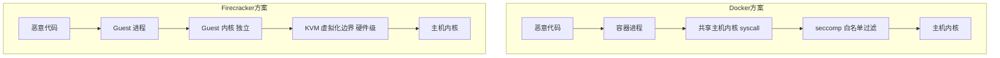
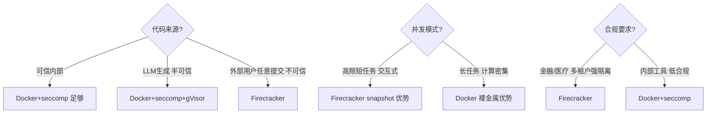
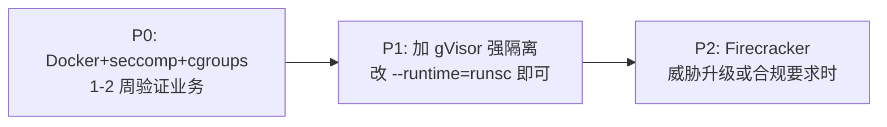

# 深度对比：Firecracker vs Docker + seccomp + cgroups + 超时

> 版本：v1.0 · 日期：2026-07-16
> 场景：AI Agent 平台代码执行沙箱，从 0 搭建，面向不可信代码。
> 结论先行：**两者不是「同档次」方案**——隔离原理不同、攻击面不同、成本结构不同。选型必须先看威胁模型，再谈性能。

---

## 1. 隔离原理的本质差异（最核心区别）

| 维度 | Docker + seccomp + cgroups | Firecracker microVM |
|------|----------------------------|---------------------|
| **隔离边界** | 进程级，**共享主机内核** | 虚拟机级，**独立 Guest 内核** |
| **边界类型** | 软件层过滤（syscall 白名单） | 硬件虚拟化（KVM/VT-x/AMD-V） |
| **syscall 路径** | 容器 syscall → seccomp filter → **主机内核直接处理** | Guest syscall → Guest 内核 → KVM exit → 主机处理 |
| **逃逸难度** | 依赖内核漏洞 + seccomp 绕过，历史上有逃逸 CVE | 需破 KVM/hypervisor，难度高一个数量级 |

> 📌 **一句话本质**：Docker 方案是「**让恶意代码跑在主机内核上，但过滤它能调什么**」；Firecracker 是「**让恶意代码跑在自己的内核上，主机内核根本不直接碰它**」。前者是「过滤」，后者是「隔离」。

---

## 2. 攻击面对比（逃逸路径）

### 2.1 Docker + seccomp 的逃逸面

Docker 容器与主机**共享内核**，意味着：

1. **内核漏洞直达**：任何 Linux 内核本地提权 CVE（如 Dirty Pipe CVE-2022-0847、OverlayFS CVE-2023-0386 等）都可能被容器内恶意代码利用，直接打到主机内核。seccomp **无法防御未知的内核漏洞**——它只过滤已知 syscall，不防 syscall 内部的漏洞。
2. **seccomp 绕过**：
   - 白名单设计失误（如放开了 `bpf`、`userfaultfd`、`perf_event_open`）会暴露大量内核攻击面
   - 用户态库（glibc 等）与 syscall 的间接调用难以完全枚举
   - 历史上 seccomp profile 被 `x32` ABI、`syscall 号漂移` 等绕过
3. **共享内核攻击面**：容器内可触发的内核子系统（netfilter、bpf、io_uring）远多于 microVM Guest，即使 seccomp 拦截，攻击面本身更大
4. **历史逃逸 CVE**：runc CVE-2019-5736（容器逃逸到主机）、CVE-2022-0165（容器内 CAP_SYS_ADMIN 逃逸）等

**结论**：Docker + seccomp 的安全性 = `Linux 内核安全性 × seccomp profile 严谨度`。内核是共享的、庞大的、持续暴露新漏洞的。

### 2.2 Firecracker 的逃逸面

Firecracker 只模拟**最小设备集**（virtio-block、virtio-net、串口、键盘），刻意删掉了除块设备外的设备模型：

1. **攻击面极小**：Guest 内核只能通过 virtio 设备与外界交互，没有 SCSI、USB、显卡等复杂驱动攻击面
2. **KVM 边界**：逃逸需破 KVM，这是硬件辅助的边界，漏洞极少且修复快（AWS 自家在跑，持续加固）
3. **Guest 内核独立**：Guest 内核即使被攻破，也只是攻破这台 microVM，主机和其他租户不受影响
4. **最小化原则**：Firecracker 实现了约 20 个 syscall（vmm 进程），自身攻击面也极小

**结论**：Firecracker 的安全性 = `KVM 边界强度 × virtio 设备模型安全性`。这是硬件级边界，攻击面刻意最小化。

### 2.3 攻击面对比矩阵

| 攻击向量 | Docker+seccomp | Firecracker |
|---------|---------------|-------------|
| Linux 内核 LPE CVE | ❌ 直接受影响 | ✅ Guest 内核独立，主机不受影响 |
| seccomp 白名单绕过 | ⚠️ 风险存在 | ✅ 无此层（不需 seccomp） |
| 容器运行时漏洞（runc） | ⚠️ 历史有 CVE | ✅ 不依赖 runc |
| 设备驱动攻击面 | ⚠️ 共享内核驱动多 | ✅ 仅 virtio 最小集 |
| 逃逸后横向移动 | ❌ 直达主机 | ✅ 需再破 KVM 才能到主机 |

---

## 3. 性能对比

| 指标 | Docker + seccomp | Firecracker |
|------|-----------------|-------------|
| **冷启动（裸）** | ~1–3s（含 daemon 调度） | ~125ms（AWS 官测） |
| **冷启动（warm pool）** | ~100–500ms（镜像层已缓存） | ~10–20ms（**snapshot restore**） |
| **执行开销** | 几乎无（裸金属跑） | ~1–5%（KVM 退出开销，virtio IO 略有损耗） |
| **CPU 性能损失** | <1% | 2–5%（内存密集型）/ 5–15%（密集 syscall） |
| **网络吞吐** | N/A（`--network=none`） | N/A（默认同样禁用） |

> 🔑 **关键洞察**：
> - Docker **执行期**性能更好（无虚拟化开销），但**启动期**慢。
> - Firecracker **启动期**极快（snapshot），但**执行期**有 KVM 开销。
> - 对 AI Agent 场景（短任务、频繁启停），**启动时间是瓶颈**，Firecracker 的 snapshot restore 优势放大。
> - 对计算密集型长任务，Docker 裸金属优势显现。

### 3.1 为什么 Firecracker 冷启动快

1. **Rust 实现，无 QEMU 的设备模型包袱**：只模拟最小设备
2. **Snapshot restore**：预先创建已加载运行时的 microVM 内存快照，每个请求从快照恢复，跳过 boot + 运行时初始化
3. **无 BIOS/UEFI、无 bootloader**：直接加载内核镜像

### 3.2 Docker 冷启动慢在哪

1. `dockerd` 调度开销
2. namespace + cgroup 创建
3. 镜像层 overlay 挂载
4. 运行时进程启动 + 模块加载（Python import numpy 等耗时 ~200ms）

> **warm pool 能把 Docker 启动压到几百 ms，但压不到几十 ms**——因为实例复用会引入状态泄漏风险，而 Firecracker snapshot 是「干净的冻结态」，可安全反复恢复。

---

## 4. 资源开销对比

| 指标 | Docker + seccomp | Firecracker |
|------|-----------------|-------------|
| **每实例内存开销** | ~10–50MB（容器进程） | ~5–10MB（VMM + Guest 基线） |
| **每实例磁盘** | 镜像层共享，可写层 tmpfs | rootfs + 内存快照 |
| **实例密度（每核）** | 高（共享内核，仅进程开销） | 中（每 VM 独立，KVM 调度） |
| **镜像大小** | 镜像分层共享，MB 级 | rootfs + 内核镜像，较大但可共享 |
| **snapshot 成本** | 无原生支持（需 CRIU，不稳） | 原生支持，文件即快照 |

> Docker 在**实例密度**上占优（共享内核，进程级开销），Firecracker 在**单实例内存**上占优（VMM 极轻）。但 Firecracker 每个 VM 是独立调度实体，**密度上限低于容器**。

---

## 5. 运维复杂度对比

| 维度 | Docker + seccomp | Firecracker |
|------|-----------------|-------------|
| **上手难度** | ⭐ 低（生态成熟，文档全） | ⭐⭐⭐ 高（需懂 KVM、网络桥接、snapshot） |
| **镜像管理** | Dockerfile + registry，成熟 | rootfs 构建（需 `deb`/`ext4` 制作），较繁琐 |
| **网络配置** | `--network=none` 一行搞定 | 需配 tap 设备、网桥、iptables |
| **监控** | cAdvisor / Prometheus 原生 | 需自建 Firecracker metrics 采集 |
| **编排** | Docker Compose / K8s 成熟 | 需自研或用 firecracker-containerd（成熟度低） |
| **安全审计** | seccomp profile 维护负担重 | KVM 边界由内核维护，审计简单 |
| **故障排查** | `docker logs/exec` 直观 | 串口日志，调试门槛高 |

> ⚠️ **从 0 落地的现实**：Docker 方案 1 人天可跑通闭环；Firecracker 方案至少 1–2 周才能稳定投产（含网络、snapshot、监控）。

### 5.1 Firecracker 的额外运维负担

1. **rootfs 制作**：需用 `debootstrap` 或 `docker export` 制作 ext4 镜像，不像 Dockerfile 直观
2. **内核镜像**：需选用精简 Guest 内核（如 AWS 提供的 microVM kernel）
3. **网络**：即使默认禁网，也要配好 tap 设备供未来按需联网
4. **snapshot 生命周期**：快照文件管理、版本更新、内存快照的内存占用
5. **没有 `docker exec`**：进不了运行中实例调试，只能靠串口日志

---

## 6. 适用场景对比

| 场景 | 推荐 | 理由 |
|------|------|------|
| 内部 CI、可信代码 | Docker+seccomp | 隔离需求低，运维成本低 |
| LLM Code Interpreter，交互式 | **Firecracker**（预算足）或 **gVisor**（折中） | 短任务启动是瓶颈，snapshot 快 |
| 面向外部用户任意代码 | **Firecracker** | 强隔离，合规与防逃逸刚需 |
| 计算密集长任务（ML 训练） | Docker | 裸金属性能优势 |
| 多租户 SaaS（金融/医疗） | **Firecracker** | 硬件级隔离满足合规审计 |
| 快速验证 / MVP | Docker+seccomp | 1 人天跑通，验证业务优先 |

---

## 7. 决策矩阵（综合评分）

> 评分 1–5，5 最优。权重按 AI Agent 通用场景设定。

| 维度（权重） | Docker+seccomp | Firecracker | 说明 |
|--------------|:---:|:---:|------|
| 安全性（30%） | 3 | 5 | Firecracker 硬件级隔离碾压 |
| 冷启动性能（20%） | 2 | 5 | snapshot restore 决定交互体验 |
| 执行期性能（10%） | 5 | 4 | Docker 无虚拟化开销 |
| 资源开销/密度（10%） | 4 | 3 | Docker 实例密度高 |
| 运维复杂度（15%） | 5 | 2 | Docker 生态成熟 |
| 落地速度（15%） | 5 | 2 | 从 0 搞，Docker 1 人天 vs FC 1–2 周 |
| **加权总分** | **3.7** | **3.7** | **打平——各有主场** |

> 打平恰恰说明：**没有绝对赢家**。安全与启动性能是 Firecracker 的主场，运维与落地速度是 Docker 的主场。决策必须落到具体威胁模型与团队能力上。

---

## 8. 给「从 0 开始」场景的推荐架构

### 8.1 渐进式三段走

**不要一上来就上 Firecracker**。理由（Simplicity First）：

1. **业务价值未验证**：先用 1 人天跑通 Docker 闭环，确认 Agent 真的需要沙箱、确认调用模式与负载特征
2. **运维成本前置**：Firecracker 的 rootfs/网络/snapshot 运维负担在业务未稳时是纯负债
3. **威胁模型可能不升级**：很多内部场景 Docker+seccomp 已足够，强隔离是过度工程

### 8.2 留好升级接口

P0 的 Docker 方案要为后续升级留接口：

| P0（Docker） | 升级动作 | P2（Firecracker） |
|--------------|---------|-------------------|
| `executor.py` 调 `docker run` | 替换为调 `firecracker --config-file` | 执行器接口不变 |
| `security.py` 生成 docker args | 替换为生成 FC 配置 | 协议不变 |
| warm pool = 预热镜像层 | 替换为 snapshot restore | 池接口不变 |
| seccomp profile | 弃用（KVM 边界替代） | 无需 |

关键：**把「隔离后端」抽象成接口，P0 实现是 Docker，P2 实现是 Firecracker，上层调度与协议不变**。这是控制升级成本的核心。

### 8.3 何时必须上 Firecracker

触发升级的硬指标（出现任一即应启动 P2）：

- [ ] 代码来源从「内部」扩展到「外部用户任意提交」
- [ ] 出现安全审计要求硬件级隔离（金融/医疗/等保）
- [ ] 冷启动 p95 超过交互容忍阈值（如 > 1s，Agent 体验差）
- [ ] 单租户密度要求下 Docker 实例内存开销成为瓶颈

---

## 9. 一张图总结

| 问 | Docker+seccomp+cgroups | Firecracker |
|----|------------------------|-------------|
| 隔离靠什么？ | 软件过滤 syscall | 硬件虚拟化 + 独立内核 |
| 逃逸难度？ | 中（依赖内核漏洞） | 高（需破 KVM） |
| 冷启动？ | 慢（~1s） | 快（snapshot ~10ms） |
| 执行性能？ | 裸金属，最快 | KVM 开销 2–15% |
| 运维？ | 成熟，1 人天上手 | 复杂，1–2 周稳定 |
| 从 0 落地？ | ✅ 首选 P0 | ⏳ P2 升级目标 |

> **最终建议**：从 0 落地用 **Docker + seccomp + cgroups + 超时 + warm pool** 跑通 P0，抽象好隔离后端接口，按威胁模型决定何时升级到 Firecracker。不要为了「看起来更强」一上来就上 microVM——那是把运维复杂度前置给了还没验证的业务。
