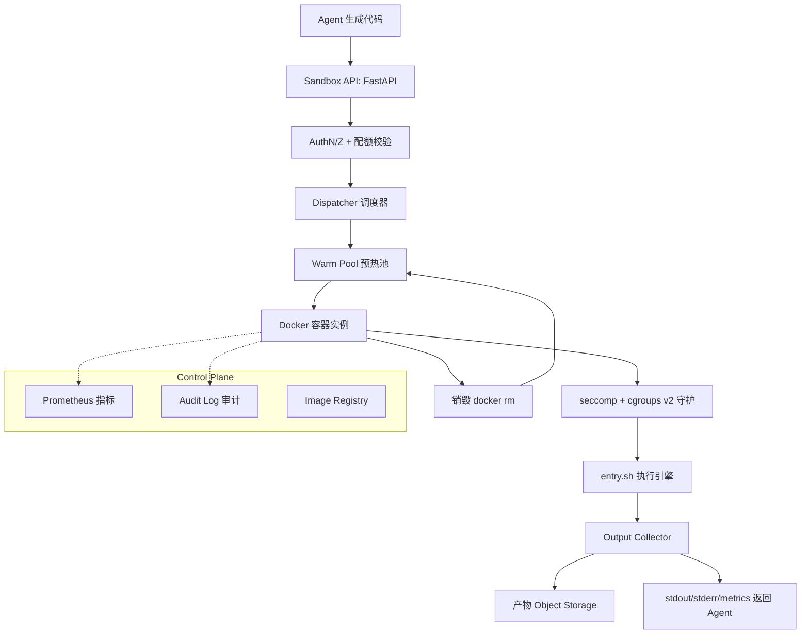

# AI Agent 代码执行 Sandbox 模块技术方案（从 0 落地版）

> 版本：v1.0 · 日期：2026-07-16
> 目标：从零搭建一个可直接投产的代码执行沙箱，覆盖安全、性能、可观测、多语言四条主线。
> 默认选型：**Docker + seccomp + cgroups v2 + warm pool**（P0 落地），并预留升级到 **Firecracker** 的接口（见 `sandbox-isolation-comparison.md`）。

---

## 0. 设计原则

1. **威胁模型驱动**：代码默认不可信（LLM 生成或外部用户提交），假设会尝试逃逸、外泄、耗尽资源。
2. **最小可信面**：默认拒绝一切（无网络、只读、无权限），按需放行。
3. **用完即弃**：每个执行实例执行完即销毁，不复用运行时状态，防状态泄漏与提权驻留。
4. **二值化结果**：执行结果状态机严格二值（completed / failed），宁可失败也不返回半截误导 Agent。
5. **Simplicity First**：P0 用 Docker 加固跑通闭环，验证业务价值后再按威胁等级升级隔离强度。

---

## 1. 总体架构



---

## 2. 目录结构

```
sandbox/
├── docker/
│   ├── Dockerfile                 # 运行时镜像（多语言基础层）
│   ├── entry.sh                   # 容器内执行入口
│   └── seccomp-profile.json       # seccomp 系统调用白名单
├── src/
│   ├── api.py                     # FastAPI 网关 + 执行协议
│   ├── dispatcher.py              # 调度器 + warm pool
│   ├── executor.py                # 容器执行器（docker run 封装）
│   ├── security.py                # 安全配置生成（资源限制/超时）
│   ├── collector.py               # 输出采集 + 产物上传
│   ├── metrics.py                 # Prometheus 指标
│   └── config.py                  # 常量与配置
├── tests/
│   └── test_security.py           # 安全约束测试（fork bomb/超时/OOM）
├── docker-compose.yml             # 本地开发编排
└── Makefile
```

---

## 3. 安全配置（P0 核心：Docker + seccomp + cgroups）

### 3.1 Dockerfile（多语言基础镜像）

```dockerfile
# sandbox/docker/Dockerfile
FROM node:22-slim AS base

# 安装运行时：Python + 常用科学计算栈（离线场景可换成私有 registry）
RUN apt-get update && apt-get install -y --no-install-recommends \
    python3 python3-pip python3-venv ca-certificates && \
    rm -rf /var/lib/apt/lists/* && \
    pip3 install --no-cache-dir numpy pandas matplotlib requests

# 创建非 root 用户
RUN useradd -m -u 1000 -s /bin/sh sandbox
USER sandbox
WORKDIR /workspace

# 入口脚本
COPY --chown=sandbox:sandbox entry.sh /entry.sh
RUN chmod +x /entry.sh

# /workspace 作为可写层（运行时由 tmpfs 覆盖）
VOLUME ["/workspace"]

ENTRYPOINT ["/entry.sh"]
```

### 3.2 容器内执行入口 entry.sh

```bash
#!/bin/sh
# sandbox/docker/entry.sh
# 从 stdin 读取代码写入文件，按语言执行，捕获 stdout/stderr/exit code
set -eu

LANG="${LANG:-python}"
TIMEOUT="${TIMEOUT_MS:-30000}"
WORKDIR="/workspace"

# 读取代码（由宿主通过 stdin 注入）
cat > "$WORKDIR/code" 

case "$LANG" in
  python)
    CMD="python3 -u $WORKDIR/code"
    ;;
  node)
    CMD="node $WORKDIR/code"
    ;;
  sh)
    CMD="sh $WORKDIR/code"
    ;;
  *)
    echo "UNSUPPORTED_LANG" >&2
    exit 127
    ;;
esac

# 硬超时（wall-clock），CPU 时间由 cgroups 限制
timeout --preserve-status --signal=TERM "$((TIMEOUT/1000))s" $CMD
EXIT=$?

# 输出元数据行（被宿主 collector 解析）
echo "__SANDBOX_EXIT__:$EXIT"
exit 0
```

### 3.3 seccomp Profile（系统调用白名单，default deny）

```json
// sandbox/docker/seccomp-profile.json
{
  "defaultAction": "SCMP_ACT_ERRNO",
  "defaultErrnoRet": 1,
  "architectures": ["SCMP_ARCH_X86_64"],
  "syscalls": [
    {
      "names": [
        "accept","accept4","access","arch_prctl","bind","brk","capget","capset",
        "chdir","chmod","chown","clock_gettime","close","connect","copy_file_range",
        "dup","dup2","dup3","epoll_create","epoll_create1","epoll_ctl","epoll_wait",
        "eventfd","eventfd2","execve","exit","exit_group","faccessat","faccessat2",
        "fchmod","fchmodat","fchown","fchownat","fcntl","fdatasync","flock",
        "fstat","fstatfs","fsync","ftruncate","futex","getcwd","getdents64",
        "getegid","geteuid","getgid","getgroups","getpeername","getpgid","getpid",
        "getppid","getrandom","getsockname","getsockopt","gettid","gettimeofday",
        "getuid","ioctl","listen","lseek","mkdir","mkdirat","mmap","mprotect",
        "munmap","nanosleep","newfstatat","open","openat","pipe","pipe2","poll",
        "ppoll","prctl","pread64","pwrite64","read","readlink","readlinkat",
        "recvfrom","recvmsg","rename","renameat","rseq","rt_sigaction",
        "rt_sigpending","rt_sigprocmask","rt_sigreturn","sched_yield","sendmsg",
        "sendto","set_robust_list","set_tid_address","setgid","setgroups","setuid",
        "shutdown","sigaltstack","socket","socketpair","statfs","sysinfo",
        "umask","unlink","unlinkat","utimensat","wait4","write","writev"
      ],
      "action": "SCMP_ACT_ALLOW"
    }
  ]
}
```

> 关键禁用项：`keyring/keyctl`（内核密钥）、`ptrace`（进程跟踪）、`mount/umount`（挂载）、`unshare/clone3`（命名空间，防逃逸）、`bpf`（内核 eBPF）、`perf_event_open`、`setns`、`reboot`、`kexec_load`。

### 3.4 Docker 运行命令（完整安全参数）

这是 P0 落地最关键的一段——所有安全约束都在这里一次到位：

```bash
docker run --rm \
  --name sandbox-${EXEC_ID} \
  --user 1000:1000 \
  --read-only \
  --tmpfs /workspace:rw,size=256m,mode=0700,uid=1000,gid=1000 \
  --tmpfs /tmp:rw,size=64m,mode=0700 \
  --network=none \
  --security-opt no-new-privileges \
  --security-opt seccomp=/path/to/seccomp-profile.json \
  --cap-drop ALL \
  --memory=512m \
  --memory-swap=512m \
  --cpus=1 \
  --pids-limit=64 \
  --ulimit nofile=128:128 \
  --ulimit nproc=64:64 \
  --ulimit fsize=524288:524288 \
  --workdir /workspace \
  -e LANG=python \
  -e TIMEOUT_MS=30000 \
  --init \
  --stop-signal=TERM \
  --stop-timeout=2 \
  -i sandbox:latest \
  < code.txt
```

参数逐条说明：

| 参数 | 作用 |
|------|------|
| `--user 1000:1000` | 非 root 执行 |
| `--read-only` | rootfs 只读，防篡改 |
| `--tmpfs /workspace` | 可写层限定大小，执行完随容器销毁 |
| `--network=none` | 完全无网络，杜绝外泄与回连 |
| `no-new-privileges` | 禁止提权（setuid 等） |
| `seccomp=...` | syscall 白名单 |
| `--cap-drop ALL` | 丢弃所有 Linux capabilities |
| `--memory` + `--memory-swap` | 内存硬上限（swap 同值 = 禁 swap） |
| `--cpus` | CPU 上限 |
| `--pids-limit` | 进程数上限，防 fork bomb |
| `--ulimit nproc/fsize` | 进程/文件大小兜底 |
| `--init` | init 进程回收僵尸，防孤儿进程泄漏 |

### 3.5 cgroups v2（Docker 19+ 默认，补充细粒度）

Docker 的 `--memory/--cpus/--pids-limit` 已基于 cgroups v2 实现。如需更细粒度的 **CPU 时间上限**（区别于 wall-clock 超时，防 `sleep` 拖时间）：

```bash
# 容器启动后定位 cgroup 路径
CGROUP="/sys/fs/cgroup/system.slice/docker-<cid>.scope"
# 设置 CPU 时间上限：100ms（100000 微秒 → 写 quota）
echo "100000" > $CGROUP/cpu.max   # quota=100000 period=100000 → 1 核满载上限
# 监控用量
cat $CGROUP/cpu.stat | grep "usage_usec"
```

> 在容器内 `ulimit` 不可靠，**资源限制必须用 cgroups**，这是初级方案最常踩的坑。

---

## 4. 执行协议

### 4.1 请求

```json
POST /api/sandbox/execute
{
  "language": "python",
  "code": "print('hello')",
  "stdin": "",
  "limits": {
    "wall_timeout_ms": 30000,
    "memory_mb": 512,
    "cpus": 1.0,
    "disk_mb": 256,
    "pids_max": 64
  },
  "network": { "enabled": false },
  "tenant_id": "user-123"
}
```

### 4.2 响应

```json
{
  "execution_id": "uuid",
  "status": "completed",
  "exit_code": 0,
  "stdout": "hello\n",
  "stderr": "",
  "truncated": false,
  "artifacts": [
    {"key": "plot.png", "size": 1234, "url": "https://..."}
  ],
  "metrics": {
    "duration_ms": 1234,
    "cpu_ms": 800,
    "peak_memory_mb": 410,
    "bytes_written": 4096
  }
}
```

`status` 枚举：`completed | timeout | oom | killed | error`（二值化，失败必带原因）。

---

## 5. 核心代码实现（Python 后端骨架）

### 5.1 config.py

```python
# sandbox/src/config.py
import os

WARM_POOL_SIZE = int(os.getenv("WARM_POOL_SIZE", "4"))
MAX_CONCURRENT = int(os.getenv("MAX_CONCURRENT", "20"))
IMAGE = os.getenv("SANDBOX_IMAGE", "sandbox:latest")
SECCOMP_PROFILE = os.getenv("SECCOMP_PROFILE", "docker/seccomp-profile.json")
OUTPUT_LIMIT = int(os.getenv("OUTPUT_LIMIT_BYTES", str(1024 * 1024)))  # 1MB
WALL_TIMEOUT_DEFAULT_MS = 30_000
MEMORY_DEFAULT_MB = 512
CPUS_DEFAULT = 1.0
PIDS_DEFAULT = 64
ARTIFACT_DIR = os.getenv("ARTIFACT_DIR", "/var/sandbox/artifacts")
```

### 5.2 security.py（生成 docker run 安全参数）

```python
# sandbox/src/security.py
from dataclasses import dataclass
from .config import SECCOMP_PROFILE


@dataclass
class Limits:
    wall_timeout_ms: int = 30_000
    memory_mb: int = 512
    cpus: float = 1.0
    disk_mb: int = 256
    pids_max: int = 64


def build_docker_args(exec_id: str, limits: Limits, language: str) -> list[str]:
    """生成完整的 docker run 安全参数。"""
    return [
        "docker", "run", "--rm",
        "--name", f"sandbox-{exec_id}",
        "--user", "1000:1000",
        "--read-only",
        "--tmpfs", f"/workspace:rw,size={limits.disk_mb}m,mode=0700,uid=1000,gid=1000",
        "--tmpfs", "/tmp:rw,size=64m,mode=0700",
        "--network=none",
        "--security-opt", "no-new-privileges",
        "--security-opt", f"seccomp={SECCOMP_PROFILE}",
        "--cap-drop", "ALL",
        "--memory", f"{limits.memory_mb}m",
        "--memory-swap", f"{limits.memory_mb}m",
        "--cpus", str(limits.cpus),
        "--pids-limit", str(limits.pids_max),
        "--ulimit", "nofile=128:128",
        "--ulimit", "nproc=64:64",
        "--ulimit", f"fsize={limits.disk_mb * 1024}:{limits.disk_mb * 1024}",
        "--workdir", "/workspace",
        "-e", f"LANG={language}",
        "-e", f"TIMEOUT_MS={limits.wall_timeout_ms}",
        "--init",
        "--stop-signal", "TERM",
        "--stop-timeout", "2",
        "-i",
        "sandbox:latest",
    ]
```

### 5.3 executor.py（执行 + 输出采集 + 超时）

```python
# sandbox/src/executor.py
import asyncio
import uuid
from .security import build_docker_args, Limits
from .config import OUTPUT_LIMIT


async def execute(code: str, language: str, limits: Limits) -> dict:
    exec_id = uuid.uuid4().hex[:12]
    args = build_docker_args(exec_id, limits, language)

    proc = await asyncio.create_subprocess_exec(
        *args,
        stdin=asyncio.subprocess.PIPE,
        stdout=asyncio.subprocess.PIPE,
        stderr=asyncio.subprocess.PIPE,
    )

    try:
        stdout, stderr = await asyncio.wait_for(
            proc.communicate(code.encode()),
            timeout=limits.wall_timeout_ms / 1000 + 5,  # 5s 宽限给容器清理
        )
    except asyncio.TimeoutError:
        # 硬超时，docker --stop-timeout 会 SIGKILL
        return {"status": "timeout", "execution_id": exec_id, "stdout": "", "stderr": ""}

    stdout_b = _truncate(stdout, OUTPUT_LIMIT)
    stderr_b = _truncate(stderr, OUTPUT_LIMIT)
    truncated = len(stdout) > OUTPUT_LIMIT or len(stderr) > OUTPUT_LIMIT

    return {
        "execution_id": exec_id,
        "status": "completed" if proc.returncode == 0 else "error",
        "exit_code": proc.returncode or 0,
        "stdout": stdout_b.decode(errors="replace"),
        "stderr": stderr_b.decode(errors="replace"),
        "truncated": truncated,
        "artifacts": [],  # 由 collector 从 tmpfs 提取（需挂载共享卷，见 §5.4）
    }


def _truncate(data: bytes, limit: int) -> bytes:
    return data[:limit] if len(data) > limit else data
```

### 5.4 dispatcher.py（warm pool + 并发控制）

```python
# sandbox/src/dispatcher.py
import asyncio
from .config import MAX_CONCURRENT, WARM_POOL_SIZE
from .executor import execute
from .security import Limits


class Dispatcher:
    def __init__(self):
        self._semaphore = asyncio.Semaphore(MAX_CONCURRENT)
        # warm pool：预创建容器或仅预热镜像层（P0 用镜像缓存层预热）
        self._pool = asyncio.Semaphore(WARM_POOL_SIZE)

    async def submit(self, code: str, language: str, limits: Limits) -> dict:
        async with self._semaphore:
            return await execute(code, language, limits)
```

### 5.5 api.py（FastAPI 网关）

```python
# sandbox/src/api.py
from fastapi import FastAPI, HTTPException
from pydantic import BaseModel
from .dispatcher import Dispatcher
from .security import Limits

app = FastAPI()
dispatcher = Dispatcher()


class ExecuteReq(BaseModel):
    language: str = "python"
    code: str
    stdin: str = ""
    limits: dict = {}
    tenant_id: str


@app.post("/api/sandbox/execute")
async def run(req: ExecuteReq):
    if not req.code.strip():
        raise HTTPException(400, "empty code")
    limits = Limits(**{k: v for k, v in req.limits.items() if k in Limits.__dataclass_fields__})
    result = await dispatcher.submit(req.code, req.language, limits)
    return result


@app.get("/health")
async def health():
    return {"status": "ok"}
```

---

## 6. 安全约束测试（验收必须通过）

```python
# sandbox/tests/test_security.py
import asyncio
from src.dispatcher import Dispatcher
from src.security import Limits

async def run(code, lang="python"):
    d = Dispatcher()
    return await d.submit(code, lang, Limits())

def test_fork_bomb_blocked():
    # 无限 fork，应被 pids-limit 杀掉
    code = "import os\nwhile True: os.fork()"
    r = asyncio.run(run(code))
    assert r["status"] in ("oom", "killed", "error")

def test_cpu_timeout():
    # 死循环，应在 wall_timeout 内终止
    code = "while True: pass"
    r = asyncio.run(run(code))
    assert r["status"] in ("timeout", "killed")

def test_network_blocked():
    # 网络请求应失败（--network=none）
    code = "import urllib.request\nurllib.request.urlopen('http://1.1.1.1', timeout=3)"
    r = asyncio.run(run(code))
    assert r["status"] != "completed"

def test_output_truncation():
    # 海量输出应被截断
    code = "print('x'*10_000_000)"
    r = asyncio.run(run(code))
    assert r["truncated"] is True
```

---

## 7. 部署与运维

### 7.1 本地起服务

```bash
# 构建镜像
docker build -t sandbox:latest -f docker/Dockerfile docker/

# 启动后端
uvicorn src.api:app --host 0.0.0.0 --port 9899
```

### 7.2 生产部署要点

- **专用 worker 节点**：跑沙箱的节点与控制面物理/逻辑隔离，磁盘只读
- **DinD 替代**：生产避免 Docker-in-Docker，改用 **Kata + containerd** 或 **Firecracker 直调**（见对比文档）
- **节点资源预留**：每实例预留 `memory + 256MB` 余量
- **镜像 registry**：私有 registry，预装常用包，离线场景禁止实时 `pip install`

### 7.3 可观测性

| 维度 | 指标 |
|------|------|
| 性能 | `sandbox_cold_start_seconds`、`sandbox_duration_seconds`、`sandbox_pool_utilization` |
| 安全 | `sandbox_oom_total`、`sandbox_timeout_total`、`sandbox_seccomp_violation_total` |
| 成本 | `sandbox_cpu_seconds`、`sandbox_peak_memory_bytes`（per execution_id + tenant_id） |

审计日志字段：`execution_id / tenant_id / code_hash / status / exit_code / cpu_ms / peak_mem_mb / timestamp`。

---

## 8. 落地路线图

| 阶段 | 目标 | 验收 |
|------|------|------|
| **P0** | Docker + seccomp + cgroups + 超时 + warm pool | §6 安全测试全过；p95 冷启动 < 1s |
| **P1** | 配额 + 审计 + Prometheus | per-tenant 限流；成本归账 |
| **P2** | 切换 gVisor 或 Firecracker | 逃逸测试套件通过；冷启动 < 100ms |
| **P3** | snapshot restore + 多语言扩展 | 冷启动 < 50ms；新语言 < 1 人天接入 |

---

## 9. P0 验收清单

- [ ] `docker run` 命令带齐 §3.4 全部安全参数
- [ ] seccomp profile default deny，白名单经 `seccomp-tools` 验证
- [ ] fork bomb 测试被 `pids-limit` 杀掉
- [ ] 死循环测试被 wall timeout + CPU 限制终止
- [ ] 网络请求测试失败（`--network=none`）
- [ ] stdout/stderr 超过 1MB 被截断且 `truncated=true`
- [ ] 每个实例执行完 `docker rm` 销毁，无残留
- [ ] 审计日志写入，含 code_hash 与资源用量
