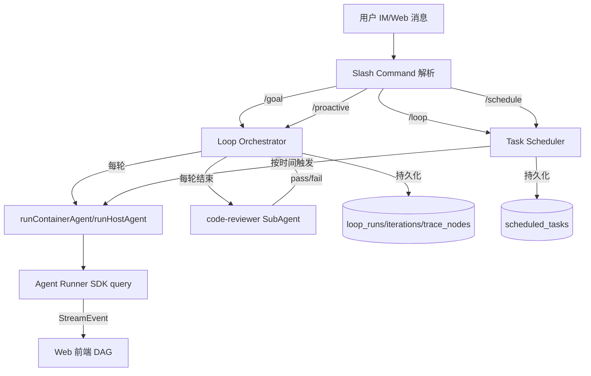
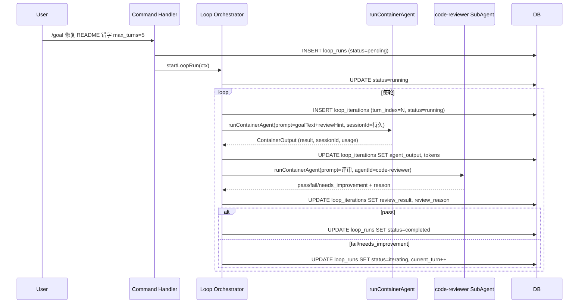

# DeepThink Loop Engineering 技术方案

> 需求 ID: loop-engineering
> 分支: `feat/loop-engineering`
> 创建日期: 2026-07-08
> 关联 PRD: [`docs/prd/loop-engineering/PRD.md`](../../prd/loop-engineering/PRD.md)

## 一、架构概览



## 二、数据模型（DB Schema v40 → v41）

### 2.1 新增表

```sql
-- loop_runs：一次循环执行的顶层记录
CREATE TABLE IF NOT EXISTS loop_runs (
  id TEXT PRIMARY KEY,
  owner_user_id TEXT NOT NULL,
  group_folder TEXT NOT NULL,
  chat_jid TEXT NOT NULL,
  kind TEXT NOT NULL CHECK(kind IN ('goal','loop','schedule','proactive')),
  goal_text TEXT NOT NULL,
  success_criteria TEXT,
  max_turns INTEGER NOT NULL DEFAULT 5,
  current_turn INTEGER NOT NULL DEFAULT 0,
  status TEXT NOT NULL DEFAULT 'pending'
    CHECK(status IN ('pending','running','reviewing','iterating','completed','failed','cancelled')),
  started_at TEXT NOT NULL,
  ended_at TEXT,
  total_input_tokens INTEGER NOT NULL DEFAULT 0,
  total_output_tokens INTEGER NOT NULL DEFAULT 0,
  total_cost_usd REAL NOT NULL DEFAULT 0,
  root_prompt TEXT,
  scheduled_task_id TEXT,
  workflow_mode TEXT,
  cancel_reason TEXT,
  FOREIGN KEY (owner_user_id) REFERENCES users(id)
);
CREATE INDEX IF NOT EXISTS idx_loop_runs_owner ON loop_runs(owner_user_id, started_at DESC);
CREATE INDEX IF NOT EXISTS idx_loop_runs_status ON loop_runs(status);

-- loop_iterations：每一轮的执行详情
CREATE TABLE IF NOT EXISTS loop_iterations (
  id INTEGER PRIMARY KEY AUTOINCREMENT,
  loop_run_id TEXT NOT NULL,
  turn_index INTEGER NOT NULL,
  status TEXT NOT NULL DEFAULT 'running'
    CHECK(status IN ('running','completed','failed','skipped')),
  agent_session_id TEXT,
  started_at TEXT NOT NULL,
  ended_at TEXT,
  input_tokens INTEGER NOT NULL DEFAULT 0,
  output_tokens INTEGER NOT NULL DEFAULT 0,
  cost_usd REAL NOT NULL DEFAULT 0,
  review_result TEXT CHECK(review_result IN ('pass','fail','needs_improvement','skipped')),
  review_reason TEXT,
  agent_output TEXT,
  FOREIGN KEY (loop_run_id) REFERENCES loop_runs(id)
);
CREATE INDEX IF NOT EXISTS idx_loop_iterations_run ON loop_iterations(loop_run_id, turn_index);

-- loop_trace_nodes：DAG 节点（每个 turn / tool / review / goal_check）
CREATE TABLE IF NOT EXISTS loop_trace_nodes (
  id INTEGER PRIMARY KEY AUTOINCREMENT,
  loop_run_id TEXT NOT NULL,
  iteration_id INTEGER,
  node_type TEXT NOT NULL CHECK(node_type IN ('turn','tool','review','goal_check','skill','subagent')),
  parent_node_id INTEGER,
  tool_name TEXT,
  tool_use_id TEXT,
  title TEXT,
  input_summary TEXT,
  output_summary TEXT,
  started_at TEXT NOT NULL,
  ended_at TEXT,
  tokens INTEGER NOT NULL DEFAULT 0,
  status TEXT,
  FOREIGN KEY (loop_run_id) REFERENCES loop_runs(id),
  FOREIGN KEY (iteration_id) REFERENCES loop_iterations(id),
  FOREIGN KEY (parent_node_id) REFERENCES loop_trace_nodes(id)
);
CREATE INDEX IF NOT EXISTS idx_loop_trace_run ON loop_trace_nodes(loop_run_id, started_at);
CREATE INDEX IF NOT EXISTS idx_loop_trace_parent ON loop_trace_nodes(parent_node_id);
```

### 2.2 扩展 `scheduled_tasks`

```sql
ALTER TABLE scheduled_tasks ADD COLUMN loop_kind TEXT DEFAULT NULL;
ALTER TABLE scheduled_tasks ADD COLUMN loop_run_id TEXT DEFAULT NULL;
```

`loop_kind` 取值：`null`（普通任务）/`loop`/`schedule`/`proactive`。`loop_run_id` 关联 `loop_runs.id`。

### 2.3 迁移策略

- `SCHEMA_VERSION` 从 `'40'` 升到 `'41'`
- 在 `migrateSchema()` 中执行 `ALTER TABLE scheduled_tasks ADD COLUMN loop_kind TEXT` 等幂等语句（column 已存在时跳过）
- 新增 3 张表用 `CREATE TABLE IF NOT EXISTS`，首次启动自动建表

## 三、StreamEvent 扩展

### 3.1 新增事件类型

在 `shared/stream-event.ts` 的 `StreamEventType` 联合类型追加：

```typescript
| 'loop_start' | 'loop_iteration_start' | 'loop_iteration_end'
| 'loop_goal_check' | 'loop_review_result' | 'loop_end'
```

### 3.2 `StreamEvent` 接口新增字段

```typescript
export interface StreamEvent {
  // ... 现有字段
  loop?: {
    loopRunId: string;
    kind: 'goal' | 'loop' | 'schedule' | 'proactive';
    iteration?: number;
    goalText?: string;
    successCriteria?: string;
    maxTurns?: number;
    currentTurn?: number;
    status?: string;
    reviewResult?: 'pass' | 'fail' | 'needs_improvement' | 'skipped';
    reviewReason?: string;
    totalTokens?: number;
    totalCostUsd?: number;
  };
  traceNode?: {
    nodeId: number;
    nodeType: 'turn' | 'tool' | 'review' | 'goal_check' | 'skill' | 'subagent';
    parentNodeId?: number | null;
    title?: string;
    inputSummary?: string;
    outputSummary?: string;
    tokens?: number;
    status?: string;
  };
}
```

### 3.3 同步流程

修改 `shared/stream-event.ts` → 运行 `make sync-types` 同步到 `src/`、`container/agent-runner/src/`、`web/src/`。`make build` 自动触发同步。

## 四、Loop Orchestrator 设计

### 4.1 状态机

```
pending → running → reviewing → ┬→ iterating → running (循环)
                               └→ completed (达标)
                               └→ failed (max_turns 用尽)
                               └→ cancelled (用户取消)
```

### 4.2 `src/loop-orchestrator.ts` 核心接口

```typescript
export interface LoopRunContext {
  loopRunId: string;
  ownerUserId: string;
  groupFolder: string;
  chatJid: string;
  kind: 'goal' | 'proactive';
  goalText: string;
  successCriteria?: string;
  maxTurns: number;
  workflowMode?: 'parallel' | 'sequential';
  rootPrompt?: string;
  userLanguage?: string;
}

export async function startLoopRun(ctx: LoopRunContext): Promise<string>;
export async function cancelLoopRun(loopRunId: string, reason?: string): Promise<void>;
export async function runOneIteration(
  ctx: LoopRunContext,
  iterationIndex: number,
  reviewHint?: string,
): Promise<{ output: string; reviewResult: 'pass' | 'fail' | 'needs_improvement'; reviewReason: string }>;
export async function executeGoalLoop(ctx: LoopRunContext): Promise<void>;
```

### 4.3 执行流程



### 4.4 评审 Agent 提示词

```
你是一个严格的代码评审 Agent。请基于以下信息判定是否达成目标：

【目标】
{goalText}

【成功标准】
{successCriteria 或 "由你根据目标判断"}

【Agent 本轮产出】
{agentOutput}

请输出 JSON：
{
  "result": "pass" | "fail" | "needs_improvement",
  "reason": "具体原因，如未达标则说明缺什么",
  "suggestion": "下一轮 Agent 应该改进的方向"
}
```

评审 Agent 调用 `runHostAgent`/`runContainerAgent`，`agentId='code-reviewer'`（复用现有 `agent-definitions.ts`）。

## 五、斜杠命令实现

### 5.1 命令解析

在 `src/commands.ts` 和 `src/im-command-utils.ts` 新增命令解析：

| 命令 | 解析规则 |
|---|---|
| `/goal <text> [max_turns=N]` | `text` 为 goal，`N` 默认 5，硬上限 10 |
| `/loop <interval> <text>` | `interval` 支持 `30s`/`5m`/`1h`，`text` 为任务 |
| `/schedule <cron> <text>` | `cron` 为标准 5 字段，`text` 为任务 |
| `/proactive <cron> <goal> [workflow=parallel]` | 组合 schedule + goal |
| `/cancel <loop_id>` | 取消运行中 loop |
| `/loops` | 列出当前活跃 loop |

### 5.2 时间循环落库

`/loop` 和 `/schedule` 复用 `task-scheduler.ts`：

- 创建 `scheduled_tasks` 记录，`loop_kind='loop'`/`'schedule'`，`loop_run_id=NULL`（时间循环本身不需要 goal 评审，一个 task 即可）
- 调度触发时正常走 `runGroupModeTask` 或 `runTask`
- `/proactive` 创建 `loop_runs`（kind=proactive）+ `scheduled_tasks`（`loop_kind='proactive'`, `loop_run_id=关联`），每次触发时调用 `executeGoalLoop`

### 5.3 命令路由

`src/index.ts` 的 `handleCommand()` 增加分支：

```typescript
case '/goal': return handleGoalCommand(...);
case '/loop': return handleLoopCommand(...);
case '/schedule': return handleScheduleCommand(...);
case '/proactive': return handleProactiveCommand(...);
case '/cancel': return handleCancelCommand(...);
case '/loops': return handleListLoopsCommand(...);
```

## 六、Web API 设计

### 6.1 新增路由 `src/routes/loops.ts`

| 方法 | 路径 | 用途 |
|---|---|---|
| GET | `/api/loops` | 列出当前用户 loop_runs（分页 + status/kind 过滤） |
| GET | `/api/loops/:id` | 返回 loop_run + iterations + trace_nodes |
| POST | `/api/loops/:id/cancel` | 取消运行中 loop |
| GET | `/api/loops/:id/usage` | 按 iteration 聚合的 token 消耗 |
| GET | `/api/loops/:id/trace` | trace_nodes 树形结构（用于 DAG 渲染） |

### 6.2 鉴权

- 所有路由通过 `requireAuth` 中间件
- 用户只能访问自己的 loop_runs（`owner_user_id = req.user.id`）
- admin 可访问所有

## 七、Web 前端

### 7.1 新增页面 `/loops`

- `web/src/pages/LoopsPage.tsx` — loop 列表，按状态/类型过滤，点击进入详情
- 路由注册到 `App.tsx`

### 7.2 DAG 可视化组件

- `web/src/components/loops/LoopDagPanel.tsx` — 主 DAG 渲染器
  - 输入：`loop_trace_nodes` 数组
  - 输出：React 节点树（根 turn → 子 tool/review/goal_check）
  - 使用 SVG 连线 + 绝对定位盒子
  - 节点颜色按 status 区分（绿色=pass，红色=fail，灰色=running）
  - 点击节点 → 弹出 `TraceDetailDrawer`
- `web/src/components/loops/TraceDetailDrawer.tsx` — 节点 Trace 详情
  - 展示 input_summary / output_summary / tokens / started_at / ended_at
  - 支持 JSON 高亮
- `web/src/components/loops/LoopIterationList.tsx` — 迭代列表（左侧）
- `web/src/stores/loops.ts` — Zustand store

### 7.3 实时更新

- WebSocket 监听 `stream_event` 中的 `loop_*` 事件
- 收到 `loop_iteration_end` 后 refetch trace_nodes
- 收到 `loop_end` 后标记完成

### 7.4 ChatPage 内联展示

- 在 `ChatPage` 消息流中，遇到 `loop_start` 事件时插入 `LoopDagPanel` 卡片
- 卡片随 loop 进行实时更新

## 八、agent-runner 改动

### 8.1 ContainerInput 扩展

```typescript
export interface ContainerInput {
  // ... 现有字段
  loopRunId?: string;
  loopIteration?: number;
  loopKind?: 'goal' | 'proactive';
  loopReviewHint?: string;
}
```

### 8.2 StreamEvent 发射

在 `stream-processor.ts` 中：

- 启动时若 `loopRunId` 存在，发射 `loop_start` 事件
- 每个 turn 开始发射 `loop_iteration_start`，结束时发射 `loop_iteration_end`
- 评审阶段发射 `loop_review_result`
- 最终发射 `loop_end`

### 8.3 Trace 节点持久化

主进程 `container-runner.ts` 在处理 `tool_use_start`/`tool_use_end` 等事件时，若 `loopRunId` 存在，**异步写入** `loop_trace_nodes` 表（不阻塞流式输出）。

## 九、Token 统计聚合

- `loop_runs.total_input_tokens` / `total_output_tokens` / `total_cost_usd` 在每轮结束后增量更新
- 数据来源：`StreamEvent.usage`（已有）+ `usage_records` 表（已有）
- 按 iteration 聚合 API：`SELECT SUM(input_tokens), SUM(output_tokens), SUM(cost_usd) FROM loop_iterations WHERE loop_run_id=?`

## 十、实施步骤

| 步骤 | 文件 | 产出 |
|---|---|---|
| 1 | `src/db.ts` | Schema v41 + 3 张新表 + `scheduled_tasks` 扩列 + CRUD 函数 |
| 2 | `shared/stream-event.ts` | 新增 6 个事件类型 + loop/traceNode 字段 |
| 3 | `make sync-types` | 同步到 3 处副本 |
| 4 | `src/loop-orchestrator.ts` | 状态机 + `executeGoalLoop` + `runOneIteration` + `cancelLoopRun` |
| 5 | `src/commands.ts` + `src/im-command-utils.ts` | 6 个斜杠命令解析 |
| 6 | `src/index.ts` | `handleCommand` 分支路由 |
| 7 | `src/routes/loops.ts` | 5 个 REST API |
| 8 | `src/web.ts` | 挂载 loops 路由 |
| 9 | `container/agent-runner/src/types.ts` | ContainerInput 扩展 |
| 10 | `container/agent-runner/src/stream-processor.ts` | loop_* 事件发射 |
| 11 | `src/container-runner.ts` | trace 节点持久化 + ContainerInput 透传 |
| 12 | `web/src/stream-event.types.ts` | 同步 |
| 13 | `web/src/stores/loops.ts` | Zustand store |
| 14 | `web/src/api/loops.ts` | API client |
| 15 | `web/src/components/loops/LoopDagPanel.tsx` + `TraceDetailDrawer.tsx` | DAG 组件 |
| 16 | `web/src/pages/LoopsPage.tsx` | 列表页 |
| 17 | `web/src/App.tsx` | 路由注册 |
| 18 | `web/src/components/chat/StreamingDisplay.tsx` | 内联 loop 卡片 |
| 19 | `tests/units/loop-orchestrator.test.ts` | 状态机单元测试 |
| 20 | `tests/units/loop-command-parser.test.ts` | 命令解析测试 |
| 21 | `make typecheck && npx vitest run` | 验证 |
| 22 | Web E2E 手动验证 + 截图 | |
| 23 | `docs/test_report/loop-engineering/TEST_REPORT.md` | 测试报告 |
| 24 | 合并 main + push | |

## 十一、关键设计决策

1. **时间循环不走 loop_runs**：`/loop` 和 `/schedule` 是纯定时触发，无 goal 评审需求，直接落 `scheduled_tasks` + `loop_kind` 区分即可，避免过度设计（Simplicity First）
2. **`/proactive` 走 loop_runs**：主动循环需要 goal + 评审，故走 loop_runs + 关联 scheduled_task
3. **评审 Agent 复用 code-reviewer**：不新建 Agent，直接调 `runContainerAgent` with `agentId='code-reviewer'`
4. **trace 节点异步写入**：不阻塞流式输出，写入失败只记 log 不影响主流程
5. **DAG 不引入新可视化库**：用 React + SVG 手写节点树，避免重依赖
6. **max_turns 硬上限 10**：防止死循环
7. **loop_run_id 透传到 agent-runner**：通过 ContainerInput 字段，让 runner 知道自己处于 loop 模式

## 十二、回滚方案

- DB 迁移幂等，回滚只需删 3 张新表 + 移除 `scheduled_tasks.loop_kind` 列（保留也无害）
- 路由文件可独立删除
- StreamEvent 新增事件类型是附加式的，不影响现有事件
- Web 组件独立，可整目录删除

## 十三、验收检查清单

- [ ] `make typecheck` 通过
- [ ] `npx vitest run` 全部通过
- [ ] `/goal 修复 README 错字 max_turns=2` 在 IM/Web 可执行
- [ ] Web `/loops` 页面展示 loop 列表
- [ ] DAG 节点可点击展开 Trace
- [ ] `/cancel <loop_id>` 可取消
- [ ] 评审 fail 时下一轮注入 review_reason
- [ ] token 统计准确（与 usage_records 对账）
