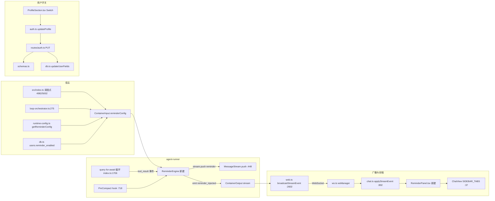

# 技术方案 — DeepThink Reminder 机制

> 分支：`feat/reminder-mechanism` ｜ 创建日期：2026-07-24

## 1. 设计原则

遵循最高宪法四原则：
- **Think Before Coding**：注入点、配置载体、事件通路均经代码实证（见各节 file:line 引用），不留假设。
- **Simplicity First**：复用既有 `MessageStream.push()` 注入通道、`broadcastStreamEvent` 广交通道、`SIDEBAR_TABS` 面板挂载点、`default_require_mention` 用户偏好奇镜像；不引入新传输层、新 DB 表、新状态机。
- **Surgical Changes**：只动必要文件，不重构 `buildIterationPrompt`、不改 loop 状态机。
- **Goal-Driven Execution**：退出条件 = PRD AC-F1~F5 + TC-01~TC-13 全通过。

## 2. 架构总览



## 3. 注入机制选型理由

### 3.1 为什么用 `MessageStream.push()` 而非改 system prompt

- system prompt 在每次 `query()` 调用前构建**一次**，SDK 内部多轮循环期间固定不变（`container/agent-runner/src/index.ts:1487-1512` 拼装、`:1652` 传入）。中途刷新 system prompt 只能新开 query，开销大且打断当前 query。
- `MessageStream.push()`（`:448`）向 SDK 注入一条 user message，SDK 在下一 turn 边界读取并据此开新 turn——这正是既有 IPC follow-up（`:1459`）与时间前缀注入（`:478`）的成熟通道，零新传输路径。

### 3.2 为什么计数 `tool_result` 而非 `result`

- `result` 事件是 turn 边界（`:1340 resultCount`），但单次长 query 可能仅产生 1~2 个 result（agent 在 turn 内自主完成多次工具调用），粒度过粗，周期触发不可靠。
- `tool_result` 事件对应每个完成的工具调用步骤，粒度匹配参考资料「每执行 N 步注入」语义，且触发时机恰为「工具返回结果后」（资料推荐的注入点）。

### 3.3 为什么不新建 DB 表存注入日志

- 注入日志的生命周期 = 单次会话流式态，天然归属 `StreamingState`（`chat.ts:119`）与 `streamingSnapshots`（`web.ts:2617` 断线重连恢复）。既有机制已覆盖持久化与恢复，新建 DB 表属过度工程。
- 用户开关走 `users.reminder_enabled` 列（镜像 `default_require_mention`），全局默认走文件配置 `reminder.json`——与既有配置层一致，无需 DB 迁移表结构。

## 4. 详细改动点

### 4.1 流式事件类型扩展（canonical 源）

**文件**：`shared/stream-event.ts`（同步源，`scripts/sync-stream-event.sh` 拷贝到 3 处副本）

- `StreamEventType` 联合（`:12-25`）新增：`| 'reminder_injected'`
- `StreamEvent` 接口（`:79-220`）新增可选字段：
```ts
reminder?: {
  reason: 'periodic' | 'compact';
  turnIndex: number;
  stepsSinceLast: number;
  goalSnippet: string;
  summary: string;
};
```
- 运行 `make sync-types`（或直接 `bash scripts/sync-stream-event.sh`）同步到 `src/stream-event.types.ts`、`container/agent-runner/src/stream-event.types.ts`、`web/src/stream-event.types.ts`。

### 4.2 ReminderEngine（新文件）

**文件**：`container/agent-runner/src/reminder-engine.ts`（新建）

职责：维护步数计数、按条件注入 Reminder、emit `reminder_injected` 事件。

接口：
```ts
export interface ReminderConfig {
  enabled: boolean;
  intervalSteps: number;      // 默认 8
  goalSnippet: string;         // 原 prompt 截断 500 字
}

export interface ReminderEngineDeps {
  emit: (out: ContainerOutput) => void;        // agent-runner emit
  push: (text: string) => void;               // stream.push
  getTurnCount: () => number;                  // 当前 SDK turn 计数
}

export class ReminderEngine {
  private stepsSinceLast = 0;
  private injections = 0;
  constructor(private cfg: ReminderConfig, private deps: ReminderEngineDeps) {}
  onToolResult(): void;   // stepsSinceLast++; 周期触发
  onCompact(): void;      // 事件驱动触发
  private inject(reason): void;
}
```

注入文本模板（含措辞轮转，避免习惯性忽略）：
```
*** Reminder · 已执行 {steps} 步（turn {n}）***
任务目标：{goalSnippet}
{nudge}
```
`nudge` 池（按 `injections` 索引取模轮转）：
- 「请核对当前进度是否偏离上述目标；若已完成可输出最终结果，否则继续推进。」
- 「提醒：保持对原始约束的遵守，不要遗漏输出格式要求。」
- 「若陷入循环或重复调用同一工具，请改变策略或输出当前结论。」
- 「再次确认：当前行动是否直接服务于上述任务目标？」

`inject()` 实现：
1. 构造文本 → `deps.push(text)`（若 stream 已 end，push 返回 no-op，不抛错）。
2. `injections++`，`stepsSinceLast=0`（仅 periodic 重置；compact 不重置周期计数以免打乱节奏）。
3. `deps.emit({ status:'stream', result:null, streamEvent:{ eventType:'reminder_injected', reminder:{ reason, turnIndex: deps.getTurnCount(), stepsSinceLast, goalSnippet, summary: text.slice(0,200) } } })`。

### 4.3 agent-runner 集成

**文件**：`container/agent-runner/src/index.ts`

- 在 query 启动前（`:1640` 之前、`stream` 已创建后）实例化 `ReminderEngine`：
```ts
const reminderEngine = new ReminderEngine(
  containerInput.reminderConfig ?? { enabled:false, intervalSteps:8, goalSnippet:'' },
  { emit, push: (t)=>stream.push(t), getTurnCount: ()=>resultCount }
);
```
- `for await` 循环内（`:1706` 起），`stream_event` 分支里检测 `tool_result`：
```ts
if ((message as any).type === 'stream_event') {
  ...
  const se = (message as any).stream_event ?? (message as any).event;
  if (se?.eventType === 'tool_result') reminderEngine.onToolResult();
  ...
}
```
  （需确认 stream_event 消息承载 `eventType` 的字段路径；实施时以 `processor`/`stream-processor.ts` 实际接收结构为准。）
- `PreCompact` hook（`createPreCompactHook` `:718` 定义、`:1686` 注册）：在 hook deps 增加 `onCompact: ()=>reminderEngine.onCompact()`，或直接闭包捕获 `reminderEngine`（engine 在 query 前已创建）。hook 内 `return {}` 前调用 `reminderEngine.onCompact()`。
- `container/agent-runner/src/types.ts` 的 `ContainerInput`（`:11`）新增 `reminderConfig?: ReminderConfig`（import 自 reminder-engine.ts）。

### 4.4 宿主配置传递

**文件**：`src/container-runner.ts`
- `ContainerInput` 接口（`:235`）新增 `reminderConfig?: { enabled; intervalSteps; goalSnippet }`（与 agent-runner 同构；为避免循环依赖，host 侧用内联结构类型）。
- `dockerInput`/`hostInput` 经 `...input` spread 已自动透传（`:1317`/`:2237`），无需额外改。

**文件**：`src/runtime-config.ts`
- 新增 `reminder.json` 配置域，仿 `getAppearanceConfig`（`:3057`）/`saveAppearanceConfig`（`:3092`）：
```ts
export interface ReminderConfig { enabled: boolean; intervalSteps: number; }
const REMINDER_CONFIG_FILE = path.join(CLAUDE_CONFIG_DIR, 'reminder.json');
const DEFAULT_REMINDER_CONFIG = { enabled: true, intervalSteps: 8 };
export function getReminderConfig(): ReminderConfig { ... }
export function saveReminderConfig(next: Partial<ReminderConfig>): ReminderConfig { ... }
```

**文件**：`src/index.ts`（主调度点 `:4982`/`:5002`）
- 在构建 input 处，新增辅助 `buildReminderConfig(group, prompt)`：
  - `enabled` = owner 用户 `reminder_enabled`（`getUserById(group.created_by ?? adminId).reminder_enabled ?? true`）
  - `intervalSteps` = `getReminderConfig().intervalSteps`
  - `goalSnippet` = `prompt.slice(0, 500)`
- 传入 `runHostAgent`/`runContainerAgent` 的 input 对象加 `reminderConfig`。

**文件**：`src/loop-orchestrator.ts`（`:275` 调度点）
- 同样在 input 构建（`:301` workspaceGroup 附近）注入 `reminderConfig`（loop 任务 goal 已在 prompt 中，goalSnippet 取 prompt 截断即可）。

### 4.5 前端 Reminder 面板

**文件**：`web/src/stores/chat.ts`
- `StreamingState`（`:119-148`）新增：
```ts
reminderLog: ReminderLogEntry[];
reminderStatus?: { enabled: boolean; stepsSinceLast: number; intervalSteps: number; lastReason?: string; lastAt?: number };
```
- `ReminderLogEntry`：`{ id; at; reason; turnIndex; stepsSinceLast; goalSnippet; summary }`
- `applyStreamEvent`（`:892`）新增 `case 'reminder_injected'`：push 到 `reminderLog`（限长 50 条）、更新 `reminderStatus`。
- 初始 `emptyStreamingState` 加 `reminderLog: []`。
- `handleStreamSnapshot`（`:3050` 附近）从快照恢复 `reminderLog`。

**文件**：`web/src/components/chat/ReminderPanel.tsx`（新建）
- 仿 `FilePanel`/`TracePanel`：props `{ groupJid }`，从 chat store 选 `reminderLog` + `reminderStatus`。
- 上半区「实时状态」卡片：开关状态、当前步数/间隔、距下次注入剩余、最近注入原因时间。
- 下半区「注入日志」列表：每条 时间 + 原因标签（periodic 蓝 / compact 紫）+ 步数 + 目标摘要（折叠）+ 注入摘要。
- 空态：无注入记录时提示「暂无 Reminder 注入记录」。

**文件**：`web/src/components/chat/ChatView.tsx`
- `SIDEBAR_TABS`（`:37`）加 `{ id:'reminder' as const, icon: Bell, label:'Reminder' }`
- `SidebarTab` 类型（`:55`）加 `| 'reminder'`
- 面板 switch（`:856-876`）加 `: sidebarTab==='reminder' ? <ReminderPanel groupJid={groupJid} /> :`
- 顶部 import 加 `Bell`（lucide-react）与 `ReminderPanel`。
- 移动端 Sheet（`:915+`）与 mobile actions（`:1011+`）同步新增 reminder 入口。

### 4.6 用户开关

镜像 `default_require_mention` 全链路：

| 层 | 文件 | 改动 |
|---|---|---|
| 前端 store | `web/src/stores/auth.ts:16-39` | `UserPublic` 加 `reminder_enabled: boolean` |
| 前端 UI | `web/src/components/settings/ProfileSection.tsx` | 加 `Switch`（仿 `:286-299`），`updateProfile({reminder_enabled})`（仿 `:470` 区块） |
| 后端 schema | `src/schemas.ts:488` | `reminder_enabled: z.boolean().optional()` |
| 后端路由 | `src/routes/auth.ts:595-634` | PUT 加 `if (validation.data.reminder_enabled !== undefined) updates.reminder_enabled = ...` |
| DB 建表 | `src/db.ts:786` | `reminder_enabled INTEGER NOT NULL DEFAULT 1` |
| DB insert 列 | `src/db.ts:1289` | 加 `'reminder_enabled'` |
| DB select 列 | `src/db.ts:1467` | 加 `'reminder_enabled'` |
| DB 行映射 | `src/db.ts:5874/5903` | `reminder_enabled: !!row.reminder_enabled` |
| DB update allowlist | `src/db.ts:6192/6269` | 加 `reminder_enabled` 字段处理 |
| DB 迁移 | `src/db.ts:1893` 后 | 新增 v38→v39 迁移 `ALTER TABLE users ADD COLUMN reminder_enabled INTEGER NOT NULL DEFAULT 1` |
| 类型 | `src/types.ts:323/352` | `UserPublic`/`UserRow` 加 `reminder_enabled: boolean` |
| 前端映射 | `src/routes/auth.ts` GET `/api/auth/me` 字段映射处 | 加 `reminder_enabled: u.reminder_enabled` |

## 5. 风险与对策

| 风险 | 对策 |
|---|---|
| Reminder 注入打断 agent 即将输出的最终答案 | 注入点选 `tool_result`（agent 仍在工具循环中），非 `result`（最终停止点）；push 在 stream.ended 后自动 no-op |
| 频繁注入撑爆上下文/增成本 | interval 默认 8 步；Reminder 为压缩摘要（goalSnippet 500 字上限 + 短 nudge）；goalSnippet 来自 prompt 缓存前缀之后区域，不击穿 prompt cache |
| 措辞重复致模型习惯性忽略 | nudge 池轮转（4 条），按 injections 取模 |
| stream_event 消息字段路径不确定 | 实施时先读 `stream-processor.ts` 与 for-await 内 `processor.processStreamEvent` 调用，确认 `eventType` 字段路径再接线 |
| 前端 reminderLog 跨会话残留 | 新 turn/emptyStreamingState 初始化为 `[]`；snapshot 恢复时以快照为准 |

## 6. 验证计划

1. `make sync-types` + `make build`（含 `scripts/check-stream-event-sync.sh` 校验三处一致）。
2. `npm run typecheck`（后端）+ `cd web && npx tsc --noEmit`（前端）无新增错误。
3. vitest：新增 `tests/reminder-engine.test.ts`（TC-09~TC-13）。
4. UI 自动化（Playwright，admin/Test12345!）：TC-01~TC-08。
5. 遇 bug 走 Issue 修复流程（`docs/issues/`），循环至全通过。

## 7. 实施顺序

1. 流式事件类型扩展 + sync-types（F2）——基础类型，其他改动依赖它。
2. ReminderEngine + agent-runner 集成（F1）——核心注入逻辑。
3. 宿主配置传递 + runtime-config（F3）——让 engine 拿到配置。
4. 用户开关全链路（F5）——DB 迁移优先，避免运行时报错。
5. 前端 store + ReminderPanel + ChatView 挂载（F4）——UI 呈现。
6. 测试 + 修复循环（TC 全量）。
7. 测试报告 + 合并 push。
