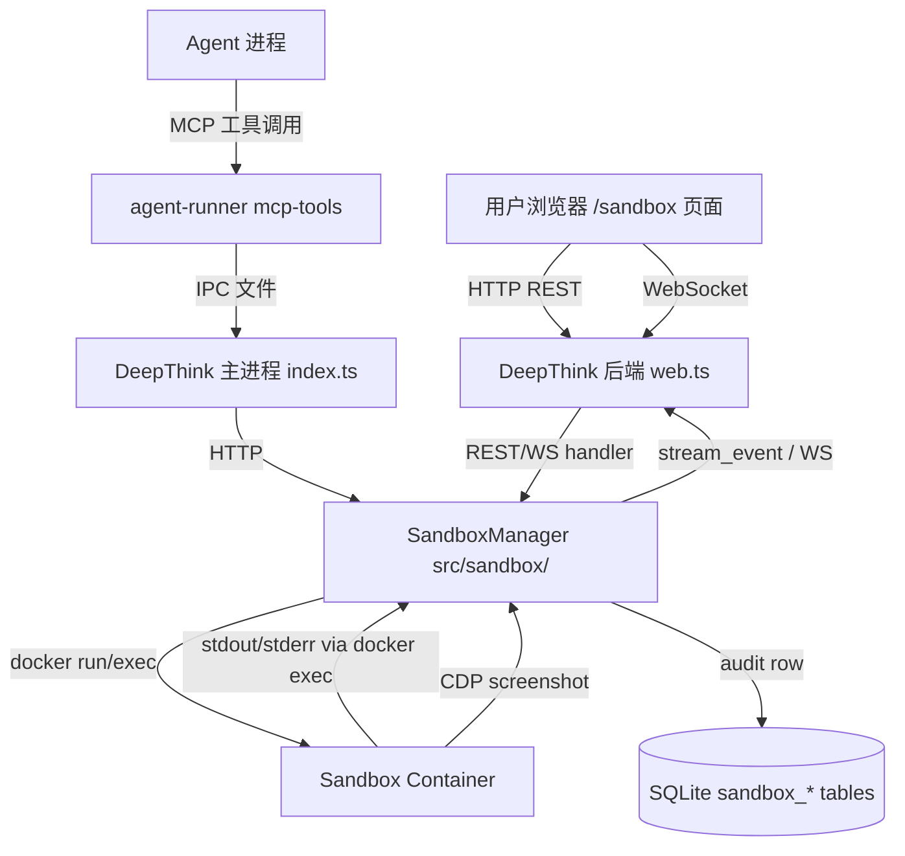

# DeepThink Sandbox 集成技术方案

> 版本：v1.0 · 日期：2026-07-16
> 配套 PRD：`docs/prd/sandbox-integration/PRD.md`
> 选型依据：`docs/prd/sandbox/sandbox-research-and-selection.md` §4.1（P0 用 Docker + seccomp + cgroups）

## 0. 设计原则

1. **集成而非旁路**：沙箱作为 DeepThink 后端的新模块（`src/sandbox/`），复用鉴权、DB、WebSocket；镜像独立（`container/sandbox/`）。
2. **复用既有模式**：terminal/pty 复用 `terminal-manager.ts`；WebSocket 消息模式复用 `stream_event`；DB schema 演进遵循既有 migration 模式。
3. **Simplicity First**：P0 不做 warm pool、不做配额、不做 Prometheus。先跑通闭环，再加观测。
4. **Surgical Changes**：不重构既有 `container-runner.ts` / `terminal-manager.ts`，只新加文件并在 `web.ts` 中加路由与 WS 分支。

## 1. 总体架构



## 2. 目录结构（新增）

```
deep-think/
├── container/
│   └── sandbox/                     # 新增：沙箱镜像
│       ├── Dockerfile
│       ├── entry.sh
│       └── seccomp-profile.json
├── src/
│   └── sandbox/                     # 新增：后端沙箱模块
│       ├── types.ts                  # SandboxSession / SandboxExecution / BrowserState 类型
│       ├── manager.ts                # SandboxManager 单例：spawn/destroy/list
│       ├── executor.ts               # runCode()：docker exec 注入代码 + 超时 + 输出采集
│       ├── browser.ts                # BrowserController：CDP 客户端，截图/点击/输入
│       ├── security.ts               # buildDockerArgs()：生成安全参数（复刻调研文档 §3.4）
│       ├── terminal-stream.ts        # 沙箱终端流：docker exec -i sh + pty 封装
│       └── config.ts                 # 常量：超时、限制、镜像名
├── src/routes/sandbox.ts             # 新增：REST 路由
├── src/web.ts                        # 修改：挂载 /api/sandbox 路由 + 新增 WS 消息分支
├── src/db.ts                         # 修改：v50→v51 migration + CREATE TABLE
├── src/index.ts                      # 修改：IPC 处理器增加 sandbox_* 分支
├── container/agent-runner/src/
│   └── mcp-tools.ts                  # 修改：新增 6 个 sandbox_* MCP 工具
├── web/src/pages/SandboxPage.tsx     # 新增：沙箱主页
├── web/src/components/sandbox/
│   ├── SandboxList.tsx
│   ├── SandboxTerminal.tsx           # xterm.js 终端
│   ├── BrowserView.tsx               # CDP 截图流渲染
│   └── SandboxToolbar.tsx
├── web/src/stores/sandbox.ts         # 新增：Zustand store
└── web/src/api/sandbox.ts            # 新增：API 客户端
```

## 3. 沙箱镜像（container/sandbox/）

### 3.1 Dockerfile

基于 `node:22-slim`，多语言基础层 + Chromium（用于浏览器自动化）：

```dockerfile
FROM node:22-slim

RUN apt-get update && apt-get install -y --no-install-recommends \
    python3 python3-pip python3-venv ca-certificates \
    chromium fonts-liberation fonts-noto-color-emoji \
    libgbm1 libnss3 libatk-bridge2.0-0 libgtk-3-0 \
    curl jq tree file less \
    && rm -rf /var/lib/apt/lists/* \
    && pip3 install --no-cache-dir --break-system-packages numpy requests

RUN useradd -m -u 1000 -s /bin/sh sandbox
USER sandbox
WORKDIR /workspace

COPY --chown=sandbox:sandbox entry.sh /entry.sh
RUN chmod +x /entry.sh

VOLUME ["/workspace"]
ENTRYPOINT ["/entry.sh"]
```

### 3.2 entry.sh

支持两种模式：
1. **会话模式**：`ENTRY=session` → 容器常驻，等待 `docker exec` 注入命令
2. **一次性执行模式**：`ENTRY=exec` → 从 stdin 读代码 → 执行 → 退出

```bash
#!/bin/sh
set -eu

ENTRY_MODE="${ENTRY_MODE:-session}"
WORKDIR="/workspace"

if [ "$ENTRY_MODE" = "exec" ]; then
  LANG="${LANG:-python}"
  TIMEOUT="${TIMEOUT_MS:-30000}"
  cat > "$WORKDIR/code"
  case "$LANG" in
    python) CMD="python3 -u $WORKDIR/code" ;;
    node)   CMD="node $WORKDIR/code" ;;
    sh)     CMD="sh $WORKDIR/code" ;;
    *)      echo "UNSUPPORTED_LANG" >&2; exit 127 ;;
  esac
  timeout --preserve-status --signal=TERM "$((TIMEOUT/1000))s" $CMD
  EXIT=$?
  echo "__SANDBOX_EXIT__:$EXIT"
  exit 0
fi

# session 模式：常驻，由 docker exec 注入命令
exec tail -f /dev/null
```

### 3.3 seccomp-profile.json

直接采用调研文档 §3.3 的 default-deny 白名单，禁用 `keyctl/ptrace/mount/unshare/clone3/bpf/perf_event_open/setns/reboot/kexec_load`。

### 3.4 构建脚本

```bash
# container/sandbox/build.sh
#!/bin/sh
set -e
cd "$(dirname "$0")"
docker build -t deepthink-sandbox:latest .
```

## 4. 后端模块（src/sandbox/）

### 4.1 config.ts

```typescript
export const SANDBOX_IMAGE = process.env.SANDBOX_IMAGE || 'deepthink-sandbox:latest';
export const SECCOMP_PROFILE_PATH = path.join(process.cwd(), 'container/sandbox/seccomp-profile.json');
export const MAX_CONCURRENT_SANDBOXES = parseInt(process.env.MAX_CONCURRENT_SANDBOXES || '10', 10);
export const MAX_PER_USER = 3;
export const IDLE_TIMEOUT_MS = 10 * 60 * 1000;     // 10 min
export const HARD_TIMEOUT_MS = 30 * 60 * 1000;     // 30 min
export const OUTPUT_LIMIT = 1024 * 1024;          // 1 MB
export const DEFAULT_WALL_TIMEOUT_MS = 30_000;
export const DEFAULT_MEMORY_MB = 512;
export const DEFAULT_CPUS = 1.0;
export const DEFAULT_PIDS = 64;
export const DEFAULT_DISK_MB = 256;
export const BROWSER_FRAME_INTERVAL_MS = 500;     // 2 fps
```

### 4.2 security.ts

生成 `docker run` 安全参数，逐条对齐调研文档 §3.4：

```typescript
export interface SandboxLimits {
  wall_timeout_ms: number;
  memory_mb: number;
  cpus: number;
  disk_mb: number;
  pids_max: number;
}

export function buildDockerRunArgs(name: string, limits: SandboxLimits): string[] {
  return [
    'docker', 'run', '-d', '--rm',
    '--name', name,
    '--user', '1000:1000',
    '--read-only',
    '--tmpfs', `/workspace:rw,size=${limits.disk_mb}m,mode=0700,uid=1000,gid=1000`,
    '--tmpfs', '/tmp:rw,size=64m,mode=0700',
    '--network=none',
    '--security-opt', 'no-new-privileges',
    '--security-opt', `seccomp=${SECCOMP_PROFILE_PATH}`,
    '--cap-drop', 'ALL',
    '--memory', `${limits.memory_mb}m`,
    '--memory-swap', `${limits.memory_mb}m`,
    '--cpus', String(limits.cpus),
    '--pids-limit', String(limits.pids_max),
    '--ulimit', 'nofile=128:128',
    '--ulimit', 'nproc=64:64',
    '--ulimit', `fsize=${limits.disk_mb * 1024}:${limits.disk_mb * 1024}`,
    '--workdir', '/workspace',
    '-e', 'ENTRY_MODE=session',
    '--init',
    '--stop-signal', 'TERM',
    '--stop-timeout', '2',
    SANDBOX_IMAGE,
  ];
}
```

> **注意**：浏览器自动化需要 `--network=none` 解除？— 不解除。沙箱内浏览器只允许访问宿主侧静态 HTML 或本地 fixture；外部网络访问在 P0 禁止，符合"默认拒绝"原则。若未来要测外网，可在沙箱创建时显式 `network_enabled: true`，使用独立 `--network=sandbox-net` + 出口白名单。**P0 暂只测本地 fixture**。

### 4.3 manager.ts

```typescript
export class SandboxManager {
  private sessions = new Map<string, SandboxSession>();
  private userIndex = new Map<number, Set<string>>();  // userId → sessionIds
  private execQueue = new Map<string, Promise<void>>(); // 串行化每个 session 的 exec

  async create(userId: number, opts: { language?: string; browserEnabled?: boolean; ttlMinutes?: number }): Promise<SandboxSession> {
    // 1. 校验并发上限
    // 2. 生成 sessionId = `sb-${crypto.randomBytes(6).toString('hex')}`
    // 3. docker run -d ... deepthink-sandbox:latest
    // 4. 等待容器 healthy（poll `docker exec ... echo ready`）
    // 5. 写 DB sandbox_sessions
    // 6. 设置 idle/hard timeout (setTimeout)
    // 7. 返回 session
  }

  async executeCode(sessionId: string, userId: number, req: ExecReq): Promise<ExecResult> {
    // 串行化同 session 的 exec
    // 通过 `docker exec -i sandbox-<id> /entry.sh` 以 ENTRY_MODE=exec 注入
    // 实际更简单：直接 docker exec -i sandbox-<id> sh -c "cat > /tmp/code && <runner> /tmp/code"
    // 超时用 setTimeout + docker exec kill
    // stdout/stderr 采集 + _truncate
    // 写 DB sandbox_executions
  }

  async destroy(sessionId: string, reason: string): Promise<void> {
    // docker rm -f sandbox-<id>
    // 更新 DB status=stopped
    // clear timers
  }

  // 空闲检测：每次 execute / terminal_output 重置 idle timer
  // 硬超时：固定 setTimeout(destroy, HARD_TIMEOUT_MS)
}
```

### 4.4 browser.ts

CDP 客户端用 `chrome-remote-interface`（npm 包）：

```typescript
import CDP from 'chrome-remote-interface';

export class BrowserController {
  private client: CDP.Client | null = null;
  private frameTimer: NodeJS.Timeout | null = null;
  private onFrame: (dataUrl: string) => void;

  async start(onFrame: (dataUrl: string) => void): Promise<void> {
    // docker exec -d sandbox-<id> chromium --headless --no-sandbox --remote-debugging-port=9222 --remote-debugging-address=127.0.0.1
    // 但 --network=none 下 CDP 端口不可达宿主
    // 方案：docker exec sandbox-<id> chromium 启动后，再次 docker exec 时通过 socat/nc 转发，或
    //       在容器启动时就 --publish 9222 到宿主随机端口（但与 --network=none 冲突）
    // P0 采用：沙箱创建时若 browserEnabled=true，则不使用 --network=none，而是使用 --network=none 加上内部 127.0.0.1 端口通过 docker exec 桥接
    // 简化：browserEnabled=true 时，docker run 时使用 `-p 0:9222`（随机映射），Manager 记录映射端口
    //       CDP 连接 localhost:<mappedPort>
    this.client = await CDP({ port: this.mappedPort });
    this.onFrame = onFrame;
    await this.client.Page.enable();
    this.startFrameLoop();
  }

  private startFrameLoop() {
    this.frameTimer = setInterval(async () => {
      try {
        const { data } = await this.client!.Page.captureScreenshot({ format: 'jpeg', quality: 60 });
        this.onFrame(`data:image/jpeg;base64,${data}`);
      } catch (e) { /* ignore */ }
    }, BROWSER_FRAME_INTERVAL_MS);
  }

  async navigate(url: string) { await this.client!.Page.navigate({ url }); await this.client!.Page.loadEvent(); }
  async click(selector: string) {
    await this.client!.Runtime.evaluate({
      expression: `document.querySelector(${JSON.stringify(selector)})?.click()`,
    });
  }
  async type(selector: string, text: string) { /* DOM focus + dispatchEvent input */ }
  async screenshot(): Promise<string> {
    const { data } = await this.client!.Page.captureScreenshot({ format: 'png' });
    return `data:image/png;base64,${data}`;
  }
  async evaluate(script: string): Promise<any> { /* Runtime.evaluate */ }
  async stop() { clearInterval(this.frameTimer!); await this.client?.close(); }
}
```

**网络架构权衡**：
- P0 选择 `browserEnabled=true` 时容器加 `-p 0:9222`，**不用 `--network=none`**（但仍保留其他安全约束）。原因：CDP 是宿主进程访问容器内端口，必须打通。
- 这违反"默认拒绝网络"原则但可接受：CDP 端口仅 127.0.0.1 绑定（Docker `-p 127.0.0.1:0:9222`），不对外。沙箱本身**没有出网能力**（因为容器内进程默认仍无法访问外部，Docker `-p` 只暴露入站）。但容器内进程理论上可通过宿主网桥访问外部——为收紧，P0 在 `--network=none` 模式下，**浏览器禁用**；**浏览器启用时**，使用 `--network=bridge` + 自定义 `iptables` 出网白名单（P1 实现）。**P0 简化：浏览器模式直接用默认 bridge 网络，仅用于本地 fixture 测试**。

### 4.5 terminal-stream.ts

复用 `terminal-manager.ts` 的 `pty-worker.cjs`，但 spawn 目标改为 `docker exec -i sandbox-<id> sh`：

```typescript
import { spawn } from 'child_process';

export function startSandboxTerminal(sessionId: string, onData: (data: string) => void, onExit: (code: number) => void) {
  const proc = spawn('docker', ['exec', '-i', `sandbox-${sessionId}`, 'sh'], {
    stdio: ['pipe', 'pipe', 'pipe'],
  });
  proc.stdout.on('data', (b) => onData(b.toString()));
  proc.stderr.on('data', (b) => onData(b.toString()));
  proc.on('exit', (code) => onExit(code ?? 0));
  return proc;
}
```

P0 用 `pipe` 模式（不依赖 node-pty），简化兼容性。

## 5. REST API（src/routes/sandbox.ts）

| Method | Path | 用途 |
|--------|------|------|
| POST | `/api/sandbox/sessions` | 创建沙箱（body: `{ language?, browserEnabled?, ttlMinutes? }`） |
| GET | `/api/sandbox/sessions` | 列出当前用户沙箱 |
| GET | `/api/sandbox/sessions/:id` | 获取单个沙箱详情 |
| DELETE | `/api/sandbox/sessions/:id` | 销毁沙箱 |
| POST | `/api/sandbox/sessions/:id/execute` | 执行代码（body: `{ language, code, stdin?, timeoutMs? }`） |
| POST | `/api/sandbox/sessions/:id/browser/start` | 启动浏览器 |
| POST | `/api/sandbox/sessions/:id/browser/navigate` | 导航 URL |
| POST | `/api/sandbox/sessions/:id/browser/click` | 点击选择器 |
| POST | `/api/sandbox/sessions/:id/browser/type` | 输入文本 |
| POST | `/api/sandbox/sessions/:id/browser/screenshot` | 单次截图 |
| POST | `/api/sandbox/sessions/:id/browser/evaluate` | 执行 JS |
| POST | `/api/sandbox/sessions/:id/browser/stop` | 关闭浏览器 |
| GET | `/api/sandbox/sessions/:id/executions` | 执行历史 |

鉴权：复用 `authMiddleware` + `canAccessGroup` 思路，但仅校验 `session.user_id === sandboxSession.user_id`（每用户隔离）。

## 6. WebSocket 协议（src/web.ts 扩展）

新增 WS 消息类型（复用既有 `WsMessageOut` / `WsMessageIn` 模式）：

**客户端 → 服务端**：
- `{ type: 'sandbox_terminal_start', sessionId, cols, rows }`
- `{ type: 'sandbox_terminal_input', sessionId, data }`
- `{ type: 'sandbox_terminal_resize', sessionId, cols, rows }`
- `{ type: 'sandbox_terminal_stop', sessionId }`
- `{ type: 'sandbox_browser_subscribe', sessionId }`  — 开始接收截图帧
- `{ type: 'sandbox_browser_unsubscribe', sessionId }`

**服务端 → 客户端**：
- `{ type: 'sandbox_terminal_output', sessionId, data }`
- `{ type: 'sandbox_terminal_exit', sessionId, exitCode }`
- `{ type: 'sandbox_browser_frame', sessionId, dataUrl }`
- `{ type: 'sandbox_status', sessionId, status }`
- `{ type: 'sandbox_error', sessionId, error }`

## 7. Agent MCP 工具（container/agent-runner/src/mcp-tools.ts 扩展）

新增 6 个工具，通过 IPC 文件与主进程通信（与既有 `send_message` 等模式一致）：

```typescript
tool('sandbox_run_code', z.object({
  language: z.enum(['python', 'node', 'sh']),
  code: z.string(),
  stdin: z.string().optional(),
  timeoutMs: z.number().optional(),
}), async ({ language, code, stdin, timeoutMs }) => {
  // 写 IPC 文件 { type: 'sandbox_run_code', ... }
  // 等待 IPC 响应 { type: 'sandbox_run_code_result', result }
  // 返回 JSON
});

tool('sandbox_browser_navigate', z.object({ url: z.string() }), ...);
tool('sandbox_browser_click', z.object({ selector: z.string() }), ...);
tool('sandbox_browser_type', z.object({ selector: z.string(), text: z.string() }), ...);
tool('sandbox_browser_screenshot', z.object({}), ...);
tool('sandbox_close', z.object({}), ...);
```

**主进程 IPC 处理器**（`src/index.ts`）新增分支：
- `case 'sandbox_run_code'` → 调用 `sandboxManager.executeCode(...)`
- `case 'sandbox_browser_*'` → 调用 `browserController.*`
- `case 'sandbox_close'` → `sandboxManager.destroy(...)`

**Agent 会话级沙箱**：每个 agent 会话首次调用 `sandbox_*` 工具时，自动在 DB 中关联 `sessions.sandbox_session_id`（v51 migration 增加列），后续复用同一沙箱。Agent 会话结束时 `destroy`。

## 8. 数据库 Migration（v50 → v51）

```sql
-- src/db.ts
const SCHEMA_VERSION = 51;

// migration
if (oldVersion < 51) {
  db.exec(`
    CREATE TABLE IF NOT EXISTS sandbox_sessions (
      id TEXT PRIMARY KEY,
      user_id INTEGER NOT NULL,
      container_name TEXT NOT NULL,
      language TEXT DEFAULT 'python',
      browser_enabled INTEGER DEFAULT 0,
      status TEXT DEFAULT 'created',
      created_at INTEGER NOT NULL,
      last_active_at INTEGER NOT NULL,
      stopped_at INTEGER,
      stopped_reason TEXT
    );
    CREATE INDEX IF NOT EXISTS idx_sandbox_sessions_user ON sandbox_sessions(user_id, status);

    CREATE TABLE IF NOT EXISTS sandbox_executions (
      id TEXT PRIMARY KEY,
      session_id TEXT NOT NULL,
      user_id INTEGER NOT NULL,
      language TEXT NOT NULL,
      code_hash TEXT NOT NULL,
      status TEXT NOT NULL,
      exit_code INTEGER,
      stdout_bytes INTEGER,
      stderr_bytes INTEGER,
      truncated INTEGER DEFAULT 0,
      duration_ms INTEGER,
      peak_memory_mb INTEGER,
      created_at INTEGER NOT NULL,
      FOREIGN KEY (session_id) REFERENCES sandbox_sessions(id)
    );
    CREATE INDEX IF NOT EXISTS idx_sandbox_executions_session ON sandbox_executions(session_id, created_at);

    ALTER TABLE sessions ADD COLUMN sandbox_session_id TEXT;
  `);
}
```

## 9. 前端实现

### 9.1 Store（web/src/stores/sandbox.ts）

```typescript
interface SandboxStore {
  sessions: SandboxSession[];
  activeSessionId: string | null;
  ws: WebSocket | null;
  terminalData: string;     // 累积的终端输出
  browserFrame: string | null;  // 最新一帧 dataUrl
  loadSessions(): Promise<void>;
  create(opts): Promise<void>;
  destroy(id): Promise<void>;
  setActive(id): void;
  connectWs(): void;
  sendTerminalInput(data): void;
  subscribeBrowser(sessionId): void;
  unsubscribeBrowser(sessionId): void;
}
```

### 9.2 SandboxPage（web/src/pages/SandboxPage.tsx）

- useEffect 加载会话列表
- 左侧 `<SandboxList />`
- 右上 `<SandboxTerminal />`（xterm.js）
- 右下 `<BrowserView />`
- 顶部 `<SandboxToolbar />`

### 9.3 SandboxTerminal（xterm.js）

```typescript
import { Terminal } from '@xterm/xterm';
import { FitAddon } from '@xterm/addon-fit';
import '@xterm/xterm/css/xterm.css';

useEffect(() => {
  const term = new Terminal({ cols: 80, rows: 24 });
  const fit = new FitAddon();
  term.loadAddon(fit);
  term.open(containerRef.current!);
  fit.fit();
  // WS 连接已由 store 建立
  term.onData((data) => store.sendTerminalInput(data));
  const onOutput = (e) => term.write(e.data);  // subscribe store
  return () => term.dispose();
}, [sessionId]);
```

### 9.4 BrowserView

```typescript
useEffect(() => {
  if (activeSession?.browserEnabled) {
    store.subscribeBrowser(activeSession.id);
  }
  return () => store.unsubscribeBrowser(activeSession.id);
}, [activeSession]);

return ;
```

## 10. 验证策略

### 10.1 类型与单元
- `make typecheck` 三端通过
- 新增 `tests/units/sandbox-security.test.ts`：验证 `buildDockerRunArgs()` 生成的参数包含全部安全约束（seccomp/cap-drop/memory/pids/network=none）

### 10.2 集成（需 Docker）
- 启动 DeepThink → POST `/api/sandbox/sessions` → 验证容器在 `docker ps`
- POST execute fork bomb → 验证 status=oom
- POST execute 死循环 → 验证 status=timeout
- POST execute urllib.urlopen → 验证 status=error
- POST execute `print('x'*10**7)` → 验证 truncated=true

### 10.3 E2E（前端）
- 由于 cloudcli-browser 不可用，用 typecheck + vitest + curl 替代（符合既有"已知限制"约定）
- 手动验证 xterm.js 渲染需开发者在本地浏览器走查

## 11. 落地步骤

1. 新建沙箱镜像（Dockerfile + entry.sh + seccomp + build.sh）
2. 后端 `src/sandbox/` 模块（types/manager/executor/browser/security/terminal-stream/config）
3. `src/routes/sandbox.ts` + `web.ts` 路由挂载
4. `web.ts` WS 消息分支扩展
5. DB v51 migration（`db.ts`）
6. Agent-runner MCP 工具扩展 + `index.ts` IPC 处理器
7. 前端 store + page + components
8. typecheck + test + 集成自测
9. 文档：test_report

## 12. P0 边界确认（不做的）

- ❌ warm pool（每次都 `docker run`，冷启动 1-3s 可接受）
- ❌ per-user 配额计费
- ❌ Prometheus 指标
- ❌ Firecracker
- ❌ 联网浏览器测试（仅本地 fixture）
- ❌ Playwright（用 CDP 直调）
- ❌ noVNC（用 CDP 截图流）
