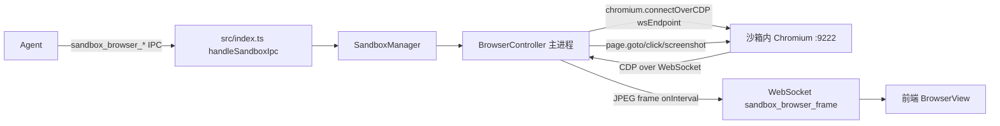

# 技术方案: Sandbox Playwright 迁移 + P1 待办收尾

## 设计原则

- **接口零破坏**：`BrowserController` 对外方法签名不变，`SandboxManager` / IPC handler / MCP 工具零改动
- **Simplicity First**：用 `playwright-core` 而非 `playwright`（不下载浏览器二进制），通过 `connectOverCDP` 复用沙箱内已有的 Chromium
- **Surgical Changes**：只动 `browser.ts`（重写）+ `config.ts`（加常量）+ `security.ts`（分支）+ `Makefile`（加 target）+ test（加用例），不碰其他文件
- **跨平台**：macOS / Linux 均可运行；`restricted` 网络模式需 Linux + iptables，P1 跳过

## 架构



主进程的 Playwright 通过 `connectOverCDP` 连接沙箱容器暴露的 CDP 端口（127.0.0.1:{动态端口}），获取 Browser → BrowserContext → Page，后续所有操作通过 Playwright API，由 Playwright 内部翻译为 CDP 消息。

## 目录结构变更

```
deep-think/
├── package.json                           # +playwright-core 1.61.1
├── Makefile                                # +sandbox-build +_ensure-sandbox-image
├── src/sandbox/
│   ├── config.ts                           # +BROWSER_NETWORK_MODE
│   ├── security.ts                         # buildDockerRunArgs browser 分支按 mode
│   └── browser.ts                          # 重写为 Playwright
├── container/sandbox/                      # 不变
└── tests/units/
    └── sandbox-security.test.ts            # +browser network=none 用例
```

## 1. BrowserController 重写

### 1.1 依赖

```json
{
  "dependencies": {
    "playwright-core": "^1.61.1"
  }
}
```

`playwright-core` 不触发浏览器二进制下载，安装轻量（~10MB JS）。

### 1.2 新 browser.ts 结构

```typescript
import { chromium, type Browser, type Page } from 'playwright-core';
import { logger } from '../logger.js';
import { spawn } from 'child_process';

export class BrowserController {
  private browser: Browser | null = null;
  private page: Page | null = null;
  private frameTimer: NodeJS.Timeout | null = null;
  private onFrame: (dataUrl: string) => void = () => {};
  private readonly cdpPort: number;
  private readonly containerName: string;
  private chromiumStarted = false;

  constructor(cdpPort: number, containerName: string) { ... }

  async start(onFrame, frameIntervalMs, initialUrl?): Promise<void> {
    this.onFrame = onFrame;
    await this.ensureChromiumRunning();
    const endpoint = `http://127.0.0.1:${this.cdpPort}`;
    this.browser = await chromium.connectOverCDP(endpoint, { timeout: 15_000 });
    const ctx = this.browser.contexts()[0] ?? await this.browser.newContext();
    this.page = ctx.pages()[0] ?? await ctx.newPage();
    if (initialUrl) await this.navigate(initialUrl);
    this.startFrameLoop(frameIntervalMs);
  }

  async navigate(url: string): Promise<void> {
    if (!this.page) throw new Error('浏览器未启动');
    await this.page.goto(url, { waitUntil: 'load', timeout: 30_000 });
  }

  async click(selector: string): Promise<void> {
    if (!this.page) throw new Error('浏览器未启动');
    await this.page.click(selector, { timeout: 10_000 });
  }

  async type(selector: string, text: string): Promise<void> {
    if (!this.page) throw new Error('浏览器未启动');
    await this.page.fill(selector, text, { timeout: 10_000 });
  }

  async screenshot(): Promise<string> {
    if (!this.page) throw new Error('浏览器未启动');
    const buf = await this.page.screenshot({ type: 'png' });
    return `data:image/png;base64,${buf.toString('base64')}`;
  }

  async evaluate(expression: string): Promise<any> {
    if (!this.page) throw new Error('浏览器未启动');
    // Playwright 接受 () => expr 或 expression string，统一用箭头函数包裹执行表达式
    return await this.page.evaluate(`(() => (${expression}))()`);
  }

  async getTitle(): Promise<string | null> {
    return this.page?.title() ?? null;
  }

  async getCurrentUrl(): Promise<string | null> {
    return this.page?.url() ?? null;
  }

  async stop(): Promise<void> {
    if (this.frameTimer) { clearInterval(this.frameTimer); this.frameTimer = null; }
    if (this.browser) {
      try { await this.browser.close(); } catch { /* ignore */ }
      this.browser = null;
    }
    this.page = null;
    if (this.chromiumStarted) {
      await this.killChromiumInContainer();
      this.chromiumStarted = false;
    }
  }

  private startFrameLoop(intervalMs: number): void {
    this.frameTimer = setInterval(async () => {
      try {
        if (!this.page) return;
        const buf = await this.page.screenshot({ type: 'jpeg', quality: 60 });
        this.onFrame(`data:image/jpeg;base64,${buf.toString('base64')}`);
      } catch { /* swallow — frame loop must not die */ }
    }, intervalMs);
  }

  private async ensureChromiumRunning(): Promise<void> {
    if (this.chromiumStarted) return;
    const args = [
      'exec', '-d', this.containerName,
      'chromium',
      '--headless=new',
      '--no-sandbox',
      '--disable-gpu',
      '--remote-debugging-port=9222',
      '--remote-debugging-address=127.0.0.1',
      '--disable-dev-shm-usage',
      '--user-data-dir=/tmp/chromium',
      'about:blank',
    ];
    await new Promise<void>((resolve) => {
      const p = spawn('docker', args, { stdio: 'ignore' });
      p.on('close', () => resolve());
      p.on('error', () => resolve());
    });
    this.chromiumStarted = true;
    // wait for CDP endpoint reachable
    const start = Date.now();
    while (Date.now() - start < 10_000) {
      if (await this.pingCdp()) return;
      await new Promise((r) => setTimeout(r, 200));
    }
    throw new Error('Chromium CDP 启动超时');
  }

  private async pingCdp(): Promise<boolean> {
    try { return (await fetch(`http://127.0.0.1:${this.cdpPort}/json/version`)).ok; }
    catch { return false; }
  }

  private async killChromiumInContainer(): Promise<void> {
    return new Promise((resolve) => {
      const p = spawn(
        'docker',
        ['exec', this.containerName, 'sh', '-c', 'pkill -f "chromium --headless" 2>/dev/null; true'],
        { stdio: 'ignore' },
      );
      p.on('close', () => resolve());
      p.on('error', () => resolve());
    });
  }
}
```

### 1.3 关键设计决策

- **`connectOverCDP` vs `launch`**：`launch` 会启动新 Chromium 进程（在主进程），但 Chromium 必须跑在沙箱容器内（受 seccomp/cap-drop 保护），所以只能 `connectOverCDP`
- **默认 context/page 复用**：沙箱内 Chromium 启动时带 `about:blank`，CDP 暴露第一个 page，主进程连接后获取该 page；避免无谓创建新 context
- **evaluate 表达式包装**：Playwright `page.evaluate` 接受函数或表达式字符串，但表达式字符串必须返回值。我们统一包装为 `(() => (${expression}))()`，与原 CDP `Runtime.evaluate` 语义对齐
- **`browser.close()` 行为**：`connectOverCDP` 模式下 `browser.close()` 只断开 CDP 连接，不杀沙箱内 Chromium 进程（这是 Playwright 设计）。所以仍需 `docker exec pkill chromium` 清理

## 2. config.ts 新增

```typescript
/** Browser sandbox network mode.
 *  - 'bridge' (default): full network access, browser can reach any URL
 *  - 'none':              --network=none + CDP port mapped on 127.0.0.1
 *                         (browser can only load about:blank or local HTML)
 *  - 'restricted':        P2 — requires Linux + iptables for egress whitelist
 */
export type BrowserNetworkMode = 'bridge' | 'none' | 'restricted';

export const BROWSER_NETWORK_MODE: BrowserNetworkMode =
  (process.env.SANDBOX_BROWSER_NETWORK as BrowserNetworkMode) || 'bridge';
```

## 3. security.ts 修改

```typescript
import { BROWSER_NETWORK_MODE } from './config.js';

if (browserEnabled) {
  switch (BROWSER_NETWORK_MODE) {
    case 'none':
      // Docker allows --network=none + -p (port mapping uses loopback only)
      args.push('--network=none', '-p', '127.0.0.1::9222');
      break;
    case 'restricted':
      // P2: not implemented — fall through to bridge for now
      logger.warn('SANDBOX_BROWSER_NETWORK=restricted not yet implemented, falling back to bridge');
      args.push('-p', '127.0.0.1::9222');
      break;
    case 'bridge':
    default:
      args.push('-p', '127.0.0.1::9222');
      break;
  }
} else {
  args.push('--network=none');
}
```

`validateSecurityArgs` 不变（已支持 `--network=none` OR `-p 127.0.0.1::9222` 任一存在）。

## 4. Makefile 集成

### 4.1 新增源码列表与 sentinel

```makefile
SANDBOX_SRC := container/sandbox/Dockerfile container/sandbox/entry.sh container/sandbox/seccomp-profile.json
```

### 4.2 新增 target

```makefile
sandbox-build: ## 构建沙箱镜像 deepthink-sandbox:latest
	./container/sandbox/build.sh
	@touch .sandbox-docker-build-sentinel

_ensure-sandbox-image: ## (内部) 检测沙箱镜像是否需要构建/重建
	@if command -v docker >/dev/null 2>&1; then \
	  if ! docker image inspect deepthink-sandbox:latest >/dev/null 2>&1; then \
	    echo "🐳 沙箱镜像不存在，正在构建..."; \
	    $(MAKE) sandbox-build; \
	  elif [ ! -f .sandbox-docker-build-sentinel ]; then \
	    echo "🐳 沙箱镜像 sentinel 缺失，正在重建..."; \
	    $(MAKE) sandbox-build; \
	  else \
	    STALE=0; \
	    for f in $(SANDBOX_SRC); do \
	      if [ "$$f" -nt .sandbox-docker-build-sentinel ]; then STALE=1; break; fi; \
	    done; \
	    if [ "$$STALE" = "1" ]; then \
	      echo "🐳 检测到沙箱源码变更，正在重建..."; \
	      $(MAKE) sandbox-build; \
	    else \
	      echo "✅ 沙箱镜像无需重建"; \
	    fi; \
	  fi; \
	fi
```

### 4.3 修改 `dev` / `_start-direct` / `_start-pm2`

在 `dev` 的 `_ensure-docker-image` 后追加 `_ensure-sandbox-image`。
在 `_start-direct` 的 `_ensure-docker-image` 后追加 `_ensure-sandbox-image`。
`_start-pm2`（pm2 模式）也追加 `_ensure-sandbox-image`。

### 4.4 修改 `clean`

```makefile
clean:
	rm -rf dist
	rm -rf web/dist
	rm -rf container/agent-runner/dist
	rm -f .build-sentinel .docker-build-sentinel .sandbox-docker-build-sentinel
```

## 5. 测试策略

### 5.1 单元测试新增

`tests/units/sandbox-security.test.ts` 增加：

```typescript
it('browser mode with SANDBOX_BROWSER_NETWORK=none includes --network=none and CDP port', () => {
  const orig = process.env.SANDBOX_BROWSER_NETWORK;
  process.env.SANDBOX_BROWSER_NETWORK = 'none';
  try {
    const args = buildDockerRunArgs('test-sb', DEFAULT_LIMITS, true, 'deepthink-sandbox:latest');
    expect(args).toContain('--network=none');
    expect(args).toEqual(expect.arrayContaining(['-p', '127.0.0.1::9222']));
    expect(validateSecurityArgs(args)).toEqual([]);
  } finally {
    if (orig === undefined) delete process.env.SANDBOX_BROWSER_NETWORK;
    else process.env.SANDBOX_BROWSER_NETWORK = orig;
  }
});
```

注意：config.ts 模块加载时 `BROWSER_NETWORK_MODE` 已固定，需修改为函数读取或重新加载模块。**修正**：把 `BROWSER_NETWORK_MODE` 改为函数 `getBrowserNetworkMode()`，每次读取环境变量，方便测试切换。

### 5.2 容器实测

```bash
# 1. 构建沙箱镜像
./container/sandbox/build.sh

# 2. 启动浏览器沙箱（bridge 模式默认）
curl -X POST http://localhost:9898/api/sandbox/sessions \
  -H "Content-Type: application/json" \
  -d '{"browserEnabled": true, "language": "python"}'

# 3. 启动浏览器 + 导航
# (通过 WebSocket sandbox_browser_subscribe 或直接 REST /browser/navigate)
curl -X POST http://localhost:9898/api/sandbox/sessions/<id>/browser/navigate \
  -H "Content-Type: application/json" \
  -d '{"url": "https://example.com"}'

# 4. 截图
curl -X POST http://localhost:9898/api/sandbox/sessions/<id>/browser/screenshot

# 5. 验证：截图 PNG 文件保存到 data/groups/<folder>/downloads/sandbox/screenshot-*.png，非空
```

### 5.3 测试范围

- `make typecheck`：三端类型检查（后端 + 前端 + agent-runner）
- `make test`：vitest 全量，零回归
- 容器实测：浏览器沙箱 + Playwright + navigate + screenshot

## 6. P1.b restricted 模式为何推迟

真正硬性 egress 白名单实施需要：
- Linux 宿主（macOS Docker Desktop 用 LinuxKit VM，宿主 iptables 无法操作 Docker bridge 网络）
- 自定义 Docker network（`docker network create deepthink-sandbox-restricted`）
- 宿主 iptables FORWARD 链规则：限制该 network 出站到白名单 IP/端口
- 或容器内跑 socks5 代理 + `--proxy-server`（破坏沙箱最小化原则）

跨平台实施复杂度 + 维护成本 > 当前收益。P1 先提供 `none` 模式（最严格，完全禁网）覆盖"安全敏感场景"，`restricted` 推迟到 P2。

## 7. 已知限制（REPORT.md 记录）

- `SANDBOX_BROWSER_NETWORK=restricted` 未实施，fallback 到 `bridge`
- `cloudcli-browser` MCP 不可用，UI E2E 走查跳过
- Playwright `connectOverCDP` 在沙箱 Chromium 异常退出后无法自动重连，需 Agent 调 `sandbox_browser_navigate` 重新触发 `ensureChromiumRunning`

## 8. 验证步骤

1. `make typecheck` 通过
2. `make test` 通过，新增 `browser network=none` 用例通过
3. `./container/sandbox/build.sh` 构建成功
4. 启动后端 `make dev-backend`，curl 调 `/api/sandbox/sessions` + `/browser/navigate` + `/browser/screenshot`，截图非空
5. 文档三段式齐全
6. commit + push + merge main + push
